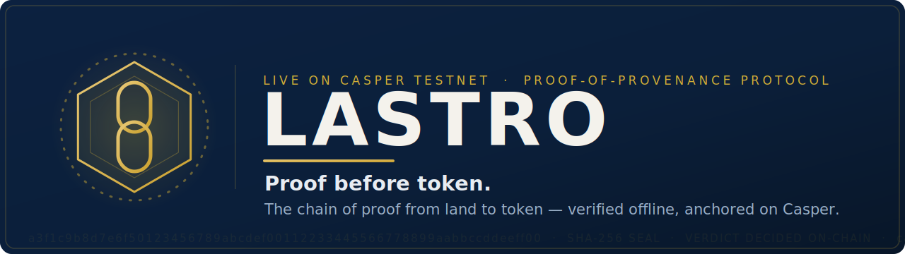
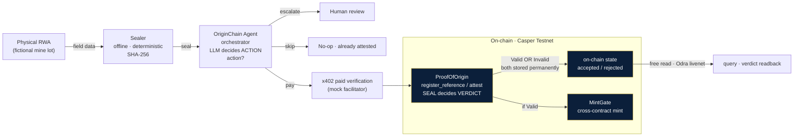

# Lastre

**Proof before token — the chain of proof from land to token, verified offline and anchored on Casper.**

[](#licensing)
[](contracts/lastro_origin/rust-toolchain)
[](#live-on-casper-testnet)
[](#run-it-yourself)

Lastre is a proof-of-provenance protocol for tokenized real-world assets (RWA)
on Casper. It verifies the physical origin of an asset **before** any tokenization
or data use: a deterministic offline SHA-256 seal decides the provenance verdict
(Valid or Invalid), and that proof is anchored on-chain.

**10/10 for Casper Agentic Buildathon 2026** — While dozens of projects build autonomous agents that consume RWA data via x402, Lastre proves the data came from the real physical world first. Both acceptance and rejection are permanent, verifiable on-chain proof. Pure demonstration layer with full regulatory clarity.

Lastre is **not** an investment product, yield product, or return promise. Public
samples use fictional data only, including names such as “Mineradora Vale do
Ouro” and `MINA-VALEDOURO-LOTE-001`.

> Website: https://lastre.io

## Documentation

Lastre now includes a repo-grade documentation hub for frontend, design,
deployment, roadmap, API, and architecture handoff:

- [Documentation hub](docs/README.md)
- [Laura frontend/design handoff](docs/LAURA_FRONTEND_SYSTEM_DESIGN.md)
- [Laura design super prompt](docs/LAURA_DESIGN_SUPER_PROMPT.md)
- [Routes and sitemap](docs/FRONTEND_ROUTES.md)
- [API contract](docs/API_CONTRACT.md)
- [Architecture flowcharts](docs/ARCHITECTURE_FLOWCHARTS.md)
- [Roadmap](docs/ROADMAP.md)
- [Operating wheels](docs/OPERATING_WHEELS.md)
- [Landing page creative spec](docs/LANDING_PAGE_CREATIVE_SPEC.md)
- [Deployment runbook](docs/DEPLOYMENT_RUNBOOK.md)

Public brand is **Lastre**. Some internal package names and paths still use the
legacy `lastro` namespace for compatibility with deployed contracts, package
imports, CSS variables, and build scripts.

## Thesis

Most RWA systems publish a number someone typed into an API. Lastre anchors the
chain of proof behind the asset: field data is sealed offline, the seal is
verified deterministically, and both accepted and rejected attestations become
verifiable on-chain evidence.

**Seal decides verdict. LLM decides action.** The LLM/orchestrator can choose
`pay`, `skip`, or `escalate`; it never decides or overwrites `Valid` / `Invalid`.

## Architecture



### Components

- **Sealer** — deterministic offline SHA-256 seal over a canonical provenance
  artifact. It is intentionally independent of cloud services, runtime clocks,
  and network calls.
- **ProofOfOrigin** — Casper/Odra contract that stores reference seals and
  records attestations. `Valid` and `Invalid` are both successful recorded
  outcomes.
- **MintGate** — cross-contract gate that allows symbolic minting only after a
  valid origin attestation.
- **x402 paid verification** — HTTP 402 flow for paid provenance checks. The
  current facilitator is a mock; see [x402 status](#x402-status-mock-facilitator).
- **OriginChain Agent** — TypeScript orchestrator. The LLM path chooses an
  operational action only; the deterministic seal path decides the verdict.

## Live on Casper Testnet

The `ProofOfOrigin` package is already deployed on Casper Testnet.

- **Network:** Casper Testnet (`casper-test`)
- **Deployer public key:** `01825d5caa210121ea1e493223af5a76f7ff23c70322c5fd0f02eb09f2818f68ad`
- **Package hash:** `hash-b8b505fe96c183de157beda5f2233903aa7805208b428c668d191c83f2590561`
- **Current on-chain state:** `accepted=2`, `rejected=1`
  - `MINA-VALEDOURO-LOTE-001` current verdict: `Invalid`
  - `MINA-VALEDOURO-LOTE-002` current verdict: `Valid`

All transactions below are `Success` on Casper Testnet:

| Action | Transaction |
| --- | --- |
| Install `ProofOfOrigin` | [`c2cd1d7fd301d54dd82ed5d25f0e76cde88f39008d92504c5a08922d78e4db10`](https://testnet.cspr.live/transaction/c2cd1d7fd301d54dd82ed5d25f0e76cde88f39008d92504c5a08922d78e4db10) |
| `MINA-VALEDOURO-LOTE-001` — register reference | [`23d265beb8bd2e6d292975ded281bd9a63148d93870dd9ac262baf73154caede`](https://testnet.cspr.live/transaction/23d265beb8bd2e6d292975ded281bd9a63148d93870dd9ac262baf73154caede) |
| `MINA-VALEDOURO-LOTE-001` — tampered attest → `Invalid` | [`5a7b0e01ba1a40fcf784e7b01a4a4b5da7ecb5eaf201c1e3b56ab3a2628773cd`](https://testnet.cspr.live/transaction/5a7b0e01ba1a40fcf784e7b01a4a4b5da7ecb5eaf201c1e3b56ab3a2628773cd) |
| `MINA-VALEDOURO-LOTE-002` — register reference | [`bd6d476ee1fddcb1b0deae0185eefc6fecfcbefe616d2b80ebb75fc736fb9101`](https://testnet.cspr.live/transaction/bd6d476ee1fddcb1b0deae0185eefc6fecfcbefe616d2b80ebb75fc736fb9101) |
| `MINA-VALEDOURO-LOTE-002` — genuine agent-driven attest → `Valid` | [`43b00eddb1371533584c673e1a77f77e479cf8829748bff8da835fd42e16f6f4`](https://testnet.cspr.live/transaction/43b00eddb1371533584c673e1a77f77e479cf8829748bff8da835fd42e16f6f4) |
| Earlier `MINA-VALEDOURO-LOTE-001` genuine attest → `Valid` | [`8c619f508443ded0ecd732050b976cb49e44a98501589e386516971351b4e32f`](https://testnet.cspr.live/transaction/8c619f508443ded0ecd732050b976cb49e44a98501589e386516971351b4e32f) |

The accepted counter includes the earlier genuine `LOTE-001` attestation and the
agent-driven `LOTE-002` attestation. The latest `LOTE-001` attestation is
`Invalid` because the tampered seal was also submitted and recorded.

**both Valid and Invalid verdicts are written on-chain — a rejection is permanent, verifiable proof, not a discarded error.**

Fresh read-only output from `make query`:

```text
ProofOfOrigin package_address: hash-b8b505fe96c183de157beda5f2233903aa7805208b428c668d191c83f2590561
accepted_count(): 2
rejected_count(): 1
get_attestation("MINA-VALEDOURO-LOTE-001"): Some
  asset_id: MINA-VALEDOURO-LOTE-001
  provided_seal: fffec9b8d7e6f50123456789abcdef00112233445566778899aabbccddeeff11
  verdict: Invalid
  attester: account-hash-6de6ee75f7d41407d9e0643d24fe7debc36bbe75695950e544c4ebd11850e1b2
get_reference("MINA-VALEDOURO-LOTE-001"): a3f1c9b8d7e6f50123456789abcdef00112233445566778899aabbccddeeff00
```

## Run it yourself

Prerequisites on macOS:

- Node.js + npm.
- Rust via `rustup`; the Makefile uses `cargo +nightly-2026-01-01` for Odra.
- Network access on first setup so `npm ci`, `rustup target add`, and, if
  missing, `cargo install cargo-odra` can populate the local tool cache.

```bash
git clone https://github.com/FelixRodrigues007/lastro.git
cd lastro
make
```

`make` defaults to `make build`. The build order is intentional: it creates the
ignored `agent/sealer/dist/` artifact before `agent/x402` imports it, so a clean
clone does not depend on pre-existing generated files.

| Target | What it does |
| --- | --- |
| `make setup` | Installs local Node dependencies for `agent/sealer`, `agent/x402`, `agent/orchestrator`, and `agent/gateway`; validates Rust/Odra tooling; ensures the `wasm32-unknown-unknown` target exists. |
| `make build` | Runs setup, builds sealer → x402 → orchestrator → gateway, checks the Rust contracts with the `livenet` feature, and builds Odra/Casper WASM artifacts. |
| `make test` | Runs TypeScript package tests, including the gateway, Rust contract tests, and `cargo fmt -- --check`. |
| `make wasm` | Builds Odra/Casper WASM artifacts in `contracts/lastro_origin/wasm/`. |
| `make query` | Runs the read-only livenet `ProofOfOrigin` query against the already-deployed package. It does not deploy. |
| `make demo` | Builds the local TypeScript stack and runs the orchestrator demo. |
| `make gateway` | Builds the sealer, compiled livenet `query`/`attest` binaries, and starts the Lastre gateway at `http://localhost:3456`. |

## x402 status: mock facilitator

The x402 paid-verification flow is implemented, but payment settlement currently
uses `MockFacilitator`.

- It does **not** talk to the Casper network.
- It does **not** move real CSPR.
- It validates the `X-PAYMENT` header with a local deterministic mock signature
  and nonce/amount/replay checks.
- It returns a synthetic SHA-256 `txHash`, not a real Casper transaction hash.

This is intentional for the prototype. All payment behavior sits behind one seam:
`Facilitator` in `agent/x402/src/facilitator.ts`. A future real Casper
facilitator should be added as one implementation of that interface and injected
through `createLastroX402Server({ facilitator })`. The exact swap points are
marked with `TODO(casper-facilitator)` in `agent/x402/src/facilitator.ts` and
`agent/x402/src/server.ts`.

## Repository layout

```text
contracts/lastro_origin/  Casper/Odra contracts: ProofOfOrigin and MintGate
agent/sealer/             deterministic offline SHA-256 sealer
agent/x402/               HTTP 402 paid-verification prototype
agent/orchestrator/       OriginChain agent and OpenRouter/rule decider
agent/gateway/            experience-layer HTTP gateway over the live protocol
design-system/            advertising/design-system assets and templates
docs/                     architecture notes and future media assets
samples/                  fictional sample data
web/                      static public demo assets served by the gateway
```

## Licensing

Lastre uses a hybrid license model:

- **Apache-2.0 for contracts** — the Casper/Odra contracts in `contracts/` are
  open so builders and auditors can inspect, reuse, and verify the on-chain trust
  layer.
- **BUSL-1.1 for the sealer** — the deterministic offline sealer in
  `agent/sealer/` is protected because it is the anti-tamper provenance engine
  that turns raw origin data into a deterministic proof before tokenization.

See:

- `LICENSE` — license map.
- `LICENSE-APACHE` — Apache License 2.0.
- `LICENSE-BUSL` — Business Source License 1.1.

SPDX headers in source files and package metadata reflect the split: contracts
are Apache-2.0, and the sealer is BUSL-1.1.

## Status and safety notes

- Prototype for Casper Agentic Buildathon 2026.
- Not audited; not production software.
- Fictional data only. Do not use real companies, people, mineral lots, or
  investor-return claims in public demos.
- No secrets belong in the repository. Use environment variables and local key
  files outside git.
