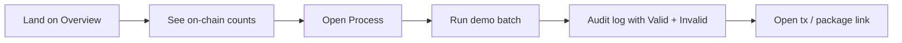
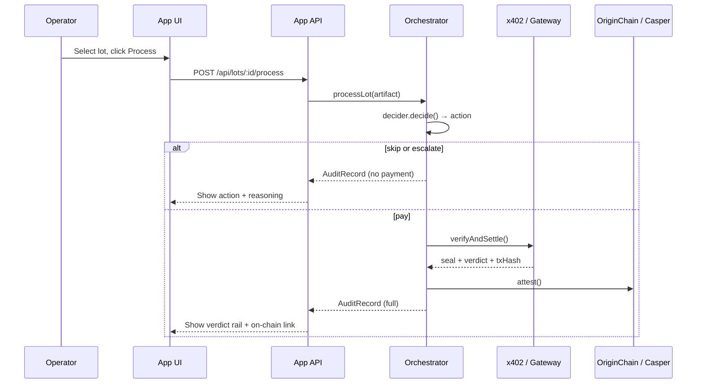

# Lastro App — UI Architecture Spec

**Status:** draft / ready for implementation  
**Date:** 2026-06-26  
**Scope:** Product UI for the Lastro provenance console — not the marketing landing (`web/`).

## Summary

The Lastro **app** is a forensic provenance console: operators and evaluators submit fictional lots, watch the agent decide an **action**, see the deterministic seal decide the **verdict**, and inspect on-chain evidence. It exposes what `make demo` already does in the terminal, with clear separation between orchestration UI and marketing site.

**Non-goals for v1:** investment flows, token sale, wallet onboarding, real payment settlement, production auth, or replacing the Casper explorer.

---

## Product thesis (unchanged)

> **Proof before token** — the chain of proof from land to token, verified offline and anchored on Casper.

### Invariants the UI must never break

1. **Seal decides verdict.** `Valid` / `Invalid` comes from deterministic SHA-256 comparison, never from the LLM.
2. **LLM decides action only.** `pay` / `skip` / `escalate` — never truth.
3. **Invalid is proof too.** Rejections are recorded outcomes, not errors to hide.
4. **Fictional data only** in all public demos and default samples.
5. **No investment language.** No yield, ROI, token sale, or ownership claims.

---

## Personas & jobs

| Persona | Job in the app | Success |
|---|---|---|
| **Technical evaluator** | Run the end-to-end demo and inspect audit output | Understands seal vs. action separation in &lt;5 min |
| **RWA builder** | See how a lot moves from artifact → decision → attestation | Can explain the workflow to a colleague |
| **Compliance reviewer** | Trace rejected lots and on-chain evidence | Finds permanent `Invalid` records, not hidden failures |
| **Operator (demo)** | Submit or re-run a fictional lot | Gets a readable audit record with hashes and links |

**Anti-persona:** retail investor, token buyer, yield seeker — no UI paths for them.

---

## Relationship to existing surfaces

```text
lastro/
  web/          Marketing landing (static, scroll narrative) — stays separate
  app/          Product console (this spec) — new package
  agent/        Source of truth for orchestration logic — reused via API
  design-system/tokens/lastro.css   Shared visual tokens
```

The landing may link to `/app` (or a subdomain later). The app does **not** embed landing sections.

---

## Information architecture

### Route map (v1)

| Route | Screen | Purpose |
|---|---|---|
| `/` | **Overview** | Contract snapshot, batch summary, entry to demo |
| `/lots` | **Lot queue** | Fictional lots available to process |
| `/lots/:assetId` | **Lot detail** | Artifact, reference seal, latest attestation |
| `/process` | **Process batch** | Run agent on selected lots; live stepper |
| `/audit` | **Audit log** | Searchable history of `AuditRecord`s |
| `/audit/:assetId` | **Audit detail** | Full decision + verification + on-chain row |
| `/escalations` | **Review queue** | Lots with `escalate` action (human triage) |
| `/settings` | **Demo settings** | Decider mode, limits display, data disclaimer |

Optional v1.1: `/chain` read-only mirror of Casper Testnet state (replaces hardcoded `ExplorerVisual` data).

### Primary navigation

```text
[Overview]  [Lots]  [Process]  [Audit]  [Escalations]     [Demo · Testnet]
```

Persistent **proof rail** in lot/audit contexts:

```text
Physical origin → SHA-256 seal → Agent action → Paid verify → Casper verdict
```

---

## Core user flows

### Flow A — First visit (evaluator)



### Flow B — Process one lot



### Flow C — Escalation review

1. Lot appears in `/escalations` when `decision.action === "escalate"`.
2. Reviewer reads reasoning (missing field, out of perimeter, mass out of range).
3. Reviewer can **dismiss** (acknowledge) or **override to process** (admin demo only — still runs same seal path; UI must label as demo override).

### Flow D — Skip (duplicate attestation)

When `alreadyAttested`, UI shows:

- Action: `skip`
- Copy: *"Already attested — no second payment or duplicate record."*
- Link to existing audit row — not an error state.

---

## Screen specifications

### 1. Overview (`/`)

**Goal:** Orient and prove the system is live.

**Blocks:**

| Block | Content | Source |
|---|---|---|
| Status strip | `Casper Testnet · ProofOfOrigin deployed` | `site-links` / env |
| Counters | `accepted` / `rejected` on-chain | `GET /api/chain/summary` |
| Batch summary | Last run: tokenizable / rejected / skipped / escalated | `GET /api/audit/summary` |
| Quick actions | Run demo batch · View audit · Open package | navigation |
| Guardrail banner | Fictional data · not investment · seal vs LLM | static |

Reuse visual language from landing `ExplorerVisual` but bind to **live API data**, not hardcoded constants.

### 2. Lot queue (`/lots`)

**Goal:** Browse fictional lots before processing.

**Table columns:** Asset ID · Operator · Site · Mass · Captured · Status (`pending` / `attested` / `escalated`)

**Row actions:** View detail · Add to batch

Default data: artifacts from `createDemoArtifacts()` + reference registry.

### 3. Lot detail (`/lots/:assetId`)

**Goal:** Forensic view of one lot.

**Sections:**

1. **Artifact** — full `ProvenanceArtifact` JSON (pretty) + map pin (static SVG ok for v1)
2. **Computed seal** — `computeSeal(artifact)` with copy button
3. **Reference seal** — from registry; diff highlight if tampered
4. **Attestation** — latest on-chain verdict if any, with Casper tx link
5. **Proof rail** — vertical stepper (adapt `ProofPanel` pattern)

**Empty attestation:** show *"Not yet attested"* — not an error.

### 4. Process batch (`/process`)

**Goal:** Interactive replacement for `make demo`.

**UI pattern:** Split view

- **Left:** lot picker (checkboxes) + decider toggle (`Rule` / `LLM`)
- **Right:** live **process stepper** per lot:
  1. Triage (decision + reasoning + `decidedBy`)
  2. Payment (only if `pay`) — show mock x402 status
  3. Seal verification — `seal` vs `referenceSeal`
  4. Verdict — `Valid` / `Invalid` with status color tokens
  5. On-chain — `txHash` truncated + external link

**Batch defaults:** same four lots as `demo.ts` (valid, tampered, valid duplicate, out-of-region).

**Progress:** sequential processing (matches orchestrator); show running indicator on current lot.

### 5. Audit log (`/audit`)

**Goal:** Persistent session history of processed lots.

**Table columns:** # · Asset ID · Action · Verdict · Outcome · Decided by · Tx · Time

**Filters:** outcome · verdict · action · decidedBy

**Export:** JSON download of `BatchResult` (evaluators love this).

### 6. Audit detail (`/audit/:assetId`)

**Goal:** Single-record drill-down matching `renderRecord()` in `demo.ts`.

**Layout:**

```text
┌─────────────────────────────────────────┐
│ MINA-VALEDOURO-LOTE-001                 │
│ outcome: rejected                       │
├─────────────────────────────────────────┤
│ Agent decision                          │
│   action: pay · decidedBy: rule         │
│   reasoning: …                          │
├─────────────────────────────────────────┤
│ Verification (seal path)                │
│   seal: fffe…11                         │
│   reference: a3f1…00                     │
│   verdict: Invalid                      │
├─────────────────────────────────────────┤
│ On-chain                                │
│   verdict: Invalid · tx 8a3f…c2d1       │
└─────────────────────────────────────────┘
```

For `skip` / `escalate`: verification and on-chain panels show em dash with explanation.

### 7. Escalations (`/escalations`)

**Goal:** Human triage queue for demo.

**List:** assetId · reason snippet · timestamp · Review button

**Detail drawer:** full reasoning + artifact fields that triggered escalation (geo, mass, missing field).

### 8. Settings (`/settings`)

**Read-only in v1 except:**

- Decider: `RuleDecider` (default) vs `LlmDecider` (requires server `OPENROUTER_API_KEY`)
- Theme: dark (default) / light — `data-theme` on `<html>`
- Known limits display (from `DEFAULT_LIMITS`) — perimeter box, mass range

---

## Data model (UI ↔ backend)

Map directly to existing orchestrator types in `agent/orchestrator/src/types.ts`:

```typescript
// Already defined — UI consumes these shapes unchanged
type AuditRecord = {
  assetId: string;
  decision: { action: Action; reasoning: string; decidedBy: "rule" | "llm" };
  verification: VerificationResult | null;
  onChain: { verdict: VerificationVerdict; txHash: string } | null;
  outcome: "tokenizable" | "rejected" | "skipped" | "escalated";
};

type BatchResult = {
  records: AuditRecord[];
  summary: BatchSummary;
};
```

**UI-only extensions:**

```typescript
type LotListItem = {
  artifact: ProvenanceArtifact;
  referenceSeal: string | null;
  attested: boolean;
  latestVerdict?: VerificationVerdict;
};

type ChainSummary = {
  packageHash: string;
  acceptedCount: number;
  rejectedCount: number;
  network: "casper-test";
};
```

**ProvenanceArtifact** — import type from sealer; do not duplicate fields in the UI layer.

---

## Backend integration

The browser must **not** import BUSL sealer code or run the orchestrator directly. Add a thin **App API** (BFF).

### Recommended layout

```text
app/
  src/                 # React UI
  server/              # Node HTTP API (or app/api/ if using Vite proxy)
    routes/
      lots.ts
      process.ts
      audit.ts
      chain.ts
    services/
      agent.ts         # wraps Agent + LocalGateway + MockOriginChain
      casper-query.ts  # optional: wraps make query / RPC read
```

### API contract (v1)

| Method | Path | Behavior |
|---|---|---|
| `GET` | `/api/chain/summary` | Package hash + accepted/rejected counts |
| `GET` | `/api/lots` | Demo lots + reference seals + attested flag |
| `GET` | `/api/lots/:assetId` | Single lot + seals + attestation |
| `POST` | `/api/process/batch` | Body: `{ assetIds: string[], decider: "rule" \| "llm" }` → `BatchResult` |
| `GET` | `/api/audit` | Session audit log (in-memory or sqlite for v1) |
| `GET` | `/api/audit/:assetId` | Single record |
| `GET` | `/api/escalations` | Filter `outcome === "escalated"` |

**v1 persistence:** in-memory audit log (resets on server restart) is acceptable for hackathon demo. Document this in Settings.

**v2 persistence:** sqlite or append-only JSONL audit store.

### Chain data sources (phased)

| Phase | Source | Notes |
|---|---|---|
| **MVP** | `MockOriginChain` + hardcoded testnet metadata | Same as `make demo` |
| **v1.1** | Read-only Casper RPC / `make query` wrapper | Live counts and per-asset attestations |
| **v2** | Write path via deployed contract CLI or SDK | Out of scope for first UI sprint |

### x402 in the UI

For v1, payment is **simulated** (orchestrator uses `LocalGateway` + `MockFacilitator`). The UI shows:

- "Paid verification (mock)" badge
- Synthetic `txHash` — link to Casper explorer only when hash is real (v1.1+)

Do not build wallet connect or CSPR payment UI until `TODO(casper-facilitator)` is resolved.

---

## Frontend architecture

### Stack

| Layer | Choice | Rationale |
|---|---|---|
| Framework | React 19 + TypeScript | Matches `web/` |
| Build | Vite 6 | Matches `web/` |
| Routing | React Router 7 | Multi-screen console needs routes |
| Server state | TanStack Query | Batch process + chain summary fetching |
| Local UI state | React `useState` / context | Theme, batch selection |
| Styling | CSS modules or co-located CSS | Matches landing pattern; import `lastro.css` tokens |
| Icons | Inline SVG | Matches landing components |

**Avoid for v1:** heavy UI kit, CSS-in-JS runtime, global state library.

### Folder structure

```text
app/
  index.html
  package.json
  vite.config.ts
  server/                    # BFF (see above)
  src/
    main.tsx
    App.tsx                  # router shell
    routes/
      Overview.tsx
      Lots.tsx
      LotDetail.tsx
      Process.tsx
      Audit.tsx
      AuditDetail.tsx
      Escalations.tsx
      Settings.tsx
    components/
      layout/
        AppShell.tsx         # nav + guardrail banner
        ProofRail.tsx
      proof/
        SealChip.tsx         # truncated hash + copy
        VerdictBadge.tsx     # Valid / Invalid / — 
        ActionBadge.tsx      # pay / skip / escalate
        AuditRecordCard.tsx
      lots/
        LotTable.tsx
        ArtifactPanel.tsx
      process/
        BatchStepper.tsx
        DecisionPanel.tsx
    hooks/
      useChainSummary.ts
      useProcessBatch.ts
    lib/
      api.ts                 # fetch wrappers
      format.ts              # shortHash, dates
    styles/
      app.css                # imports design-system tokens
```

### Shared design system

1. Import `design-system/tokens/lastro.css` in `app/src/styles/app.css`.
2. Default theme: **dark** (`:root`).
3. Reuse landing primitives where possible:
   - `panel`, `panel--elevated`, `mono-label`, `status-chip`
   - `ProofPanel` stepper → generalized `ProofRail`
   - `ExplorerVisual` layout → `ChainSnapshot` with live data

4. Component token mapping:

| UI element | Token |
|---|---|
| Page background | `--lastro-bg-primary` |
| Cards / panels | `--lastro-bg-panel`, `--lastro-bg-elevated` |
| Primary CTA | `--lastro-button-primary-*` (seal fill) |
| Valid verdict | `--lastro-status-valid` |
| Invalid verdict | `--lastro-status-invalid` |
| Hash text | `--lastro-font-mono` |

### App shell layout

```text
┌──────────────────────────────────────────────────────────┐
│ [mark] Lastro Console          nav…          Testnet ●   │
├──────────────────────────────────────────────────────────┤
│ ⚠ Demo · fictional data · seal decides verdict · not $  │
├──────────────────────────────────────────────────────────┤
│                                                          │
│                     [page content]                       │
│                                                          │
└──────────────────────────────────────────────────────────┘
```

---

## Component catalog (v1)

| Component | Props / behavior |
|---|---|
| `VerdictBadge` | `verdict: Valid \| Invalid \| null` |
| `ActionBadge` | `action: pay \| skip \| escalate` |
| `OutcomeBadge` | `outcome: tokenizable \| rejected \| skipped \| escalated` |
| `SealChip` | `hash`, `label?`, `copyable` |
| `ProofRail` | `steps[]`, `activeStep`, `verdict?` |
| `AuditRecordCard` | `record: AuditRecord`, `compact?` |
| `BatchStepper` | `records: AuditRecord[]`, `currentIndex` |
| `GuardrailBanner` | static disclaimer |
| `ChainSnapshot` | `summary: ChainSummary`, `attestations[]` |
| `ArtifactPanel` | `artifact: ProvenanceArtifact` |
| `EmptyState` | title + description + action |
| `LoadingRow` | skeleton for tables |

All badges must include text labels (not color-only) for WCAG AA.

---

## States & UX rules

### Loading

- Overview chain summary: skeleton counters
- Process batch: disable lot picker; stepper animates per lot
- Tables: row skeletons, not spinners alone

### Empty

| Screen | Empty copy |
|---|---|
| Audit | *"No lots processed yet. Run a batch from Process."* |
| Escalations | *"No escalations — all lots passed triage or were skipped."* |

### Error

| Error | UI treatment |
|---|---|
| API unreachable | Banner + retry; link to `make demo` CLI fallback |
| Unknown asset | 404 page with back to Lots |
| LLM decider unavailable | Auto-fallback message: *"Using rule decider — OPENROUTER_API_KEY not set"* |
| Process failure | Show error on current step; prior records remain in audit |

### Invalid verdict presentation

- Use `--lastro-status-invalid` — never red error toast language
- Headline: **"Invalid — recorded on-chain"**
- Subcopy: *"Tampered or mismatched seal. This outcome is permanent proof."*

---

## Accessibility

- Dark theme default; light theme via `data-theme="light"` toggle
- All hash copy buttons: `aria-label="Copy seal hash"`
- Verdict badges: icon + text (`Valid`, `Invalid`)
- Process stepper: `aria-live="polite"` on step changes
- External links: `rel="noopener noreferrer"` + visible external indicator
- Target WCAG 2.2 AA on primary text pairs (already validated in token spec)

---

## Security & compliance (UI)

- No secrets in frontend env except public URLs
- `OPENROUTER_API_KEY` only on server
- No PII fields in forms — artifacts are fictional
- Rate-limit `POST /api/process/batch` in demo deployment
- Content Security Policy on app host

---

## Implementation phases

### Phase 0 — Scaffold (1–2 days)

- [ ] Create `app/` package with Vite + React Router
- [ ] Import design tokens; build `AppShell` + `GuardrailBanner`
- [ ] Stub routes with placeholder content

### Phase 1 — MVP console (3–5 days)

- [ ] BFF wrapping `Agent` + demo artifacts
- [ ] Overview + Process + Audit (core loop)
- [ ] `BatchStepper` + `AuditRecordCard`
- [ ] In-memory audit persistence

### Phase 2 — Lot explorer (2–3 days)

- [ ] Lots list + detail with `ArtifactPanel` + `ProofRail`
- [ ] Escalations queue
- [ ] JSON export from audit

### Phase 3 — Live chain (2–3 days)

- [ ] `GET /api/chain/summary` from Casper read path
- [ ] Replace hardcoded testnet constants
- [ ] Tx links when hashes are real

### Phase 4 — Polish (ongoing)

- [ ] Light theme
- [ ] LLM decider toggle with fallback UX
- [ ] Landing → app CTA link
- [ ] E2E test: run demo batch → audit contains 4 records with expected outcomes

---

## Testing strategy

| Layer | What to test |
|---|---|
| API | `POST /api/process/batch` returns same outcomes as `make demo` |
| UI unit | `VerdictBadge`, `SealChip` copy, `ProofRail` steps |
| E2E | Full batch → audit log row count + tampered lot = `Invalid` |
| Visual | Dark/light token contrast spot-check |

Expected demo outcomes (regression anchor):

| Asset | Expected action | Expected outcome |
|---|---|---|
| `MINA-VALEDOURO-LOTE-002` (valid) | pay | tokenizable |
| `MINA-VALEDOURO-LOTE-001` (tampered) | pay | rejected |
| valid duplicate | skip | skipped |
| `LOTE-OUTOFREGION` | escalate | escalated |

---

## Open decisions

| # | Question | Recommendation |
|---|---|---|
| 1 | Separate `app/` package or routes inside `web/`? | **Separate `app/`** — different audience, avoids landing bundle bloat |
| 2 | App API in same process as Vite dev server? | Vite proxy to `server/` on `:3001` in dev; single deploy artifact later |
| 3 | Auth for v1? | **None** — public demo; add API key gate only if abused |
| 4 | i18n? | English first (matches repo); PT-BR copy pass later |
| 5 | Mobile layout? | Responsive tables → cards below `768px`; process stepper stacks vertically |

---

## References

- Protocol architecture: [`docs/ARCHITECTURE.md`](./ARCHITECTURE.md)
- Orchestrator types: `agent/orchestrator/src/types.ts`
- Demo behavior: `agent/orchestrator/src/demo.ts`
- Design tokens: `design-system/tokens/lastro.css`
- Token spec: `docs/superpowers/specs/2026-06-25-design-system-olive-design.md`
- Marketing guardrails: `design-system/product-marketing-context.md`
