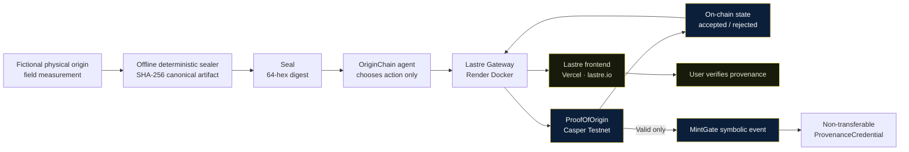
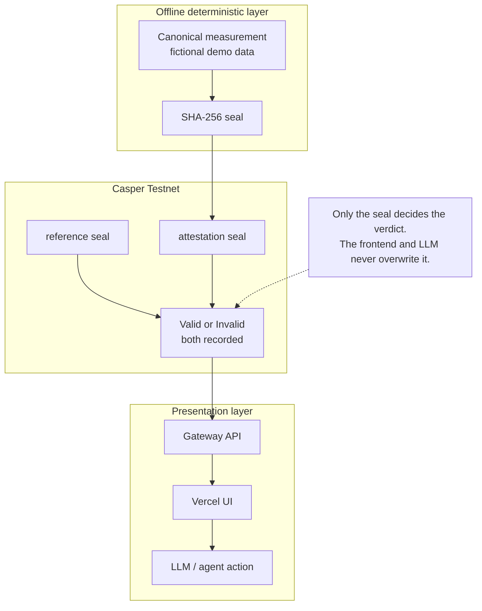
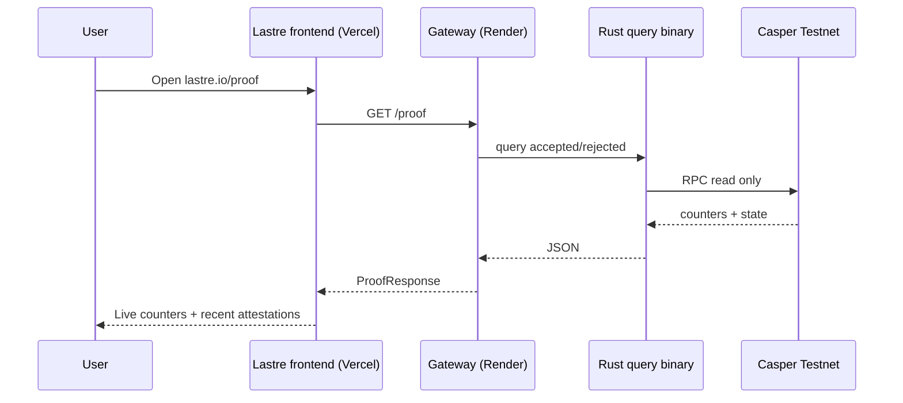
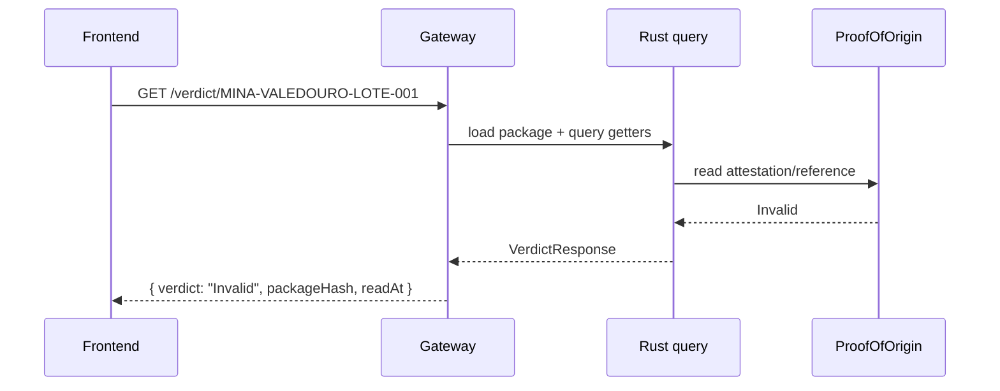
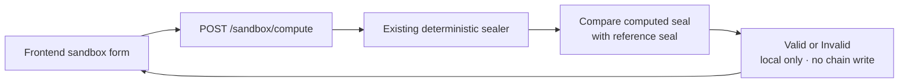
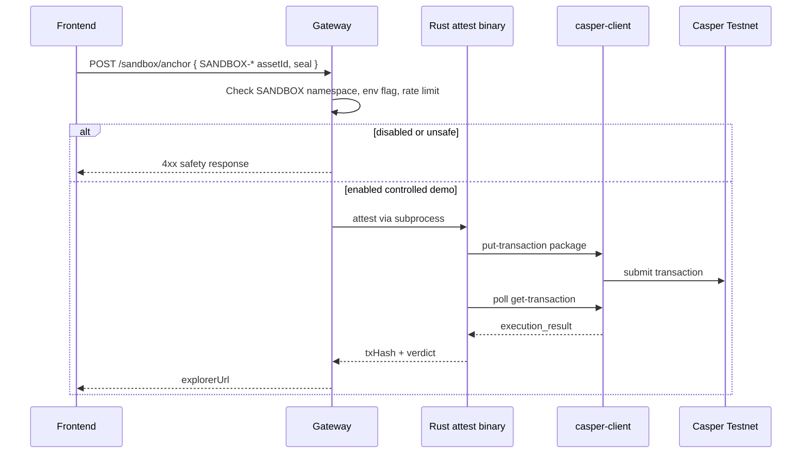
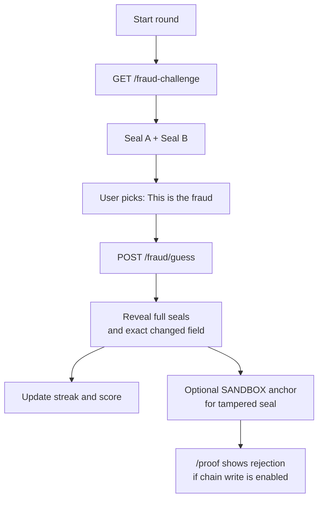
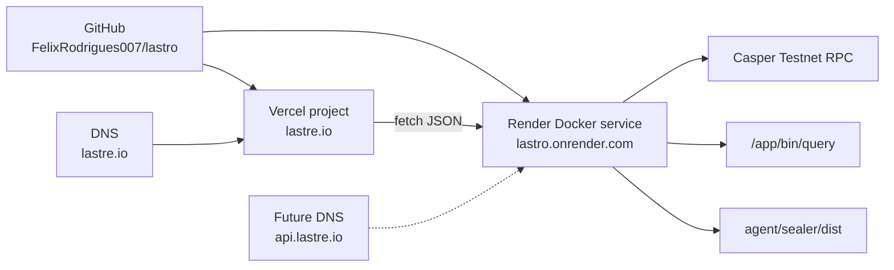
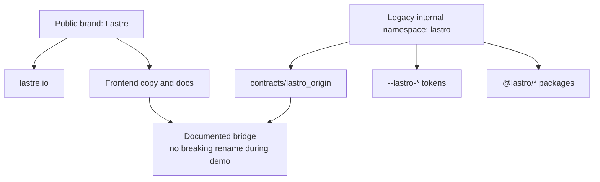

# Lastre Architecture Flowcharts

These diagrams are the canonical flowcharts for the public repo, frontend handoff,
and demo narrative.

## 1. Full system overview

## 2. Trust boundary

## 3. Free read path

## 4. Verdict path

## 5. Sandbox compute path

## 6. Controlled sandbox anchor path

## 7. Spot-the-Fraud game

## 8. Deployment topology

## 9. Rebrand state

