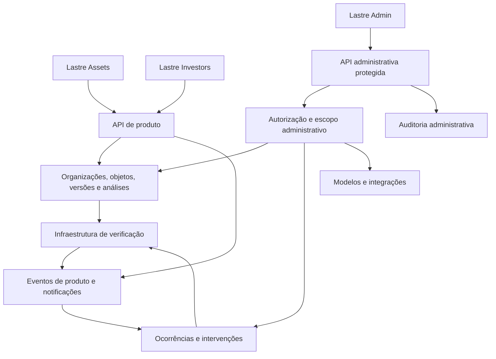

# Lastre Admin

## Arquitetura de produto, operação e experiência administrativa

**Data:** 25 de setembro de 2026  
**Versão:** 0.1 — proposta para produto, design, engenharia e operação  
**Documento de origem:** [Lastre Investors + Lastre Assets](LASTRE_PRODUCT_ARCHITECTURE.md)  
**Escopo:** administração interna da plataforma e dos dois produtos  
**Situação:** especificação de futuro. A única tela administrativa identificada na leitura é a prévia local do Inventário, `AD-001`.

O Lastre Admin deve permitir que a equipe mantenha o ciclo entre Assets e Investors funcionando: identificar quem precisa de ajuda, localizar o objeto e a versão envolvidos, resolver uma falha dentro de sua autoridade e demonstrar o que aconteceu. Deve também reunir as regras que governam esse ciclo e o inventário que acompanha sua construção.

A proposta cobre a operação completa sem transformar cada entidade, estado ou ferramenta técnica em um item de menu. O desenho combina dez destinos principais, Configurações no rodapé e páginas de detalhe abertas a partir desses destinos. A primeira entrega apresenta apenas os módulos operacionais disponíveis.

As escolhas de navegação, rotas, papéis, ações e prioridades abaixo são recomendações. Não representam autorização de produção, contratos de backend existentes ou decisões comerciais aprovadas. Lastre Assets permanece o nome proposto no documento de origem.

### Índice

1. [Missão, fronteiras e decisões de partida](#1-missão-fronteiras-e-decisões-de-partida)
2. [Pessoas, responsabilidades e acesso](#2-pessoas-responsabilidades-e-acesso)
3. [Modelo administrativo e estados](#3-modelo-administrativo-e-estados)
4. [Navegação e estrutura compartilhada](#4-navegação-e-estrutura-compartilhada)
5. [Quando usar página, tabs, drawer e modal](#5-quando-usar-página-tabs-drawer-e-modal)
6. [Mapa completo de telas](#6-mapa-completo-de-telas)
7. [Especificação de cada área](#7-especificação-de-cada-área)
8. [Catálogo das superfícies contextuais](#8-catálogo-das-superfícies-contextuais)
9. [Jornadas administrativas completas](#9-jornadas-administrativas-completas)
10. [Conteúdo, estados e qualidade de interação](#10-conteúdo-estados-e-qualidade-de-interação)
11. [Contratos de operação, versões e auditoria](#11-contratos-de-operação-versões-e-auditoria)
12. [Prioridades, entregas e limites de expansão](#12-prioridades-entregas-e-limites-de-expansão)
13. [Validação e critérios de aceitação](#13-validação-e-critérios-de-aceitação)
14. [Relação com o inventário e a implementação atual](#14-relação-com-o-inventário-e-a-implementação-atual)
15. [Decisões pendentes e fontes](#15-decisões-pendentes-e-fontes)

## 1. Missão, fronteiras e decisões de partida

### 1.1 As perguntas que o Admin precisa responder

| Pergunta de trabalho | Destino principal | Resultado esperado |
|---|---|---|
| O que requer intervenção agora? | Visão geral → Fila de trabalho | Ocorrência com responsável e próximo passo |
| Por que esta organização não consegue continuar? | Organizações → registro relacionado | Causa localizada, acesso compreendido e recuperação possível |
| Que material foi apresentado e em qual versão? | Registros | Base histórica identificada sem alterar o conteúdo do cliente |
| O processamento falhou ou encontrou uma divergência? | Verificações | Execução, resultado e validade distinguidos |
| Quais regras foram aplicadas? | Modelos e regras | Versão, autoria, alcance e vigência recuperáveis |
| Quem tem acesso e por qual motivo? | Pessoas e acessos | Permissão efetiva explicada e revogável no escopo permitido |
| O que mudou e quem fez a mudança? | Auditoria | Evento atribuível, efeito confirmado e objetos relacionados |
| O que está especificado, implementado e verificado? | Inventário | Evidências e lacunas da construção do produto |

### 1.2 Fronteiras entre os três contextos

| Contexto | Responsabilidade | Limite |
|---|---|---|
| Lastre Assets | Cadastrar, documentar, revisar e compartilhar | A organização de origem responde pelo conteúdo apresentado |
| Lastre Investors | Solicitar, analisar, pedir esclarecimentos e decidir | A organização destinatária responde pela análise e sua conclusão |
| Lastre Admin | Operar acesso, processamento, regras, suporte e confiabilidade | A equipe interna atua sobre a operação com escopo e autoria próprios |

O administrador de uma organização cliente continua dentro de Assets ou Investors para gerir sua equipe. Esse papel não concede acesso ao Lastre Admin. A equipe interna não recebe, por ser interna, acesso irrestrito a documentos e notas das organizações.

Uma intervenção administrativa preserva a autoria original. Corrigir um laudo cabe ao responsável por apresentá-lo; registrar a conclusão de uma análise cabe ao decisor da organização. O Admin pode encaminhar uma solicitação de correção e recuperar um processamento. Não oferece um botão genérico para tornar um dossiê válido, alterar uma decisão do cliente ou aprovar um investimento.

### 1.3 Escolhas que orientam o desenho

1. **Uma fila de trabalho operacional.** Suporte, exceções técnicas, pedidos de acesso temporário e incidentes têm tipos diferentes dentro de uma mesma fila. Um problema que afeta vários objetos pode gerar uma ocorrência agregadora.
2. **Um detalhe principal por objeto.** Uma organização, execução ou dossiê mantém o mesmo detalhe, independentemente de onde foi aberto. Drawers mostram uma prévia desse detalhe.
3. **Contexto antes de comandos.** Organização, objeto, versão, ambiente e efeito esperado aparecem antes da ação.
4. **Poucas ações globais.** Suspender, reprocessar, publicar ou revogar começa no registro correspondente, com revisão de alcance.
5. **Regras e resultados versionados.** Uma publicação vale para seu escopo e vigência. O histórico continua associado à regra utilizada.
6. **Diagnóstico com divulgação progressiva.** A primeira camada explica a causa e a recuperação. Logs e referências técnicas ficam disponíveis a quem precisa deles.
7. **Cada capacidade ganha interface quando puder cumprir sua tarefa.** O mapa futuro não exige menus vazios no piloto.

## 2. Pessoas, responsabilidades e acesso

### 2.1 Papéis internos propostos

| Papel | Trabalho principal | Acesso de partida |
|---|---|---|
| Operação e suporte | Acompanhar ocorrências, orientar organizações e executar recuperações delimitadas | Metadados operacionais; conteúdo somente mediante concessão específica |
| Responsável técnico | Investigar métodos, falhas e resultados da infraestrutura | Execuções, métodos e referências técnicas no escopo atribuído |
| Gestão de organizações | Ativar organizações, acompanhar uso e vínculo comercial | Cadastro organizacional e condições de uso autorizadas |
| Gestão de acesso | Administrar vínculos internos, sessões e políticas de permissão | Identidades e acesso; documentos não incluídos por esse papel |
| Produto e qualidade | Manter modelos, acompanhar jornadas e consultar o inventário | Regras de produto, métricas agregadas e inventário |
| Auditoria interna | Examinar intervenções e seus fundamentos | Leitura dos registros autorizados; nenhuma mutação por padrão |

Uma pessoa pode acumular papéis. A concessão deve nomear capacidades e escopos, sem depender de um perfil universal de “superadmin” no trabalho diário. Acesso emergencial, se necessário, é temporário, reautenticado, justificado e revisado depois do uso.

### 2.2 Matriz de autoridade

| Ação | Autoridade proposta | Condição adicional |
|---|---|---|
| Consultar metadados de ocorrência | Operação ou responsável técnico | Escopo da equipe e ambiente autorizados |
| Abrir documento restrito | Capacidade específica de leitura de conteúdo | Concessão vigente para finalidade, organização e objeto |
| Repetir execução elegível | Responsável técnico ou operador autorizado | Método permite repetição; entradas e efeito revisados |
| Suspender organização | Gestão de organizações com capacidade de suspensão | Motivo, impacto e revisão independente quando o alcance exigir |
| Revogar sessão comprometida | Gestão de acesso | Identidade e sessões afetadas confirmadas |
| Conceder acesso administrativo | Gestão de acesso | Não aprovar a própria elevação; autorização validada no servidor |
| Publicar modelo global | Responsável de produto e aprovador designado | Diff, validação e versão de publicação |
| Revogar validade de resultado | Responsável técnico com capacidade própria | Motivo, evidência e avaliação das análises afetadas |
| Exportar informações restritas | Capacidade de exportação separada da leitura | Finalidade, campos, destino e expiração do arquivo |
| Apagar ou anonimizar dados | Responsável pelo processo de dados | Política definida, revisão de dependências e impedimentos |

A revisão independente se aplica a concessão de privilégio, publicação de método, revogação com efeito em terceiros, eliminação de dados e intervenções de grande alcance. Atribuir uma ocorrência ou atualizar uma nota interna não precisa do mesmo ritual.

### 2.3 Acesso assistido ao conteúdo

O primeiro nível de suporte mostra identificação do caso, etapas, horários, erros e permissões efetivas. Se isso não bastar, o operador solicita acesso a um objeto específico, com finalidade e duração. A política aprovada define quem pode concedê-lo e quando a organização precisa participar da autorização.

Durante a concessão, a página exibe uma faixa persistente: “Acesso de suporte · [organização] · [escopo] · até [horário]”. Consultas e exportações ficam registradas. Expiração ou revogação remove o conteúdo da tela e invalida novas consultas no servidor.

Para o piloto, a recomendação é **consulta assistida em leitura**. Um futuro recurso de representação de usuário exige desenho próprio, distinguindo ator interno e identidade representada em todos os eventos. A troca de organização no Admin nunca realiza login silencioso como cliente.

## 3. Modelo administrativo e estados

### 3.1 Objetos acrescentados pelo Admin

Os objetos de negócio continuam sendo os definidos na arquitetura principal: organização, participação, ativo, lote, evidência, solicitação, dossiê, versão, verificação, análise, decisão e compartilhamento.

| Objeto administrativo | Para que existe | Relações essenciais |
|---|---|---|
| Ocorrência | Coordenar uma intervenção que tem responsável e término | Tipo, prioridade, causa, objetos afetados, participantes e resolução |
| Incidente | Agrupar ocorrências de uma mesma interrupção relevante | Serviço afetado, período, impacto, ocorrências e recuperação |
| Intervenção | Registrar um comando administrativo e seu efeito | Ator, justificativa, alvos, revisão, confirmação e recibo |
| Concessão temporária | Limitar uma consulta de suporte | Beneficiário, aprovador, finalidade, objetos, capacidades e expiração |
| Publicação de modelo | Tornar uma versão aplicável a um escopo | Autor, revisor, versão, vigência e organizações elegíveis |
| Integração | Identificar uma conexão autorizada com serviço ou fonte | Proprietário, ambiente, capacidade, saúde e credenciais referenciadas |
| Exportação | Acompanhar a geração e a disponibilidade de um arquivo | Solicitante, escopo, campos, finalidade, estado e expiração |
| Evento administrativo | Permitir reconstruir o que ocorreu | Ator, ação, alvo, ambiente, momento, resultado e correlação |

Uma ocorrência pode relacionar uma análise e uma execução, mas não ocupa o lugar delas. Encerrar o atendimento não conclui a análise do cliente. Uma execução concluída com divergência pode encerrar corretamente o problema técnico que motivou o atendimento.

### 3.2 Estados que aparecem separados

| Dimensão | Estados de trabalho propostos | Regra de apresentação |
|---|---|---|
| Ocorrência | Nova, em triagem, em atendimento, aguardando terceiro, resolvida, encerrada | Reabertura retorna a atendimento e preserva o encerramento anterior |
| Atribuição | Sem responsável, atribuída | Não confundir ausência de responsável com prioridade baixa |
| Prioridade | Crítica, alta, normal, baixa | Derivada de impacto e urgência; ajuste humano exige motivo |
| Intervenção | Em preparação, aguardando aprovação, aprovada, em execução, confirmada, falhou, resultado desconhecido, cancelada | Timeout após envio pode deixar resultado desconhecido; consultar antes de repetir |
| Organização | Convidada, em ativação, ativa, suspensa, encerrada | Situação comercial e integração técnica têm campos próprios |
| Acesso | Convidado, ativo, expirado, revogado | Mostrar escopo e datas, além do estado |
| Modelo | Rascunho, em revisão, publicado, descontinuado | Versões publicadas permanecem identificáveis |
| Serviço | Operacional, degradado, indisponível, desconhecido | Ausência de observação não é sinal de saúde |

A execução, o resultado técnico e a validade de uma verificação conservam as dimensões do documento principal. O Admin apresenta essas dimensões separadas, inclusive em filtros, métricas e exportações.

## 4. Navegação e estrutura compartilhada

### 4.1 Mapa da navegação final

```text
Lastre Admin                                      Ambiente explícito
│
├─ OPERAÇÃO
│  ├─ Visão geral
│  ├─ Fila de trabalho
│  ├─ Organizações
│  └─ Registros
│
├─ PLATAFORMA
│  ├─ Verificações
│  ├─ Modelos e regras
│  └─ Integrações
│
├─ GOVERNANÇA
│  ├─ Pessoas e acessos
│  ├─ Auditoria
│  └─ Inventário
│
└─ RODAPÉ
   ├─ Configurações
   ├─ Design system ↗
   └─ Conta e sessão
```

Dez destinos principais são suficientes para a visão completa proposta. Documentos, convites, incidentes, exportações e notificações entram nas áreas que lhes dão contexto. A barra lateral não lista cada tab. Perfis veem os destinos autorizados; links diretos continuam sujeitos à mesma autorização.

No piloto, a equipe pode operar com um subconjunto. Inventário continua acessível como referência de construção. “Verificações” no menu trata execuções sobre dados do produto; a tab atual “Verificações” dentro do Inventário trata conferências do código. Títulos completos e descrições precisam tornar essa diferença explícita.

### 4.2 Estrutura comum das páginas

| Região | Conteúdo | Comportamento |
|---|---|---|
| Barra lateral | Marca, grupos e destinos | Posição estável; contador apenas para trabalho que exige ação |
| Barra superior | Breadcrumb, ambiente, busca quando disponível, notificações e conta | Troca de ambiente explícita; produção sempre identificada por texto |
| Cabeçalho da página | Título, descrição curta, identificação e ação principal | Ações secundárias ficam próximas ao objeto ou em menu identificado |
| Faixa de contexto | Organização filtrada, versão e concessão de suporte, quando aplicável | Filtro de organização visível e removível; não amplia permissões |
| Corpo | Conteúdo necessário à tarefa | Lista, leitura, formulário ou comparação conforme o objetivo |
| Retorno da operação | Resultado confirmado, pendência ou erro recuperável | Sucessos relevantes ficam no histórico, além do aviso temporário |

Busca global procura IDs, organizações, pessoas e registros acessíveis. A prévia rápida usa um combobox; resultados extensos ganham página. O primeiro ciclo pode usar buscas locais e resolução por ID exato. Não indexar conteúdo documental antes de definir autorização e necessidade de pesquisa nesse conteúdo.

Notificações apresentam atribuições, aprovações solicitadas e resultados de tarefas iniciadas pela pessoa. Alertas recorrentes viram ou atualizam ocorrências deduplicadas na fila. O sino não reproduz cada evento técnico.

### 4.3 Regras de URL e retorno

Filtros, ordenação, tab e registro selecionado são recuperáveis pela URL. Paginação usa cursor estável quando necessário. Voltar pelo navegador restaura filtro, posição e seleção. Preferências visuais, como largura de coluna, podem ser pessoais; permissões sempre vêm do servidor.

Exemplos propostos:

- `/admin/fila?tipo=falha-tecnica&responsavel=eu&ocorrencia=OC-104`
- `/admin/organizacoes/ORG-014?tab=equipe`
- `/admin/dossies/DOS-014?tab=versoes&versao=V-002`
- `/admin/comparacoes?dossie=DOS-014&base=V-001&alvo=V-002`

Os IDs dos exemplos são fictícios. Não incluir tokens, credenciais, motivos sensíveis ou conteúdo de documento na URL. Parâmetros desconhecidos recebem uma interpretação segura; não alteram o escopo de autorização.

## 5. Quando usar página, tabs, drawer e modal

### 5.1 Matriz de decisão

| Superfície | Usar quando | Exemplo na Lastre | Evitar |
|---|---|---|---|
| Página | A tarefa exige leitura extensa, retorno independente, várias ações ou comparação | Investigar ocorrência; consultar dossiê; editar modelo | Página para cada badge, filtro ou confirmação |
| Tab | São perspectivas estáveis do mesmo objeto ou da mesma tarefa | Equipe de uma organização; tentativas de uma execução | Misturar organizações e configurações globais no mesmo detalhe |
| Drawer | É útil inspecionar ou editar poucos dados sem perder a lista de origem | Prévia de ocorrência; evento de auditoria; convite | Dossiê extenso, análise paralela de documentos ou fluxo longo |
| Modal | Há uma decisão delimitada, com poucas informações e consequência compreensível | Confirmar revogação de sessão; repetir uma execução | Formulários longos, histórico ou investigação |
| Página em etapas | Há dependência real entre escopo, configuração e revisão | Publicar mudança com muitos alvos; preparar eliminação de dados | Wizard para atribuir responsável ou mudar prazo |
| Popover | A escolha é breve e não altera algo de grande impacto sozinha | Filtrar por estado; selecionar período; ações secundárias | Política de acesso, leitura documental ou segredo |
| Expansão inline | Um detalhe complementa a linha ou seção atual | Ver motivo de falha; mostrar referência técnica | Conteúdo necessário para compreender a ação principal |
| Viewer em página | O arquivo é o foco e precisa de espaço de leitura | Documento com várias páginas e metadados | Arquivo dentro de um modal dentro de um drawer |

### 5.2 Regras práticas

**Tabs.** Usar nomes curtos e ordem estável. Uma página geralmente precisa de três a cinco tabs. Organizações pode chegar a seis porque reúne dimensões operacionais distintas. Agrupar opções avançadas em seções internas quando as tabs deixarem de caber. Filtros como “Minhas”, “Sem responsável” e “Atrasadas” são visões da mesma lista, não páginas novas.

**Drawers.** A prévia mostra identificação, situação, responsável, resumo e até poucas ações locais. Sempre que houver detalhe canônico, oferecer “Abrir página”. A ficha do Inventário é uma exceção já implementada: o drawer é sua superfície principal e comporta as cinco tabs existentes.

**Modais.** Um título descreve a consequência: “Suspender acesso da organização”, “Revogar esta sessão”. Corpo explica alvo, alcance e recuperação; o botão confirma o verbo real. Motivo é obrigatório onde há intervenção relevante. Digitar o nome do alvo fica reservado a efeitos amplos ou irreversíveis, junto da reautenticação quando aplicável.

**Empilhamento.** Manter uma única superfície bloqueante por vez. Ao confirmar uma ação iniciada em drawer modal, a confirmação substitui temporariamente seu conteúdo ou abre após fechá-lo, preservando o retorno. Uma referência relacionada abre página ou substitui a prévia; não abre uma torre de drawers.

**Mudanças não salvas.** Fechar, trocar tab ou navegar oferece salvar rascunho ou descartar quando houver edição pendente. Trocar uma tab de leitura é imediato. Escape fecha a superfície superior segura; uma ação já recebida pelo servidor continua consultável fora dela.

**Tamanho inicial para prototipação.** Drawers de inspeção podem partir de 520–680 px e modais curtos de 440–560 px. São faixas de desenho a validar com conteúdo real, zoom e viewport. No celular, drawer ocupa a área útil; documentos e tarefas extensas usam página inteira.

## 6. Mapa completo de telas

`AD-001` é um ID existente. `AD-002` a `AD-027` são identificadores **propostos neste documento**, ainda não cadastrados no inventário. Antes de implementar cada tela, confirmar disponibilidade e criar sua ficha planejada. As rotas abaixo são propostas de experiência, sem implicar endpoints ou outro deploy.

**P0:** necessária para o recorte operacional em produção. **P1:** reduz trabalho recorrente depois do ciclo validado. A prioridade recai sobre a função mínima descrita; não obriga entregar todas as tabs avançadas da mesma página.

| ID | Tela | Rota proposta | Superfície e organização | Prioridade |
|---|---|---|---|---|
| AD-001 | Inventário | `/admin/inventario` | Página com visões e ficha em drawer, já existente localmente | Existente local; proteção P0 ao publicar |
| AD-002 | Visão geral | `/admin` | Página; Operação e, depois, Indicadores | P0 / indicadores P1 |
| AD-003 | Fila de trabalho | `/admin/fila` | Lista filtrável; prévia em drawer | P0 |
| AD-004 | Ocorrência | `/admin/fila/:ocorrenciaId` | Página; Atendimento, Relacionados e Histórico | P0 |
| AD-005 | Organizações | `/admin/organizacoes` | Tabela; cadastro curto em drawer | P0 |
| AD-006 | Organização | `/admin/organizacoes/:organizacaoId` | Página; Resumo, Equipe, Atividade, Acesso e dados, Contrato e uso, Histórico | P0 / contrato P1 |
| AD-007 | Registros | `/admin/registros` | Lista por tipo; filtros compartilhados | P0 |
| AD-008 | Ativo ou lote | `/admin/objetos/:objetoId` | Página; Resumo, Dossiês e Histórico | P0 |
| AD-009 | Dossiê | `/admin/dossies/:dossieId` | Página; Conteúdo, Versões, Compartilhamentos e Histórico | P0 |
| AD-010 | Análise | `/admin/analises/:analiseId` | Página; Resumo, Solicitações, Base e conclusão, Histórico | P0 |
| AD-011 | Evidência | `/admin/evidencias/:evidenciaId` | Viewer em página com painel de metadados e versão explícita | P0 |
| AD-012 | Comparação de versões | `/admin/comparacoes` | Página; pares autorizados e diferenças | P0 mínimo / comparação visual avançada P1 |
| AD-013 | Verificações | `/admin/verificacoes` | Tabela; filtros independentes de execução, resultado e validade | P0 |
| AD-014 | Execução | `/admin/verificacoes/:execucaoId` | Página; Resumo, Entradas e resultado, Tentativas, Eventos técnicos | P0 |
| AD-015 | Modelos e regras | `/admin/modelos` | Página; Requisitos, Tipos de objeto e Métodos | Consulta P0 / gestão P1 |
| AD-016 | Modelo ou método | `/admin/modelos/:modeloId` | Página; Definição, Versões, Uso e Histórico | Consulta P0 / gestão P1 |
| AD-017 | Editor de modelo | `/admin/modelos/:modeloId/editar` | Página; seções de edição e revisão de publicação | P1 |
| AD-018 | Integrações | `/admin/integracoes` | Página; Conexões e Comunicações | Saúde mínima P0 / gestão P1 |
| AD-019 | Integração | `/admin/integracoes/:integracaoId` | Página; Resumo, Configuração, Entregas e Histórico | Consulta P0 / gestão P1 |
| AD-020 | Pessoas e acessos | `/admin/acessos` | Página; Pessoas, Equipe interna e Concessões temporárias | P0 |
| AD-021 | Pessoa | `/admin/acessos/pessoas/:pessoaId` | Página; Perfil, Vínculos e permissões, Sessões e Histórico | P0 |
| AD-022 | Papéis e políticas de acesso | `/admin/acessos/politicas` | Página; matriz legível e versões; sem editor genérico no piloto | Consulta P0 / configuração P1 |
| AD-023 | Auditoria | `/admin/auditoria` | Tabela; evento em drawer; exportação contextual | P0 |
| AD-024 | Configurações | `/admin/configuracoes` | Página; Operação, Dados e retenção, Recursos e mudanças | Consulta mínima P0 / gestão P1 |
| AD-025 | Entrada administrativa | `/admin/entrar` | Página de autenticação, verificação adicional e recuperação | P0 |
| AD-026 | Revisão de intervenção | `/admin/intervencoes/:intervencaoId` | Página com escopo, diff, aprovação, execução e recibo | P0 para ações de grande alcance |
| AD-027 | Resultados de busca | `/admin/busca` | Página agrupada por tipo, com filtros e prévia | P1 |

São 27 telas canônicas, incluindo a prévia existente, autenticação e detalhes. Apenas dez entram na navegação principal. Um sistema completo pode precisar de muitas páginas de contexto sem exigir muitos itens de menu.

Sem permissão, sessão expirada, registro indisponível, página não encontrada e manutenção são estados ou páginas utilitárias do shell. O centro de notificações, a conta pessoal e as exportações são superfícies compartilhadas. Sua especificação aparece nas seções seguintes; não recebem entradas de navegação independentes.

## 7. Especificação de cada área

### 7.1 Visão geral — AD-002

**Tarefa:** começar o turno sabendo o que agir, o que acompanhar e o que já está sob responsabilidade de alguém.

Conteúdo, nesta ordem:

1. Faixa de incidente ativo, somente quando houver impacto relevante ao perfil.
2. Até quatro indicadores acionáveis: ocorrências críticas abertas, itens sem responsável, intervenções aguardando aprovação e falhas recuperáveis pendentes. Cada número abre a fila filtrada correspondente.
3. Lista “Precisa de atenção”, ordenada por impacto, prazo aplicável e idade.
4. “Meu trabalho”, com atribuições e esperas que precisam de acompanhamento.
5. Saúde resumida dos serviços necessários ao ciclo: recebimento de arquivos, processamento, acesso a evidências e entrega de comunicações. Mostrar horário da observação.

Contadores globais respeitam o escopo do operador. “Sem dados de monitoramento” tem apresentação própria. Não usar “0 falhas” quando a coleta estiver indisponível. A página não mostra documentos, notas internas ou um ranking público de clientes.

A tab **Indicadores**, P1, reúne conclusão de envio, conclusão de análise, retrabalho, tempo de espera, tempo de processamento e demanda de suporte. Filtros: período, produto, modelo e segmento quando cadastrados. Cada indicador informa definição, denominador, exclusões, atualização e tamanho da amostra. Métricas comerciais aparecem apenas com fonte contratual real.

**Ação principal:** abrir a ocorrência prioritária. Sem trabalho pendente, mostrar a última atualização e os serviços observados; não incentivar a criação de tarefas artificiais.

### 7.2 Fila de trabalho e ocorrência — AD-003 e AD-004

**Tarefa:** receber, atribuir, investigar e concluir intervenções operacionais.

A lista usa tabela como padrão. Colunas: prioridade, título e tipo, organização ou alcance, etapa bloqueada, estado, responsável, tempo em espera e última atualização. A identificação técnica fica em segundo nível. Visões rápidas: Minhas, Sem responsável, Aguardando terceiro e Aguardando aprovação; filtros adicionais selecionam produto, tipo, estado, idade e ambiente.

Tipos iniciais: atendimento de suporte, falha técnica, problema de acesso e aprovação administrativa. Incidente agrega uma interrupção comum. Pedidos de dados entram quando o processo de retenção estiver definido. Divergências esperadas do método permanecem no trabalho do cliente; só geram ocorrência se houver intervenção interna necessária.

**Drawer de triagem:** mostra resumo do problema, origem, organização, objeto e versão, responsável e próximo passo. Permite atribuir, mudar prioridade com motivo, relacionar ocorrência ou abrir o detalhe. “Criar ocorrência” abre formulário curto com tipo, descrição, objeto e responsável; os demais dados são enriquecidos depois.

| Parte do detalhe | Conteúdo | Interação |
|---|---|---|
| Cabeçalho | ID, título, prioridade, estado, responsável e idade | Assumir ou atribuir; ação seguinte conforme estado |
| Atendimento | Resumo, causa conhecida, plano de recuperação e linha do tempo de trabalho | Registrar nota interna; atualizar etapa; executar ação elegível |
| Relacionados | Organização, objetos, versões, execuções, intervenções e incidente pai | Links canônicos com prévia curta |
| Histórico | Mudanças de atribuição, prioridade, estado e encerramentos | Somente leitura; eventos completos na Auditoria |
| Painel de contexto | Próximo responsável, prazo aplicável, última resposta e concessão de suporte | Pedir acesso restrito quando necessário |

O compositor distingue **Nota interna** de **Mensagem para a organização** por rótulo persistente e destinatários visíveis. Mensagem externa exige prévia do conteúdo e confirmação de envio; notas internas nunca migram automaticamente para ela. Se a comunicação ocorrer por ferramenta externa, registrar referência e estado conhecido, sem fingir entrega por um canal não integrado.

Resolver pede diagnóstico, ação realizada e evidência de recuperação. Encerrar registra a conclusão do atendimento. Resposta do cliente pode reabrir a ocorrência segundo política explícita. Um incidente agrupa itens relacionados e permite comunicação aos afetados com deduplicação e revisão de destinatários.

**Aceitação decisiva:** “Resolvido” exige evidência do efeito esperado; fechar o modal, disparar uma tentativa ou deixar de receber erro não basta. Duas pessoas não conseguem assumir ou encerrar com base em um estado antigo sem receber conflito.

### 7.3 Organizações — AD-005 e AD-006

**Tarefa:** entender a situação de uma organização e manter seu acesso operacional.

A lista mostra nome reconhecível, identificador secundário, produtos habilitados, situação operacional, responsável interno e última atividade relevante. Filtros: produto, situação, etapa de ativação e responsável. Evitar saldo financeiro, dados pessoais ou contagem de documentos como colunas padrão.

Criar organização, quando fizer parte da operação interna, usa drawer: nome, identificação mínima aplicável, contato administrativo, produtos elegíveis e finalidade do convite. Não exigir dados comerciais completos antes de existir contrato. Verificar possível duplicidade antes de criar; fusão de organizações exige processo próprio e não entra como ação rápida.

| Tab do detalhe | Ordem do conteúdo | Ações e limites |
|---|---|---|
| Resumo | Identidade, situação, contatos autorizados, ativação, responsável e ocorrências abertas | Editar metadados operacionais; abrir ocorrência |
| Equipe | Participantes, papéis, escopo, convites e última atividade permitida | Reenviar convite ou encerrar vínculo com capacidade específica; gestão cotidiana continua no app do cliente |
| Atividade | Registros relacionados, solicitações, envios e análises recentes | Abrir lista filtrada; conteúdo continua sujeito à concessão |
| Acesso e dados | Produtos habilitados, restrições, compartilhamentos, concessões de suporte e pedidos de dados | Rever acesso; iniciar suspensão ou solicitação de dados |
| Contrato e uso | Contratante, vigência, limites e consumo com fonte e período | Atualizar condição autorizada; abrir sistema de cobrança integrado |
| Histórico | Ativação, mudanças de acesso, contrato e responsáveis | Consultar eventos; exportar com permissão própria |

Contrato e uso aparece quando houver operação comercial correspondente. No primeiro ciclo, pode mostrar apenas a condição do piloto e seus limites, sem preços, faturas ou plano presumidos. Se o pagador for outra organização, a relação fica explícita. Consumo, custo interno e cobrança ao cliente são medidas distintas.

Suspensão exige explicar produtos e ações afetados, impacto em novos convites e compartilhamentos, tratamento de tarefas já recebidas e quem será notificado. O servidor revalida a organização em APIs e arquivos. A decisão sobre preservar leitura histórica durante suspensão precisa estar na política aplicada; o frontend não a inventa.

Encerrar uma organização gera processo de dependências e retenção. O histórico relacionado a outras organizações exige tratamento explícito. Reativação avalia cada restrição vigente; não restaura automaticamente concessões expiradas ou revogadas.

**Aceitação decisiva:** o operador consegue explicar por que a organização está bloqueada e qual autoridade pode remover aquele bloqueio, sem confundir inadimplência, falha técnica e suspensão de acesso.

### 7.4 Registros — AD-007 a AD-012

**Tarefa:** localizar a cadeia de informações que originou um envio, uma verificação ou uma análise.

Registros é um índice operacional. Um seletor de tipo alterna **Ativos e lotes**, **Dossiês**, **Solicitações** e **Análises**; as colunas se adaptam ao tipo. Uma busca por evidência também encontra o dossiê autorizado em que ela aparece. A solicitação abre o contexto correspondente no detalhe da análise ou do dossiê, com o item selecionado.

Filtros compartilhados: organização de origem, organização destinatária, tipo de objeto, período e identificador. Estados específicos aparecem depois da escolha do tipo. A tabela informa organização proprietária e contraparte em campos distintos. Uma linha não usa uma única coluna “Status” para resumir cadastro, verificação e decisão.

#### Ativo ou lote — AD-008

Cabeçalho com identificação familiar, tipo, organização responsável e estado cadastral. **Resumo** apresenta atributos do modelo, autoria, fonte, datas e vínculos de origem; quantidade sempre acompanha unidade. **Dossiês** lista finalidade, última versão enviada e destinatários autorizados. **Histórico** mostra criação, alterações cadastrais e arquivamento.

Um ativo duradouro e um lote usam a mesma estrutura de inspeção, com campos adequados a cada espécie. O Admin pode corrigir metadados internos de atendimento; alteração substantiva da declaração de origem é encaminhada ao responsável no Assets.

#### Dossiê — AD-009

Cabeçalho com nome do objeto, organização de origem, finalidade quando definida e seletor explícito de versão. Versão enviada tem autor e data; rascunho recebe rótulo próprio. Não abrir automaticamente a versão mais recente quando o link de uma ocorrência aponta uma versão histórica.

| Tab | Conteúdo | Ações |
|---|---|---|
| Conteúdo | Requisitos, campos, documentos e resultados vinculados à versão selecionada | Abrir evidência; consultar verificação; apontar problema operacional |
| Versões | Sequência de versões com autor, data e resumo de alterações | Selecionar duas versões acessíveis e comparar |
| Compartilhamentos | Destinatário, finalidade, versão ou política de atualização, operações permitidas e vigência | Diagnosticar acesso; iniciar intervenção de revogação autorizada |
| Histórico | Envio, recebimento, mudanças de acesso e referências de processamento | Abrir evento ou ocorrência relacionada |

No Conteúdo, apresentar primeiro o que foi recebido e o que falta. Arquivos negados ao operador aparecem como conteúdo restrito apenas quando ele tiver direito de conhecer sua existência. A concessão de acesso a uma organização não expõe automaticamente as notas do destinatário.

#### Análise — AD-010

**Resumo:** objeto, organização analista, finalidade, responsável, estado, bloqueio e próximo ator. **Solicitações:** requisitos enviados, destinatário, convites, respostas e pendências; selecionar um item mantém seu vínculo com a versão. **Base e conclusão:** versão recebida, verificações consideradas, autor e data da conclusão. Acesso ao texto da decisão e às notas internas requer permissão específica da organização analista. **Histórico:** transições e versões usadas.

Ações administrativas recuperam convite ou entrega e abrem uma ocorrência. A conclusão do cliente não é um campo editável pelo suporte. Uma nova versão pode produzir aviso para reanálise; a decisão anterior continua vinculada à sua base.

#### Evidência — AD-011

Viewer em página, com área principal dedicada ao documento e painel lateral recolhível contendo nome, autoria, fonte, emissão, upload, versão, requisitos atendidos e verificações relacionadas. Controles de leitura: páginas, zoom, ajuste à largura e busca textual somente quando disponível. Download depende de capacidade separada e fica registrado.

Arquivo sem prévia recebe metadados e alternativa autorizada. Falha ao renderizar não indica arquivo corrompido sem diagnóstico. Uma evidência substituída permite abrir a anterior se o acesso estiver vigente. URL temporária de arquivo não vai para logs, breadcrumb ou link compartilhável.

O botão Voltar recupera dossiê, versão, tab e posição anteriores. No celular, metadados ficam em painel expansível abaixo do título, preservando a leitura.

#### Comparação — AD-012

Cabeçalho fixa dossiê, versão base e versão alvo, com autor e data de cada uma. Primeiro aparece um resumo textual: campos alterados, arquivos adicionados, substituídos ou removidos e verificações afetadas. Depois vêm as diferenças por seção.

Na entrega mínima, uma lista estruturada de alterações e links para as evidências é suficiente. Comparação visual de documentos lado a lado é P1. No celular, usar antes/depois por item. Campos sem autorização não vazam por trecho, nome, contagem sensível ou realce de diff.

**Aceitação decisiva da área:** qualquer caminho preserva organização, objeto e versão; uma comparação não promove resultado da versão antiga para a nova; ações internas não reescrevem evidência declarada nem decisão histórica.

### 7.5 Verificações — AD-013 e AD-014

**Tarefa:** distinguir resultado de método, falha de execução e problema de validade; recuperar somente o que pode ser recuperado.

A lista mostra objeto e versão, organização, método e versão do método, execução, resultado, validade aplicável, início e duração. Filtros independentes evitam confundir “concluída” com “conforme”. Visões rápidas: Falhas técnicas, Em espera e Requer intervenção. Atualização automática não reorganiza linhas durante seleção ou leitura; avisa que há dados novos.

| Tab da execução | Conteúdo |
|---|---|
| Resumo | O que foi executado, sobre qual versão, situação atual, resultado, limitação e próxima ação |
| Entradas e resultado | Referências das entradas, fonte, método, parâmetros autorizados, resultado estruturado e validade |
| Tentativas | Tentativas da mesma execução, duração, erro classificado e resultado de cada uma |
| Eventos técnicos | Eventos correlacionados, IDs de diagnóstico e links de observabilidade autorizados, com dados sensíveis removidos |

Uma tentativa técnica mantém o mesmo objetivo e entrada. Reexecutar com método ou entrada diferente cria execução identificável e preserva a anterior. Detalhes de hash, ancoragem, rede e referência externa aparecem quando o método realmente os utiliza, junto da confirmação conhecida. Testnet, demonstração e produção recebem identificação própria.

**Tentar novamente:** modal para uma execução elegível; mostra entrada, versão, método, motivo da falha, efeitos e eventual custo conhecido. A recuperação conserva idempotência. Estado desconhecido após timeout exige consultar a tentativa antes de repetir.

**Reprocessar um conjunto:** revisão em página, com alvos, elegíveis, excluídos e justificativa; progresso e resultado por item. Não selecionar implicitamente todos os resultados de um filtro mutável.

**Revogar validade de resultado:** intervenção distinta, com fundamento e análises relacionadas. Preserva resultado histórico e marca sua nova situação de validade. Notifica responsáveis autorizados; não revoga a decisão comercial em nome deles.

**Aceitação decisiva:** o operador nunca precisa escolher “aprovar” para resolver uma falha de infraestrutura. Um método inconclusivo continua inconclusivo depois de um atendimento corretamente encerrado.

### 7.6 Modelos e regras — AD-015 a AD-017

**Tarefa:** saber quais requisitos, atributos e métodos governam cada fluxo e publicar mudanças sem alterar casos já enviados.

| Tab da lista | Unidade administrada | Informação principal |
|---|---|---|
| Requisitos | Modelo de solicitação documental | Finalidade, setor, proprietário, versão publicada e situação |
| Tipos de objeto | Estrutura de cadastro de ativo ou lote | Campos, unidades, aplicabilidade e versão |
| Métodos | Capacidade de verificação | O que confere, fonte, limitações, responsável técnico e versão |

Modelos globais da Lastre e modelos particulares de organizações têm propriedade explícita. O Admin mantém os primeiros e inspeciona os segundos conforme permissão. Mudanças em um modelo de cliente seguem a autoridade desse cliente.

“Criar modelo” abre um modal curto com tipo, nome e proprietário; o servidor cria um rascunho identificado e abre AD-017. “Duplicar” preserva a referência de origem e também cria um rascunho. Métodos executáveis entram a partir do catálogo técnico de implementações disponíveis, com a revisão correspondente.

**Detalhe AD-016:** Definição apresenta conteúdo e alcance em linguagem legível; Versões permite inspecionar e comparar publicações; Uso lista casos e organizações afetados conforme acesso; Histórico registra autoria e publicação. Um método declara entradas, resultados possíveis, validade aplicável, dependências e limitações. IA, se utilizada, aparece como parte de um método com versão e referências, mantendo extração, sugestão e resultado técnico distinguíveis.

**Editor AD-017:** página dedicada com navegação por seções, não um modal. Para requisitos, organizar Identificação e finalidade → Requisitos e exceções → Prévia para Assets e Investors → Revisão. Cada requisito informa dado solicitado, motivo, aplicabilidade, obrigatoriedade, evidência aceita e tratamento de ausência. Para tipos de objeto, incluir campos, unidades e validações. Não criar um construtor universal de regras no piloto.

Salvar rascunho não publica. Publicar mostra diff, vigência, organizações elegíveis e efeito em solicitações futuras. Casos já enviados mantêm seu modelo versionado. Uma migração de casos abertos precisa de intervenção explícita, avaliação de compatibilidade e comunicação; não é consequência automática de “Salvar”.

Métodos executáveis continuam vinculados a implementação revisada e implantação técnica. O Admin pode aprovar metadados e ativar uma versão disponível sob política definida; não executa código livre digitado em formulário. Descontinuar impede novas seleções conforme vigência e preserva referências antigas.

**Aceitação decisiva:** abrir uma análise histórica recupera a versão dos requisitos e do método efetivamente usados. Restaurar conteúdo anterior produz uma nova publicação, com autoria e efeito futuro identificados.

### 7.7 Integrações e comunicações — AD-018 e AD-019

**Tarefa:** entender qual dependência falhou, quem é responsável e como retomar entregas sem duplicá-las.

A tab **Conexões** lista serviço, finalidade, proprietário, ambiente, saúde observada, última execução bem-sucedida e ocorrências abertas. Agrupa conexões da plataforma e conexões de clientes com rótulos claros. Fontes de verificação, armazenamento, identidade e canais de comunicação entram somente quando houver integração real.

| Tab do detalhe | Conteúdo e ações |
|---|---|
| Resumo | Capacidade oferecida, dependências, proprietário, saúde e horário da observação; testar conexão por operação segura quando suportado |
| Configuração | Endpoint autorizado, escopo, limites, política de repetição e referência da credencial; edição segundo capacidade |
| Entregas | Requisições ou mensagens, destino minimizado, estado, tentativas e correlação; detalhe em drawer |
| Histórico | Mudanças de configuração, rotação de credenciais, pausas e retomadas |

Credenciais aparecem mascaradas e são armazenadas pelo mecanismo apropriado do backend. Criação pode exigir exibição única de segredo, com orientação e confirmação de guarda; consulta posterior revela apenas identificação e possibilidade de rotação. Conta de serviço pertence à integração e tem escopos, proprietário, expiração e histórico próprios. Seu gerenciamento ocorre aqui, sem confundi-la com uma pessoa.

“Adicionar conexão”, quando habilitado, abre drawer com conector suportado, proprietário, ambiente e configuração mínima. Validação usa uma operação de teste sem efeito de negócio, quando disponível. Configuração extensa continua na página de detalhe como rascunho; salvar não ativa a conexão antes de sua revisão.

A tab **Comunicações** em AD-018 reúne entregas por canal e modelos de mensagem, como convite, material recebido e nova versão. O primeiro ciclo precisa permitir diagnosticar e repetir uma entrega elegível. Editor de conteúdo é P1 e usa seção da página, com evento, destinatários, variáveis permitidas, idioma e prévia. Uma mensagem de teste usa destinatário explicitamente indicado.

Pausar integração informa quais fluxos deixarão de avançar e o tratamento de mensagens em curso. Reenvio usa a identidade do evento original e registra tentativa nova. “Aceito pelo provedor”, “entregue” e “lido” só aparecem quando houver sinal correspondente; não são estados equivalentes.

**Aceitação decisiva:** falha de uma fonte externa aparece como indisponibilidade técnica. O Admin não converte essa falha em divergência documental nem duplica convite ou compartilhamento ao reenviar uma notificação.

### 7.8 Pessoas, acessos e políticas — AD-020 a AD-022

**Tarefa:** explicar e administrar a relação entre identidade, vínculo, capacidade e objeto acessível.

AD-020 tem três tabs: **Pessoas**, para identidades de clientes e seus vínculos; **Equipe interna**, para participantes do Admin; **Concessões temporárias**, para acessos assistidos. O perfil do operador determina quais tabs e registros pode consultar. Pessoas e Equipe interna usam a mesma identidade quando aplicável, mas as concessões dos dois contextos permanecem separadas.

Colunas: nome, identificador de contato permitido, organização ou equipe, situação do vínculo, papéis e último acesso quando sua consulta for autorizada. Busca por identificador não revela se uma pessoa existe fora do escopo consultável. Convites pendentes e expirados são visões da lista, com reenvio idempotente e possibilidade de cancelamento.

**Detalhe AD-021:** Perfil mostra identidade e meios de contato autorizados; Vínculos e permissões organiza capacidades por organização ou contexto interno, origem da concessão e prazo; Sessões permite consultar e revogar sessões elegíveis; Histórico mostra alterações de acesso e intervenções. Uma pessoa com vínculo suspenso em uma organização pode continuar legítima em outra.

O diagnóstico “Por que este acesso foi permitido ou negado?” recebe pessoa, ação e objeto e explica as condições avaliadas. É uma consulta ao mecanismo de autorização, sem executar a ação nem abrir o conteúdo restrito. A resposta diferencia ausência de vínculo, escopo insuficiente, compartilhamento expirado e condição de segurança, conforme a divulgação permitida.

**Papéis e políticas AD-022:** acesso pelo cabeçalho de Pessoas e acessos. Matriz de capacidades com definição, escopos possíveis, política vigente e histórico. Papéis controlados por código podem ser apresentados em leitura. Editor de papéis customizados é P1 e depende de necessidade comprovada; não incluir uma linguagem genérica de políticas na primeira entrega.

Alterar papel mostra capacidades acrescentadas e removidas, organizações afetadas e vigência. A própria elevação não pode ser autoaprovada. Revogação de sessão não equivale a apagar a pessoa; suspensão de identidade global e remoção de vínculo são ações diferentes, com revisão proporcional.

**Aceitação decisiva:** a equipe consegue revogar um acesso específico sem retirar vínculos legítimos não relacionados, e o backend aplica a alteração a novas chamadas, arquivos e tarefas assíncronas conforme a política de revogação.

### 7.9 Auditoria — AD-023

**Tarefa:** reconstruir intervenções e acessos relevantes com autoria, alcance e resultado.

Tabela com momento, ator, ação, tipo e identificação do alvo, organização, ambiente e resultado. Filtros: período, ator, organização, ação, resultado, correlação e concessão temporária. Ordenação cronológica estável; paginação preserva a janela consultada. Uma aba separada de logs técnicos seria redundante: eventos técnicos ficam na execução ou no sistema de observabilidade relacionado.

O drawer de evento mostra resumo legível, identificadores, justificativa, autoridade utilizada, referências anteriores e posteriores minimizadas, resultado confirmado e eventos correlacionados. Dados técnicos expandem sob demanda. O evento não incorpora cópia indiscriminada de documento, credencial ou nota privada.

Exportação começa com escopo, período, campos, finalidade e quantidade estimada. Se exceder uma tarefa curta, abre AD-026 para revisar. Geração assíncrona mostra progresso conhecido ou estado indeterminado, conclusão e expiração. O download revalida acesso. Um link de arquivo não funciona como compartilhamento público implícito.

Auditoria é uma trilha própria, com política de integridade, retenção e acesso. Administradores consultam registros; correções ocorrem por eventos adicionais. Histórico de tela seleciona os eventos úteis à tarefa, mas não substitui a trilha administrativa.

**Aceitação decisiva:** é possível identificar quem consultou conteúdo por concessão de suporte, quem aprovou uma intervenção e qual efeito o servidor confirmou. Uma ação crítica só executa quando seu registro durável estiver assegurado pela arquitetura.

### 7.10 Inventário — AD-001

**Tarefa:** confrontar a especificação do produto com implementação, contratos e evidências disponíveis.

Preservar a identidade e a rota existentes. A página atual tem seis visões: **Visão geral, Catálogo, Fluxos, Operações, Verificações e Regra de alteração**. A ficha continua em drawer com **Visão geral, Contrato, Estados, Operações e Fluxos**. Não promover cada visão a um destino da barra lateral.

O catálogo informa área, ID, nome, objetivo, existência, rota ou hospedeira e lacunas. “Planejada”, “implementada” e “verificada” têm significados diferentes. A origem de cada informação permanece identificada: declarada, proposta ou gerada. A tela mostra quando foi produzido o relatório e quais fontes o sustentam.

Evoluções como dados, acesso, risco, grafo e mudanças seguem o [Inventário vivo](LASTRE_INVENTARIO_VIVO.md). Devem entrar como visões ou seções internas quando houver conteúdo e cálculo implementados. Não expandir indefinidamente a fileira de tabs; se necessário, usar um seletor de visões com agrupamento dentro da mesma página.

Na etapa atual, a edição ocorre nos arquivos versionados. O Admin não oferece um botão para marcar prontidão manualmente ou alterar o relatório gerado. A futura entrega protegida deve consultar dados internos por serviço autorizado, sem incorporar o registro completo ao bundle público.

**Aceitação decisiva:** uma tela planejada não parece pronta, cobertura de rota não parece prova de permissão e o estado desconhecido não recebe apresentação de sucesso.

### 7.11 Configurações — AD-024

**Tarefa:** consultar e, quando habilitado, manter políticas operacionais compartilhadas.

| Tab | Conteúdo | Limite |
|---|---|---|
| Operação | Responsáveis, horários aplicáveis, metas de resposta, regras simples de atribuição e canais de escalonamento | Sem editor universal de automações; prazos só existem quando definidos |
| Dados e retenção | Classes de dados, finalidade, períodos aprovados, impedimentos de eliminação, responsáveis e processo de atendimento | Não presumir um prazo único; eliminar dados exige revisão específica |
| Recursos e mudanças | Capacidades habilitadas por ambiente e organização, versão, proprietário, vigência e histórico de mudanças | Controle de produto; implantação e rollback de código continuam no fluxo de engenharia |

No piloto, políticas podem estar em configuração versionada e aparecer aqui somente para consulta. Edição administrativa entra quando a operação exige autonomia e o backend aplica a política de forma consistente.

Mudanças de alcance global produzem rascunho, avaliação de impacto, revisão e publicação com versão. Uma reversão usa uma nova mudança identificada. Não apagar o registro anterior nem supor que reativar uma configuração corrige dados já processados.

Backup, recuperação e observabilidade aparecem por referências ao procedimento e ao estado conhecido da infraestrutura quando necessários ao atendimento. O Admin não precisa reproduzir consoles de nuvem, executar SQL livre ou oferecer restauração de banco como ação de suporte.

**Aceitação decisiva:** cada configuração informa de onde vem, quem pode mudá-la, a partir de quando vale e que objetos já existentes serão afetados.

### 7.12 Entrada, conta e sessão — AD-025

**Tarefa:** entrar com identidade administrativa e retomar o contexto autorizado.

Página simples com marca Lastre Admin, ambiente e mecanismo de autenticação escolhido pela equipe. A proposta requer identidade validada no servidor e verificação adicional para acesso privilegiado; provedor e mecanismo exatos são decisão de implementação. Recuperação encaminha para processo verificável, sem contornar os fatores de autenticação.

Depois de autenticar, a pessoa volta ao destino solicitado se tiver acesso. Caso contrário, recebe estado de acesso negado e caminho adequado para solicitar vínculo. Contas de clientes sem participação interna não chegam ao Admin por escolher um perfil no navegador.

Sessão expirada interrompe novas ações, mantém somente contexto não sensível necessário à retomada e exige nova revisão antes de executar uma mutação pendente. A autenticação concluída nunca dispara automaticamente o comando que estava aberto.

O menu **Conta e sessão** apresenta identidade, papéis internos, ambiente, preferências pessoais e encerramento de sessão. Preferências de tema, densidade, fuso e notificações podem abrir drawer curto. Credenciais e fatores são geridos no provedor ou em fluxo dedicado que já exista; não precisam de um segundo cadastro no Admin.

### 7.13 Revisão de intervenção — AD-026

**Tarefa:** tornar uma ação ampla compreensível, autorizável e acompanhável antes de executá-la.

Usar esta página para suspensão com dependências, eliminação de dados, publicação de grande alcance, exportação sensível ou reprocessamento em conjunto. Ações simples sobre um alvo usam modal com o mesmo contrato de confirmação.

O conteúdo varia com a ação, mantendo cinco blocos em ordem:

1. **Alvos e motivo:** ambiente, organização, objetos, versão da seleção e justificativa.
2. **Efeito:** mudanças propostas, elegíveis, excluídos, dependências, comunicações e limites de reversão.
3. **Revisão:** diferenças em relação ao estado atual, responsável, validações e aprovações exigidas.
4. **Execução:** ação final nomeada, estado confirmado e acompanhamento por item quando necessário.
5. **Recibo:** o que ocorreu, quando, por quem, falhas parciais, próximos passos e referência de auditoria.

A aprovação fica vinculada ao conteúdo e ao conjunto revisados. Se os alvos ou efeitos mudarem, a aprovação expira e exige nova revisão. Quem aprovou uma exportação de uma organização não aprovou uma consulta posterior ampliada por alteração de filtro.

A página pode ser reaberta após sair do navegador. Fechar a interface não cancela tarefa recebida pelo servidor. Cancelamento, quando suportado, explica quais itens ainda podem ser interrompidos e quais já tiveram efeito. Falha parcial preserva o recibo de cada item.

### 7.14 Busca — AD-027

**Tarefa:** localizar um contexto conhecido a partir de um nome ou identificador.

Agrupar resultados em Organizações, Pessoas, Registros, Execuções e Ocorrências, com filtros por tipo, ambiente e organização autorizada. Cada resultado mostra nome, tipo, contexto suficiente para distinguir homônimos e situação relevante. Clique abre o detalhe canônico; uma prévia opcional usa drawer.

Pesquisa extensa de conteúdo documental, perguntas a IA e busca semântica ficam fora do primeiro recorte. Não são necessárias para encontrar um lote por ID ou um caso pelo nome de sua organização. Contagem e sugestões respeitam autorização; não revelam objetos negados.

## 8. Catálogo das superfícies contextuais

Esta tabela fecha o mapa de ações sem multiplicar páginas. Cada superfície será registrada com sua hospedeira no inventário quando implementada, conforme o suporte do modelo vigente.

| Superfície | Hospedeira / gatilho | Formato | Conteúdo indispensável |
|---|---|---|---|
| Prévia de ocorrência | Fila / selecionar linha | Drawer | Situação, contexto, responsável e próxima ação |
| Criar ocorrência | Fila / Nova ocorrência | Drawer | Tipo, descrição, objeto, organização e atribuição |
| Atribuir responsável | Fila ou ocorrência / responsável | Popover | Pessoas elegíveis e confirmação da atribuição |
| Resolver atendimento | Ocorrência / Resolver | Modal | Diagnóstico, ação, evidência e próximo responsável se existir |
| Comunicar organização | Ocorrência / Mensagem externa | Compositor inline + confirmação curta | Destinatários, canal, conteúdo e alcance |
| Cadastrar organização | Organizações / Cadastrar | Drawer | Identidade mínima, contato e produtos elegíveis |
| Convidar participante | Organização ou acessos / Convidar | Drawer | Destinatário, contexto, papel, escopo e prazo |
| Alterar vínculo | Organização ou pessoa / Alterar acesso | Drawer + etapa de revisão na própria superfície | Capacidades anteriores e propostas; motivo |
| Revogar sessão | Pessoa / Sessões | Modal | Sessão, efeito imediato e confirmação |
| Solicitar acesso de suporte | Registro restrito / Solicitar acesso | Drawer | Finalidade, objetos, capacidades e duração |
| Aprovar acesso temporário | Fila / pedido pendente | Modal ou AD-026 conforme escopo | Beneficiário, autoridade, alcance e expiração |
| Suspender ou reativar organização | Organização / menu de ações | Modal para escopo simples; AD-026 se houver dependências amplas | Motivo, alcance e recuperação |
| Repetir execução | Execução / Tentar novamente | Modal | Entrada, versão, método, efeito e tentativa anterior |
| Revogar resultado | Execução / validade | Modal ou AD-026 conforme impacto | Fundamento, responsável e análises afetadas |
| Criar ou duplicar modelo | Modelos / Criar ou Duplicar | Modal curto → editor em página | Tipo, nome, proprietário e referência de origem |
| Publicar modelo | Editor / Revisar publicação | Seção de revisão; AD-026 para aprovação ampla | Diff, versão, vigência e destinatários afetados |
| Adicionar conexão | Integrações / Adicionar conexão | Drawer → detalhe quando necessário | Conector, proprietário, ambiente, configuração e validação |
| Criar ou rotacionar credencial | Integração / Credenciais | Drawer com revisão | Escopo, duração, proprietário e transição da credencial antiga |
| Inspecionar entrega | Integração / selecionar entrega | Drawer | Evento, destino permitido, tentativas e próximo passo |
| Inspecionar evento | Auditoria / selecionar evento | Drawer | Ator, alvo, motivo, efeito e correlação |
| Exportar seleção | Lista ou detalhe / Exportar | Modal; AD-026 para escopo extenso ou sensível | Campos, filtros fixados, finalidade e expiração |
| Acompanhar exportações | Notificação ou conta / Exportações | Drawer | Tarefas da pessoa, estado e download autorizado |
| Central de notificações | Barra superior / sino | Painel curto | Itens acionáveis, estado de leitura e links de contexto |
| Filtros avançados | Listas / Filtros | Popover ou drawer no celular | Critérios ativos, aplicar e limpar |
| Conta e preferências | Barra superior ou rodapé / conta | Menu + drawer | Identidade, tema, densidade, fuso e preferências |
| Ficha do inventário | Inventário / selecionar ficha | Drawer com tabs existentes | Visão geral, contrato, estados, operações e fluxos |

Confirmações fecham com o resultado confirmado ou oferecem caminho para acompanhar processamento. Toasts servem para retorno breve; não contêm sozinhos o recibo de uma suspensão, publicação ou exportação.

## 9. Jornadas administrativas completas

### JA-01. Recuperar uma falha de processamento

**Gatilho:** a versão 2 do lote fictício HZ-014 foi recebida, mas a fonte externa ficou indisponível.

O responsável abre a ocorrência pela Visão geral, confirma organização, dossiê e versão e acessa a execução. A falha é técnica; o resultado documental ainda não foi produzido. Depois de verificar a recuperação da integração, revisa a tentativa e solicita repetição elegível.

O servidor confirma recebimento do comando. Se a resposta se perder, o Admin consulta a intervenção existente antes de repetir. Ao concluir, a execução pode trazer resultado conforme, divergente ou inconclusivo. O atendimento registra a recuperação técnica e encaminha eventual pendência de negócio ao ator responsável no produto.

**Fim verificável:** tentativa e resultado ligados à versão correta; ausência de duplicidade; ocorrência resolvida com evidência. A decisão da organização analista permanece intacta.

### JA-02. Investigar “não consigo abrir o documento”

**Gatilho:** uma pessoa do Grupo Aurora relata bloqueio ao abrir uma evidência compartilhada.

O suporte localiza organização, pessoa e análise. Consulta o diagnóstico de autorização e distingue sessão expirada, vínculo insuficiente, concessão encerrada e falha de arquivo. Compartilhamento revogado é um limite de acesso válido; o suporte informa o caminho para pedir nova concessão ao responsável.

Se houver falha de armazenamento, relaciona execução e integração à ocorrência. Se precisar ler o arquivo, solicita concessão temporária no escopo correto. Ao expirar essa concessão, a evidência deixa de estar disponível ao operador, inclusive se o viewer continuar aberto.

**Fim verificável:** causa identificada e recuperação correta, sem conceder acesso por conveniência nem enviar cópia do arquivo por um canal paralelo.

### JA-03. Ativar uma organização e seu primeiro responsável

**Gatilho:** uma organização foi autorizada a participar do piloto.

Gestão de organizações verifica duplicidade, registra a identidade mínima e a condição de participação, habilita o produto adequado e convida o responsável. A lista de ativação distingue convite enviado, identidade confirmada, vínculo criado e primeira tarefa concluída.

Convite expirado pode ser reenviado. Contato incorreto exige correção e invalidação do convite anterior conforme o contrato. Se a identidade já participa de outra organização, o novo vínculo não transfere permissões existentes.

**Fim verificável:** o responsável acessa o contexto correto e executa a primeira tarefa autorizada. Organização ativa não implica documentação aceita ou análise favorável.

### JA-04. Publicar nova versão de requisitos

**Gatilho:** o responsável pelo modelo precisa acrescentar um requisito para solicitações futuras.

Produto duplica a versão publicada para um rascunho, altera o requisito e revisa as prévias em Assets e Investors. A publicação apresenta o diff, escopo e vigência. O revisor valida exatamente essa versão; alteração posterior invalida a aprovação.

Novas solicitações passam a usar a nova publicação conforme a vigência. Solicitações já enviadas mantêm seus requisitos. Se existir necessidade de migração, ela recebe seleção e comunicação próprias em AD-026.

**Fim verificável:** cada caso informa a versão aplicável, a organização fornecedora não recebe exigência retroativa silenciosa e a trilha permite localizar a publicação.

### JA-05. Tratar comprometimento de acesso

**Gatilho:** a equipe recebe evidência de uma sessão ou credencial comprometida.

Gestão de acesso identifica o alvo e o alcance. Revoga a sessão ou credencial adequada, reautenticando quando exigido. Suspensão de identidade ou organização é avaliada separadamente para evitar ampliar a intervenção além do necessário. O evento entra na Auditoria e uma ocorrência coordena a investigação e a comunicação autorizada.

Retomada exige verificar o requisito que motivou o bloqueio. A recuperação não ressuscita sessões, links ou credenciais revogados.

**Fim verificável:** novas consultas são negadas no alcance afetado, vínculos não relacionados continuam conforme sua política e há registro de autor, motivo, alvo e confirmação.

### JA-06. Atender um pedido de exportação ou eliminação de dados

**Gatilho:** chega um pedido identificado e autorizado pelo processo de dados.

A ocorrência identifica solicitante, organização, finalidade e escopo. O responsável consulta política vigente, registros relacionados, impedimentos e dependências com versões ou decisões de terceiros. A revisão distingue dados exportáveis, elimináveis, anonimizáveis e registros cuja conservação precisa de fundamento definido pela política.

AD-026 apresenta o plano real antes da confirmação. A execução produz resultado por conjunto e indica falhas ou pendências. Downloads exigem nova autorização; eliminação inclui o tratamento documentado de índices, caches, arquivos e ciclos de backup. Não prometer remoção imediata de cópias externas já obtidas.

**Fim verificável:** recibo do que foi atendido e do que permanece pendente, com fundamento e responsável. Os prazos e requisitos desse processo precisam ser definidos pelos responsáveis da Lastre antes da operação com dados reais.

## 10. Conteúdo, estados e qualidade de interação

### 10.1 Hierarquia visual

A linguagem visual deve seguir o design system da Lastre: tipografia, cores, espaçamento, ícones e temas existentes. A densidade é de ferramenta de trabalho, com tabelas legíveis e espaço dedicado ao conteúdo. Cards servem a resumos curtos; uma lista extensa de organizações pede tabela.

Na leitura de um registro, a sequência é **identidade → situação → motivo → próxima ação → evidência → histórico**. Uma ação primária por contexto recebe maior destaque. ID técnico pode ser copiado, mas não substitui o nome reconhecível. Ações destrutivas ficam nomeadas em área secundária; vermelho indica impacto ou falha real, com texto associado.

```text
Admin / Fila / OC-104                         Ambiente: produção

Falha na consulta da fonte externa                 [Tentar novamente]
Em atendimento · prioridade alta · responsável Marina
Horizonte / HZ-014 / dossiê versão 2

Atendimento | Relacionados | Histórico

Problema e ação esperada                     Contexto
Última tentativa e evidência                 Organização e versão
Plano de recuperação                        Próximo responsável
Notas internas / mensagem externa           Prazo aplicável
```

Este exemplo é fictício e descreve hierarquia, sem substituir o protótipo. Uma verificação ainda sem tentativa elegível mostraria outra ação ou explicaria por que repetir não está disponível.

### 10.2 Padrão de listas e tabelas

Cabeçalho com busca local, filtros visíveis, quantidade de resultados autorizados e ação principal, quando houver. Cada filtro ativo pode ser removido individualmente. “Limpar filtros” preserva o ambiente e as restrições de acesso. Ordenação padrão deve corresponder à tarefa: urgência na fila, nome em cadastros e momento em auditoria.

Linha clicável mantém um link acessível para o detalhe; checkbox e menu de ações não disparam a abertura. Seleção em massa informa se abrange a página ou todos os resultados. Antes de executar, o servidor materializa e revalida os alvos. Operações de grande alcance passam por revisão.

Listas extensas usam paginação e carregamento progressivo controlados. Virtualização só entra quando necessária e preserva navegação assistiva. Colunas secundárias podem ser ocultadas; organização, identificação e estado necessário à tarefa continuam acessíveis. Exportação não inclui automaticamente colunas ou registros ocultos por falta de permissão.

### 10.3 Estados obrigatórios

| Estado | Apresentação | Recuperação |
|---|---|---|
| Carregando | Estrutura estável; dados ainda não contabilizados | Evitar saltos e botões ativos antes da autorização |
| Primeiro uso | Explicar a tarefa e o requisito para começar | Ação de criação ou configuração, se autorizada |
| Sem resultados | Informar que os filtros não encontraram itens | Limpar critérios; manter o contexto |
| Parcialmente disponível | Nomear seções indisponíveis e horário dos dados restantes | Recarregar a parte afetada |
| Dado desatualizado | Última atualização e motivo conhecido | Atualizar; ações sensíveis revalidam no servidor |
| Serviço indisponível | Explicar o que não foi consultado e o que está preservado | Tentar consulta novamente ou acompanhar ocorrência |
| Sem permissão | Mensagem no nível de divulgação permitido | Solicitar acesso pelo processo adequado |
| Concessão encerrada | Interromper leitura, remover conteúdo sensível e indicar expiração ou revogação permitida | Novo pedido, se cabível |
| Conflito de edição | Informar mudança concorrente sem descartar o rascunho | Comparar e revisar novamente |
| Executando | Mostrar comando recebido e referência | Acompanhar após sair da página |
| Resultado desconhecido | Explicar que falta confirmar o efeito | Consultar pela mesma referência antes de reenviar |
| Falha parcial | Quantidades e resultados por item, sem sucesso total | Repetir somente itens elegíveis |
| Não encontrado | Mensagem que não revele objeto restrito | Voltar à lista ou revisar identificador |

Uma ação indisponível explica a condição quando isso ajuda o operador autorizado. Ações de capacidades totalmente alheias ao perfil podem ficar ausentes. Esconder ou desabilitar um botão não substitui autorização no backend.

### 10.4 Conteúdo e microcopy

| Situação | Texto recomendado |
|---|---|
| Falha externa | “A fonte externa não respondeu. A versão 2 continua recebida; esta verificação ainda não produziu resultado.” |
| Solicitação aceita | “Recebemos a solicitação de reprocessamento. Acompanhe a intervenção INT-104.” |
| Timeout | “Ainda não confirmamos o resultado desta ação. Consulte o andamento antes de tentar novamente.” |
| Sem acesso ao conteúdo | “Você pode consultar os dados operacionais deste caso. Para abrir o documento, é necessária uma concessão de suporte.” |
| Versão histórica | “Esta conclusão usou a versão 2. Existe uma versão 3 recebida depois da decisão.” |
| Publicação | “A versão 4 será aplicada às novas solicitações a partir da vigência informada. Os casos já enviados mantêm seus requisitos.” |
| Revogação de acesso | “Novas consultas serão bloqueadas no escopo indicado. Arquivos já baixados não podem ser removidos remotamente.” |

Os textos dependem do estado real confirmado. Nomes e IDs são exemplos. Evitar “Tudo certo”, “Aprovado”, “Garantido” e “100% seguro” como resumos de dimensões distintas. Toda referência temporal informa fuso; o detalhe mantém instante preciso e distingue emissão, recebimento, processamento e decisão.

### 10.5 Acessibilidade, teclado e celular

Tabs têm navegação por setas e indicação da aba selecionada. Diálogos recebem foco inicial adequado, contêm o foco quando modais e o devolvem ao acionador. Breadcrumb, links de tabela e menus podem ser usados sem mouse. Mensagens de erro ficam ligadas aos campos; mudanças relevantes são anunciadas sem narrar continuamente toda atualização automática.

Testar zoom, contraste nos dois temas, nomes longos, datas extensas e navegação por leitor de tela. Cor, animação e posição não são o único meio de comunicar prioridade ou resultado. Respeitar preferência por movimento reduzido.

O desktop prioriza investigação e comparação. No celular, manter triagem, consulta de contexto e ações curtas; tabelas viram linhas resumidas com detalhe acessível, e tabs podem usar navegação horizontal visível. Uma tarefa ampla pode ocupar página inteira, com seções empilhadas. Não esconder dados essenciais apenas porque não cabem em uma coluna.

## 11. Contratos de operação, versões e auditoria

### 11.1 O frontend precisa de confirmação, não de suposições

Os nomes de capacidades abaixo expressam requisitos propostos. Endpoints, schemas e mecanismos de execução precisam ser definidos com backend; esta arquitetura não declara que já existem.

| Capacidade | Entrada essencial | Efeito confirmado e recuperação |
|---|---|---|
| Atribuir ocorrência | Ocorrência, responsável e revisão esperada | Atribuição registrada; conflito preserva a intenção para nova revisão |
| Solicitar acesso assistido | Objetos, finalidade, capacidades e duração | Pedido rastreável; aprovação distinta da solicitação |
| Conceder acesso assistido | Pedido revisado, aprovador e vigência | Concessão limitada; consulta e revogação disponíveis |
| Repetir verificação | Execução elegível, versão, motivo e chave idempotente | Tentativa ligada ao objetivo original, com estado consultável |
| Suspender organização | Organização, alcance, revisão e justificativa | Restrição aplicada e recibo; tarefas em curso seguem política definida |
| Publicar modelo | Versão imutável revisada, escopo e vigência | Publicação identificada; casos anteriores preservados |
| Revogar resultado | Resultado, fundamento e aprovação aplicável | Validade alterada com histórico e comunicação dos impactos |
| Exportar dados | Seleção fixada, campos, finalidade e prazo de disponibilidade | Tarefa e arquivo restritos; download revalida autorização |

Todo comando sensível deriva ator, capacidades e ambiente de contexto confiável no servidor. Organização-alvo enviada pelo cliente é revalidada. Checagem de permissão alcança APIs, armazenamento, buscas, filas, notificações e exportações.

Antes da ação, a interface pode exibir uma avaliação de impacto fornecida pelo servidor. Na confirmação, o servidor revalida a revisão e executa sob as condições aprovadas. Um cálculo anterior de impacto não autoriza executar sobre estado novo.

### 11.2 Concorrência, duplicidade e tarefas demoradas

Comandos relevantes recebem identidade de intervenção e chave idempotente. Repetição equivalente recupera o mesmo efeito; mesma chave com conteúdo diferente recebe conflito. A referência precisa ser consultável após perda de conexão.

Operações sobre versões validam a versão esperada no limite consistente de execução. Edição concorrente não usa silenciosamente a última gravação. Tarefas em conjunto fixam alvos revisados e guardam resultado por item; falhas não apagam sucessos já confirmados.

Reprocessar, cancelar, descontinuar, revogar e eliminar são ações distintas. Cada uma declara pré-condições, efeitos, recuperação e impacto histórico. Uma operação irreversível não oferece “Desfazer” sem mecanismo real de compensação.

### 11.3 Evento mínimo de auditoria

Registrar identificador, instante, ambiente, ator real, identidade representada se existir, capacidade usada, organização e alvos, revisão ou versão, ação, motivo quando exigido, intervenção relacionada, resultado e correlação técnica. Mudanças registram diferenças permitidas ou referências aos estados, evitando replicar informações restritas desnecessárias.

A trilha inclui alterações administrativas e leituras sensíveis, especialmente documentos, concessões e exportações. Consultar a própria Auditoria também respeita escopo. Sua retenção e sua proteção contra alteração precisam de implementação própria; o nome “audit log” não comprova integridade.

### 11.4 Relação com a arquitetura principal



API administrativa descreve uma fronteira de autorização e contratos. Pode começar em módulos do mesmo backend; não obriga um serviço ou banco separado. Operadores não consultam diretamente tabelas arbitrárias para contornar as regras do domínio.

## 12. Prioridades, entregas e limites de expansão

### 12.1 Sequência de construção

| Etapa | Entrega utilizável | O que comprova avanço |
|---|---|---|
| 0. Alinhar operação | Primeiro caso, responsáveis, métodos, matriz de autoridade e processo de dados definidos | A equipe consegue simular uma falha e sua recuperação sem inventar decisões no meio |
| 1. Proteger a entrada | AD-025, sessão interna, autorização, auditoria de acesso e Inventário protegido se publicado | Cliente não entra como admin; dados internos não estão no bundle público |
| 2. Localizar e acompanhar | Organizações, pessoas, registros, execuções e ocorrências no recorte do piloto | Operador percorre o caso inteiro em leitura com escopo correto |
| 3. Recuperar com controle | Atribuição, convite, repetição elegível, concessão temporária e intervenções necessárias | Há recibo, idempotência, revogação e recuperação de timeout |
| 4. Governar mudanças | Publicação de modelos, integrações gerenciáveis e configurações versionadas | Nova regra não altera silenciosamente casos históricos |
| 5. Melhorar recorrência | Indicadores, busca global, filtros salvos, comparação avançada e automações justificadas | Dados de uso mostram redução de espera, erro ou trabalho repetido |

A primeira jornada de construção recomendada é JA-01, acompanhada de JA-02 para verificar os limites de acesso. Ela exige contexto, fila, execução, integração, intervenção e auditoria, e produz um ciclo operacional completo. Não começar construindo todas as tabelas e deixar as ações sem contrato.

P0 pressupõe o conjunto mínimo necessário ao piloto escolhido. Se uma integração não pode ser repetida com segurança, a interface oferece encaminhamento e acompanhamento até existir contrato, sem um botão de reprocessamento fictício. Gestão visual pode vir depois de uma configuração versionada funcional.

### 12.2 Cobertura completa sem expansão prematura

| Necessidade | Onde é atendida nesta proposta | Quando justificaria uma área adicional |
|---|---|---|
| Suporte e incidentes | Fila, ocorrência e comunicação contextual | Operação com múltiplos canais e rotina que o modelo atual não comporte |
| Documentos | Dossiê e viewer de evidência | Curadoria documental transversal comprovada e autorizada |
| Convites | Organização, pessoa e comunicações | Não exige destino próprio no recorte previsto |
| Gestão comercial | Contrato e uso da organização; referência ao sistema comercial | Ciclo comercial extenso que a equipe realmente opere dentro do Admin |
| Cobrança pelo software Lastre | Contrato e uso, entregas e integração com provedor | Volume de reconciliação, faturas e exceções que exija fila financeira própria |
| Relatórios | Indicadores e exportação contextual | Relatórios recorrentes com destinatários, agenda e governança definidos |
| Retenção e pedidos de dados | Configurações + ocorrência + revisão de intervenção | Processo especializado com volume e responsáveis dedicados |
| Recursos habilitados e mudanças | Configurações com histórico e escopo | Necessidade de gestão de releases que não seja atendida pelo fluxo de engenharia |
| Agentes ou IA | Métodos, execuções e referências de integração | Operação humana recorrente própria, com responsabilidade e resultados definidos |
| Saúde técnica | Visão geral, integrações e links de observabilidade | O Admin não substitui a plataforma de monitoramento da equipe |

Cobrança pelo uso do software é separada de transações sobre ativos. A proposta não acrescenta custódia, negociação, emissão, crédito, aportes ou liquidação financeira aos produtos. Essas capacidades exigiriam arquitetura própria, caso entrem na estratégia.

Também ficam fora do primeiro recorte: CRM completo, construtor genérico de automações, CMS de todo o site, editor visual de políticas arbitrárias, banco de dados editável, marketplace de plugins e painel de comandos irrestritos. A ausência desses módulos não impede o ciclo administrativo definido.

## 13. Validação e critérios de aceitação

### 13.1 Cenários que a implementação precisa passar

| Cenário | Resultado verificável |
|---|---|
| Cliente tenta entrar no Admin | Acesso negado no servidor; nenhum registro interno exposto |
| Operador muda o ID da organização ou do documento na requisição | Autorização por objeto continua aplicada |
| Suporte abre caso sem concessão de conteúdo | Metadados permitidos disponíveis; documento e notas restritos |
| Concessão expira com viewer aberto | Conteúdo removido da UI e novas consultas negadas |
| Integração falha | Execução informa falha técnica; objeto não recebe resultado divergente por esse motivo |
| Resposta de comando se perde | Consulta pela referência recupera o efeito; repetição não duplica |
| Duas pessoas alteram a mesma ocorrência | Conflito é identificado e a intenção pode ser revista |
| Modelo muda depois da aprovação | Publicação exige nova revisão da mudança |
| Nova versão de dossiê chega depois de decisão | Histórico mantém a base anterior e sinaliza atualização |
| Operador tenta alterar conclusão do cliente | Capacidade ausente; encaminhamento preserva responsabilidade |
| Ação em conjunto falha em alguns itens | Resultado parcial, recibos individuais e repetição delimitada |
| Permissão muda durante geração de exportação | Entrega e download revalidam o acesso vigente |
| Auditoria durável fica indisponível | Ação crítica não executa sem garantia de registro |
| Dashboard perde coleta | Exibe dado desconhecido ou desatualizado, com horário; não mostra saúde inventada |
| Voltar de detalhe para lista | Filtros, seleção e posição recuperados |
| Operador usa somente teclado e amplia a página | Consegue localizar, revisar, confirmar e recuperar a tarefa |
| Relatório do inventário está desatualizado | Conferência falha; prontidão não é marcada manualmente |

### 13.2 Teste de compreensão com a equipe

Usar casos fictícios com nomes semelhantes, versões diferentes e resultados incompletos. Pedir ao participante que localize o problema, explique quem deve agir, identifique o efeito de uma intervenção e confirme qual versão sustenta a conclusão. Observar o trabalho antes de explicar o caminho.

Um erro sobre organização-alvo, destinatário, versão, autoridade ou efeito de uma ação bloqueia a entrega daquela jornada. Excesso de navegação, densidade e termos confusos entram na revisão de usabilidade com evidência da tarefa afetada.

### 13.3 Medidas de qualidade operacional

| Medida | Definição de trabalho | Uso |
|---|---|---|
| Tempo até contexto correto | Intervalo para localizar objeto, versão e responsável, em tarefa observada | Avaliar busca e organização da informação |
| Tempo até atribuição | Criação da ocorrência até responsável confirmado | Ajustar triagem e cobertura da equipe |
| Tempo de resolução | Criação até resolução, separado de espera por terceiros | Identificar causas de demora sem culpar o processamento errado |
| Reabertura | Ocorrências reabertas sobre ocorrências resolvidas no recorte | Verificar qualidade do diagnóstico |
| Recuperação sem duplicidade | Intervenções recuperadas sem repetir efeito sobre recuperações elegíveis | Validar operação e contrato |
| Acesso assistido | Quantidade, finalidade, duração e revisões de concessões | Reduzir acesso desnecessário e melhorar diagnóstico por metadados |
| Retrabalho de intervenção | Intervenções refeitas por alvo, versão ou escopo incorreto | Detectar falhas de compreensão e revisão |

Metas e prazos partem da operação observada. Segmentar por tipo de ocorrência e impacto; não transformar maior número de atendimentos encerrados em incentivo a fechar casos sem recuperação.

## 14. Relação com o inventário e a implementação atual

### 14.1 O que foi observado

| Fonte local | Evidência | Consequência |
|---|---|---|
| `app/src/lib/inventory/screens.ts` | `AD-001` registra `/admin/inventario` | Preservar ID, propósito e links existentes |
| `app/src/routes/admin/AdminLayout.tsx` | Shell compartilhado com uma entrada Inventário | A expansão pode reutilizar a estrutura após revisão de navegação e autorização |
| `app/src/routes/admin/AdminPreview.tsx` | Rota de inventário e redirecionamento das demais entradas da prévia | Rotas propostas aqui ainda não estão implementadas |
| `app/src/main.tsx` | Entrada administrativa condicionada a desenvolvimento | Prévia local não comprova segurança administrativa de produção |
| `docs/FRONTEND_INVENTORY.md` | Fontes versionadas, sincronização e conferências obrigatórias | Cada implementação precisa atualizar as fichas e o relatório |
| `docs/LASTRE_PRODUCT_ARCHITECTURE.md` | Dois produtos, versões explícitas e decisões atribuídas ao cliente | A operação interna preserva essas fronteiras |

Esta entrega acrescenta documentação e seu link no índice. Não cria rotas, telas, permissões, operações ou fichas implementadas; não altera a prévia local nem o relatório gerado. Os IDs propostos servem ao planejamento até serem registrados conforme a regra do repositório.

### 14.2 Procedimento para cada implementação

1. Localizar a ficha existente ou cadastrar a nova tela como planejada em `screens.ts`, confirmando o ID sugerido.
2. Especificar tarefa, contexto, dados, ações, permissões, estados, recuperação, versões e aceitação em `specifications.ts`.
3. Registrar contratos e jornadas em `operations.ts` e `flows.ts`, distinguindo proposta, implementação e evidência.
4. Identificar superfícies hospedadas e telas afetadas por mudanças no shell ou em componentes compartilhados.
5. Implementar o recorte completo, incluindo backend necessário e estados de falha; promover a situação somente com código correspondente.
6. Executar `npm run inventory:sync`, revisar `/admin/inventario` e incluir o relatório gerado na mesma entrega.
7. Executar `npm run inventory:check`, `npm run inventory:test` e verificações pertinentes à mudança; divergência bloqueia a entrega.

Alterações no shell administrativo afetam `AD-001` e as futuras telas já implementadas. Alterações de compartilhamento, versão ou resultado podem afetar também jornadas LA e LI; os IDs exatos devem ser identificados no inventário, sem presumir que a mudança é exclusiva do Admin.

## 15. Decisões pendentes e fontes

### 15.1 Decisões que precisam ser fechadas antes da operação correspondente

| Tema | Direção recomendada | Quem valida |
|---|---|---|
| Equipe e responsabilidade | Papéis acumuláveis com capacidades explícitas | Operação e liderança técnica |
| Identidade administrativa | Sessão no servidor e verificação adicional para privilégios | Engenharia e responsável por acesso |
| Primeiro caso operacional | Recuperação de verificação e diagnóstico de acesso | Produto, operação e backend |
| Acesso assistido | Leitura temporária por objeto, com finalidade e registro | Responsável pelos dados e operação |
| Aprovação de concessões | Autoridade definida por tipo de dado e vínculo | Responsáveis organizacionais e pela política de acesso |
| Suspensão | Escopo e efeito sobre leitura, escrita, compartilhamento e tarefas em curso | Produto e operação |
| Método e validade de resultado | Catálogo de capacidades reais e autoridade de revogação | Responsáveis técnicos |
| Retenção e eliminação | Política por classe de dado e dependência histórica | Responsáveis por dados e contratos |
| Cobrança da Lastre | Começar pelo contrato real, sem pressupor planos ou faturas | Negócio e operação comercial |
| Prazos e incidentes | Critérios de impacto e responsabilidades antes de metas numéricas | Operação e engenharia |
| Hospedagem do Admin | Isolamento de acesso e entrega protegida, com topologia a definir | Engenharia |

Essas decisões não impedem desenhar e testar a arquitetura com dados fictícios. Cada capacidade entra em produção depois que suas regras e seu contrato estiverem definidos e implementados.

### 15.2 Fontes e procedência

- [Arquitetura de produto](LASTRE_PRODUCT_ARCHITECTURE.md): objetos, jornadas Assets/Investors, versionamento, autoridade de decisão e limites do primeiro ciclo.
- [Inventário vivo](LASTRE_INVENTARIO_VIVO.md): distinção entre admin interno e administrador de cliente, maturidade, contratos, proveniência e evolução do inventário.
- [Procedimento do inventário](FRONTEND_INVENTORY.md) e [AGENTS.md](../AGENTS.md): obrigações de implementação e conferência.
- [Catálogo de telas](../app/src/lib/inventory/screens.ts), [especificações](../app/src/lib/inventory/specifications.ts), [operações](../app/src/lib/inventory/operations.ts) e [fluxos](../app/src/lib/inventory/flows.ts): registros locais e identidades existentes.
- [Layout administrativo](../app/src/routes/admin/AdminLayout.tsx), [entrada da prévia](../app/src/routes/admin/AdminPreview.tsx) e [entrada do app](../app/src/main.tsx): limites observados da implementação atual.

O mapa de 27 telas e as jornadas JA-01 a JA-06 são propostas deste documento, elaboradas a partir dessas fontes locais. Não foram validados por pesquisa com a equipe operacional nem representam uma auditoria completa do backend.
