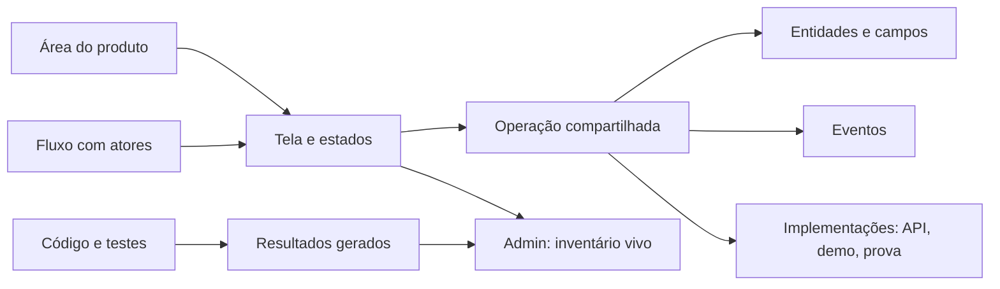

# Inventário vivo da LASTRE

**Versão:** 0.1 · 25/09/2026  
**Escopo:** especificação adaptada à Lastre + primeira interface navegável  
**Origem do método:** Laura Eckert Rodrigues, `~/.claude/knowledge/inventario-vivo.md`, versão de 25/09/2026.  
**Direção de produto:** [Lastre Investors + Lastre Assets](LASTRE_PRODUCT_ARCHITECTURE.md). Assets permanece um nome proposto.

O inventário deve mostrar a diferença entre o produto que pretendemos construir e o que o código consegue demonstrar. Na Lastre, isso inclui distinguir demonstração, persistência de sessão, consulta à Casper Testnet, prova de integridade, compartilhamento entre organizações e decisão humana. Essas capacidades não podem receber um único selo de “integrado”.

O admin é o lugar de consulta desse inventário. Produto, design e engenharia editam os registros no repositório; o admin reúne registros declarados e resultados gerados, preservando a origem de cada informação. O inventário técnico não é um dossiê de ativo do cliente.

## 1. O que esta entrega implementa

A regra obrigatória de atualização está em [AGENTS.md](../AGENTS.md) e no
[procedimento do frontend](FRONTEND_INVENTORY.md), também exibido na seção
**Regra de alteração** do Admin. As fichas LA-006, LA-007 e AD-001 têm contratos
funcionais em `specifications.ts`; as demais indicam quando esse detalhamento
ainda está pendente. O build do app confere o inventário antes de compilar.

Inventário é uma única página do Admin, cujo layout compartilhado fica em
`AdminLayout.tsx`. As seis visões são abas da página. Cada ficha abre um drawer
com abas próprias de Visão geral, Contrato, Estados, Operações e Fluxos; a seleção
é preservada por `?screen=` e `?tab=`. O menu administrativo fica disponível para
receber outras páginas, sem tratar as visões do inventário como destinos do Admin.

A assinatura de atualização inclui fontes do app, site e design system,
incluindo estilos e componentes compartilhados. A extração automática de rotas
continua restrita ao adaptador do app; sincronização não atesta revisão funcional.

| Implementado | Limite explícito |
|---|---|
| Prévia em `/admin/inventario`, com navegação por `?view=` | Disponível somente no servidor Vite de desenvolvimento; sem autenticação administrativa |
| Visão geral, catálogo, fichas em drawer, fluxos, operações e verificações | Não há captura automática, grafo, avaliação automática de risco ou monitoramento remoto |
| Busca, filtros por área/existência e links de ficha por `?screen=` | Estados de UI e relações tela–operação são declarações iniciais, não provas de execução |
| Catálogo do console, entrada da demo, site, design system, admin, Assets e Investors | Telas futuras ficam marcadas como planejadas e fora da cobertura das rotas existentes |
| Extração sintática de rotas JSX do app e da entrada especial de design system | Não resolve árvores condicionais arbitrárias, aliases de `Route`, configurações de router em objetos ou roteamento de `web/` |
| Verificação de referências e existência dos arquivos/funções citados | Não valida corpo do handler, schema, guard, importação do contrato ou comportamento |
| Snapshot determinístico, conferência de atualização e testes do adaptador | A impressão digital identifica os insumos lidos; não equivale a selo de evidência por símbolo |
| Exportação JSON pela interface | O pacote Markdown/CSV de handoff ainda será implementado |

Os números exibidos vêm do registro e de `generated/report.json`. Este documento define o método e sua implantação; não mantém uma segunda lista de todas as telas. As fichas vivem em [screens.ts](../app/src/lib/inventory/screens.ts), as operações em [operations.ts](../app/src/lib/inventory/operations.ts) e os fluxos em [flows.ts](../app/src/lib/inventory/flows.ts).

### Como abrir e atualizar

Com as dependências do app instaladas (`npm --prefix app ci`):

```bash
# Na raiz do repositório
npm run inventory:sync
npm run inventory:check
npm run inventory:test
npm --prefix app run dev:web
```

Abrir `http://localhost:5174/admin/inventario`. O frontend basta; a prévia não chama a API, não semeia sessão demo nem executa processamento, mint ou pagamento. Se o Vite escolher outra porta, usar a URL informada no terminal.

Links de trabalho:

- `/admin/inventario?view=catalogo&app=assets`
- `/admin/inventario?view=catalogo&screen=LA-007`
- `/admin/inventario?view=fluxos`
- `/admin/inventario?view=operacoes`
- `/admin/inventario?view=qualidade`

`inventory:sync` escreve somente em `app/src/lib/inventory/generated/`. `inventory:check` recompila em memória, compara com o snapshot versionado e falha se houver divergência. `inventory:test` testa o extrator e a reconciliação. Não há comando de aprovação ou publicação implícito nesses scripts.

## 2. Leitura do repositório e consequências

Esta é uma leitura do código local. Não atesta o estado de serviços implantados.

| Evidência local | Consequência para o inventário |
|---|---|
| [App.tsx](../app/src/App.tsx) usa React Router; [main.tsx](../app/src/main.tsx) tem entradas independentes | Adaptar o extrator à árvore de rotas e às entradas especiais; não procurar `page.tsx` de Next.js |
| [web/src/main.tsx](../web/src/main.tsx) seleciona landing, decks e diagramas por pathname | Outro adaptador; `app:/` e `web:/` são identidades distintas |
| [LotDetail.tsx](../app/src/routes/LotDetail.tsx) redireciona para `/lots?lot=…`; `/chain` redireciona para `/audit` | Manter atalhos no universo de rotas, mas não contá-los como páginas independentes |
| [RequireAuth.tsx](../app/src/components/onboarding/RequireAuth.tsx) lê o contexto de onboarding; [initDemoSession.ts](../app/src/lib/initDemoSession.ts) cria sessão local | Não reaproveitar essa condição como autorização de admin ou isolamento organizacional |
| [api.ts](../app/src/lib/api.ts) concentra parte dos acessos, com fallback local em `getLot` e `getAuditRecord` | Uma função pode ter API + fallback; nome do arquivo e existência de `fetch` não determinam estado do dado |
| [server/index.ts](../app/server/index.ts) usa `node:http`, comparações de caminho e regex | Handler é ramo de código com método, condição e ação; não é um arquivo por endpoint |
| [runtime.ts](../app/server/runtime.ts) tem caminhos de sessão, simulação e facilitadores configuráveis | Separar implementação, ambiente, persistência e modo de execução |
| [CI](../.github/workflows/ci.yml) já verifica frontends, agentes e contratos | Acrescentar gates incrementais; não afirmar que testes de agentes comprovam todas as telas |
| [Arquitetura de produto](LASTRE_PRODUCT_ARCHITECTURE.md) propõe organizações, versões, compartilhamento e análises | Esses contratos nascem como propostas, sem inventar endpoints existentes |

`Chain.tsx` existir no diretório não prova que `/chain` renderiza esse componente. `noindex` em decks e diagramas não é autorização. Um contador ou hash exibido na demo não basta para afirmar liquidação ou confirmação on-chain.

## 3. Áreas e identidade estável

As áreas são experiências lógicas; não obrigam criar novos deploys ou bancos. Prefixos e IDs desta primeira entrega são a semente do registro.

| Área | Prefixo | Responsabilidade | Situação |
|---|---|---|---|
| Site e apresentações | LW | Comunicação pública e superfícies de trabalho do site | Existente; adaptação automática pendente |
| Console demonstrativo | LC | Captura, processamento e inspeção técnica | Existente; preservar durante a evolução |
| Entrada da demo | ID | Login e escolha de perfil demonstrativos | Existente; não representa a futura identidade organizacional |
| Lastre Assets | LA | Cadastro, documentos, solicitações e envio | Proposta; nome e prefixos de URL não definem implantação |
| Lastre Investors | LI | Análise de evidências, esclarecimentos e decisões | Proposta |
| Admin Lastre | AD | Inventário, qualidade e futura operação interna | Prévia local do inventário |
| Design system | DS | Tokens, componentes e padrões | Existente |

Infraestrutura de prova, agentes e contratos Casper participam como implementações de operações, entidades e evidências. Não precisam virar um “app com telas” para entrar no modelo.

As rotas `/assets/...` e `/investors/...` são propostas explícitas. Não renomear automaticamente `/my-assets` para Assets ou `/marketplace` para Investors: os objetivos, os dados e a autorização são diferentes. O catálogo também não pressupõe que um investidor possa realizar aportes.

Na implantação completa, mudança de identidade exige registro de migração/lápide, motivo e substituta. Redirects preservam compatibilidade e continuam sendo conferidos. O gate histórico compara com o commit-base do PR; unicidade no snapshot atual, implementada agora, não substitui essa verificação.

## 4. Os sete registros na Lastre

| Registro | Conteúdo da Lastre | Fonte e responsabilidade propostas |
|---|---|---|
| App | Público, prefixo, shell, jornadas e política de acesso | Produto; engenharia revisa acesso |
| Tela | Objetivo, identidade, rota/hospedeira, operações e afirmações | Produto + frontend |
| Estado | Vazio, indisponível, versão alterada, acesso revogado, envio confirmado | Frontend + backend para semântica de erro |
| Fluxo | Tarefa, atores, precondições e resultado verificável | Produto + testes ponta a ponta |
| Operação | Entrada, saída, erros, autorização, idempotência e efeitos | Backend com revisão de produto |
| Entidade | Estrutura, campos sensíveis, ownership, versões e retenção | Backend + responsável por dados |
| Evento | Nome, payload mínimo, momento e finalidade | Produto + engenharia |

Evidência, decisão e dossiê técnico são anexos desses registros. “Dossiê técnico de tela” e “dossiê do lote” devem ter nomes e IDs distintos no admin.



### Proveniência obrigatória

| Origem | Exemplo | Regra |
|---|---|---|
| Identidade | `LA-007`, app, tipo de superfície | Estável e rastreada historicamente |
| Declarado | Objetivo, dono, estados esperados, operação usada | Gerador nunca reescreve |
| Derivado | Rota encontrada, chamada extraída, resultado de teste | Somente máquina escreve em `generated/` |
| Proposto | Rota futura, schema ainda em discussão, evento desejado | Marca visual própria; fora de métricas de implementação |

Na v0.1, “função observada” significa função citada e encontrada no cliente atual. Não significa `implement(op, { real })`, contrato compartilhado ou operação provada. Listas de estados vazias nas fichas existentes significam **não auditado**, não “tela sem estados”.

### Tela, estado e superfície hospedada

No modelo completo, uma tela tem uma rota estruturada **ou** uma hospedeira. Um estado da mesma tela não recebe ID de página artificial.

```ts
// Exemplos de formato-alvo; defineScreen e defineState ainda não existem.
type Location =
  | { route: { origin: 'app' | 'web'; path: string; query?: Record<string, string> } }
  | { host: { screen: string; kind: 'drawer' | 'modal' | 'tab'; trigger: string } };

const lotDetailLocation: Location = {
  host: { screen: 'LC-002', kind: 'drawer', trigger: 'abrir-lote' },
};
```

Para o drawer de lote existente, confirmar o gatilho real antes de promover esse exemplo a registro implementado. A primeira entrega cadastra o redirect compatível; a extração de superfícies hospedadas fica para a fase seguinte.

## 5. Contrato compartilhado entre front e back

O objetivo é que `dossie.compartilhar` seja importado tanto pelo frontend quanto pelo handler. O transporte HTTP implementa o contrato. Um endpoint presumido não conta como backend pronto.

### Exemplo de contrato proposto: compartilhar versão

| Campo | Especificação proposta |
|---|---|
| ID | `dossie.compartilhar` |
| Tipo | Comando |
| Entrada | `dossieId`, `expectedVersionId`, `recipientOrganizationId`, `purpose`, `idempotencyKey` |
| Identidade confiável | Usuário e organização de origem derivados da sessão no servidor, nunca aceitos apenas do corpo |
| Saída | `shareId`, `versionId`, `recipientOrganizationId`, `confirmedAt`, `receiptId` |
| Pré-condição | Papel de envio; ownership do dossiê; destinatário permitido; requisitos satisfeitos |
| Efeito | Criar compartilhamento e recibo ligados a uma versão imutável; registrar evento |
| Idempotência | Unicidade por organização autenticada + ID da operação + chave; mesma chave com payload distinto retorna conflito |
| Consistência | Validar `expectedVersionId` no mesmo limite transacional do compartilhamento |
| Transporte | A definir com backend; não existe endpoint de compartilhamento comprovado no app atual |
| Situação | Proposta; schemas runtime e contrato aprovado ainda pendentes |

| Resultado/erro proposto | Estado da tela | Recuperação esperada |
|---|---|---|
| Não autenticado | `sessao-expirada` | Autenticar e retomar com revisão; não reenviar automaticamente |
| `SEM_PERMISSAO` | `sem-permissao` | Explicar quem pode enviar; não revelar documentos de outro escopo |
| `VERSAO_DESATUALIZADA` | `versao-desatualizada` | Exibir versão atual e pedir nova revisão |
| `DESTINATARIO_INVALIDO` | `destinatario-invalido` | Corrigir destinatário antes de confirmar |
| `REQUISITOS_PENDENTES` | `requisitos-pendentes` | Abrir itens que faltam sem perder contexto |
| `INDISPONIVEL` | `indisponivel` ou `confirmacao-pendente` | Distinguir falha antes do envio de timeout após possível efeito; consultar pela chave |
| Repetição equivalente | `duplicado` | Recuperar o mesmo recibo; sucesso equivalente |
| Confirmação persistida | `recibo` | Mostrar destinatário, finalidade, versão e momento confirmados |

Os erros da semente são parciais. A tabela acima descreve o trabalho necessário antes de aprovar o contrato, inclusive autenticação e conflito de chave. Um timeout não deve autorizar repetir o efeito com chave nova.

### Outros contratos prioritários

- `analise.solicitarEsclarecimento`: vincular pergunta a requisito e versão; identificar quem responde; preservar histórico.
- `analise.registrarDecisao`: papel de decisor, versão analisada, fundamento e finalidade; correção posterior por novo registro, sem apagar a decisão anterior.
- `verificacao.consultarResultado`: separar status da execução, resultado técnico, método, versão e limitações. Contrato ainda a registrar.
- `acesso.revogarCompartilhamento`: cessar acessos futuros conforme regra de produto e registrar o efeito. Não prometer apagar cópias já baixadas. Contrato ainda a registrar.

### Migração do cliente atual

1. Enumerar cada função exportada de `api.ts`, cada `fetch` fora dele e cada handler de `server/index.ts`.
2. Relacionar funções, métodos e ramos reais; regex como `requeue|discard|override` produz três ações distintas.
3. Cadastrar schemas e erros extraídos do comportamento confirmado. Uma lacuna fica pendente; não recebe resposta inventada.
4. Colocar schemas puros num pacote compartilhado, com validação runtime, e registrar implementações por modo.
5. Fazer front e handler importarem o mesmo contrato; substituir `any` aos poucos.
6. Testar entrada, saída, erros, autorização, idempotência e efeitos. Só então marcar aquela implementação como provada.

O pacote atual do app não depende de Zod. A escolha de validador e o pacote compartilhado são parte da próxima etapa; a primeira tela não adiciona uma dependência apenas para simular contratos completos.

## 6. O estado do dado exige mais de um eixo

O método original usa proposta → mock → real → provada. A Lastre precisa preservar essa maturidade e acrescentar o contexto da implementação.

| Eixo | Valores-alvo | Exemplo |
|---|---|---|
| Contrato | Proposto, acordado, implementado, provado | Ter TypeScript no cliente não é contrato runtime |
| Origem | Fixture, navegador, runtime, serviço, cadeia, indeterminada | `getLot` combina API e fallback demo |
| Persistência | Nenhuma, local, sessão, durável, indeterminada | Recibo em memória não é confirmação durável |
| Ambiente | Local, demo, testnet, produção, indeterminado | Testnet não implica produção |
| Execução | Simulada, real, mista, indeterminada | `/simulate` e `/settle` não recebem o mesmo selo |
| Evidência | Não testada, passou, falhou, expirada | Resultado sempre vinculado ao insumo e à execução |

Derivar esses eixos de implementações registradas, configuração verificada e testes. Não inferir que uma chamada à API usa dado persistido. Não inferir que `mock` no nome cobre todos os caminhos demonstrativos.

Na agregação por tela, exibir as lacunas e a combinação dos caminhos usados. “Mista” é informação útil. Ausência de mapeamento é `INDETERMINADO`; nunca converter `[]` automaticamente em “estática”. A v0.1 mantém os estados de dado e de risco como não avaliados.

## 7. Risco, prontidão e afirmações

O risco responde ao impacto potencial. Prontidão responde à qualidade da implementação e das evidências. Uma tela arriscada com testes verdes continua arriscada, embora possa estar pronta.

### Fórmula proposta

1. **Vermelho:** efeito irreversível, pagamento real, compartilhamento externo, decisão atribuída a alguém, acesso a campos pessoais, credenciais ou alteração de acesso.
2. **Laranja:** uma aresta de ação crítica; superfície pública que afirma um resultado de prova ou um direito sobre ativo.
3. **Amarelo:** alcança uma ação crítica no grafo, sem condição anterior.
4. **Verde:** operações e dados conhecidos, sem condições anteriores.
5. **Indeterminado:** inventário de operações/dados/grafo insuficiente. Se já houver evidência de risco alto, manter o risco alto e adicionar a lacuna; incompletude nunca rebaixa risco.

Fontes: classes das operações, campos das entidades, escopo de acesso e grafo de navegação sem sidebar/layout. O ambiente acompanha a classificação: liquidação real em testnet ainda é um efeito, com seu alcance identificado; simulação não vira “dinheiro real” por usar o vocabulário de x402.

Persistir distância inalcançável como `null`, reconstituir como infinito e usar `Number.isFinite` antes de comparar. Não tratar `null` como zero. Risco não depende da validade do selo de evidência.

### Profundidade exigida

| Risco | Conteúdo exigido quando os gates estiverem ativos |
|---|---|
| Verde | Identidade, objetivo, dono, operações, estados mínimos |
| Amarelo | Anterior + mapeamento de todos os erros |
| Laranja | Anterior + dois cenários de stress e lastro para afirmações |
| Vermelho | Anterior + três pré-mortems, prova dos cenários, dados pessoais listados, sinais de confiança e veredito |
| Indeterminado | Lista explícita das lacunas; impedimento de alegar prontidão |

`INCOMPLETO` é calculado e não recebe override no admin. `prontaParaBackend` exige contratos acordados, erros cobertos e fluxos definidos; `prontaParaProducao` acrescenta implementações provadas, acesso, persistência adequada e dossiê completo. Cobertura de rota não entra como substituto de nenhum desses critérios.

### Afirmações que a Lastre deve sustentar

| Afirmação da UI | Evidência necessária |
|---|---|
| “Documento recebido” | Identificador e confirmação de persistência do documento |
| “Enviado para a organização X” | Compartilhamento persistido, destinatário e versão exatos |
| “Integridade verificada” | Método, versão, entradas examinadas e resultado determinístico |
| “Registrado na Casper” | Transação real da rede indicada, com confirmação observada; nenhum hash sintético |
| “Análise concluída” | Decisão humana persistida, autoria, finalidade e versão examinada |
| “Acesso revogado” | Teste de negação do acesso futuro no servidor, inclusive download/exportação |

“Origem garantida”, “investimento seguro” ou “rentabilidade comprovada” não decorrem de um selo de integridade. A regra de linguagem deve avaliar afirmações e contexto. Não copiar uma proibição global de “token” ou “crypto” da Akrus: esses termos podem ser necessários na inspeção técnica da Lastre.

### Pré-mortem de LA-007 — exemplo a implementar

| Esta tela falha se… | Mecanismo | Teste exigido |
|---|---|---|
| A versão mudar depois da revisão | Compartilha documentos não revisados | Conflito de versão antes do efeito |
| Um retry criar outro envio | Timeout após persistência seguido de chave nova | Duas tentativas com a mesma chave retornam o mesmo recibo |
| O destinatário for resolvido no tenant errado | Autorização usa apenas ID do objeto | Duas organizações e tentativa cruzada negada |
| O recibo aparecer antes da gravação durável | Frontend trata resposta parcial como conclusão | Falha de persistência não renderiza “enviado” |

Esses testes são requisitos, não evidências já existentes.

## 8. Entidades, campos sensíveis e eventos

O runtime atual não deve ser documentado como um banco multiempresa pronto. As entidades abaixo são modelos propostos, sem migrations afirmadas como existentes.

| Entidade proposta | Relações necessárias | Campos/exposição a registrar |
|---|---|---|
| Organização e participação | Pessoa, organização, papel, vigência | Nome, email, vínculo e permissões |
| Ativo e lote | Organização de origem, responsável | Identificadores; coordenadas e localização com classificação contextual |
| Documento | Objeto, autor, versão, armazenamento | Texto livre, metadados e pessoas citadas; potencialmente sensível |
| Versão de dossiê | Conteúdo imutável e origem | Snapshot exato; não apontar apenas para arquivos mutáveis |
| Compartilhamento | Versão, destinatário, finalidade, vigência | Acesso entre organizações e revogação |
| Verificação | Objeto/versão, método, execução | Resultado técnico, limites e referências |
| Análise e decisão | Organização analista, responsável, versão | Fundamentação em texto livre e comunicação externa |
| Recibo e histórico | Operação, ator, objeto e momento | Rastreabilidade; payload mínimo e acesso restrito |

PII é classificação por campo e contexto. Hashes e identificadores pseudônimos podem continuar correlacionáveis. Não publicar documentos, textos livres ou dados de clientes em artefatos do inventário. Screenshots e fixtures usam dados fictícios. Prazos de retenção permanecem decisão pendente; o inventário registra a pendência, sem inventar um prazo legal.

Eventos de negócio propostos: `dossie.compartilhado`, `analise.esclarecimentoSolicitado`, `analise.decisaoRegistrada`. Payload mínimo: IDs internos, versão, execução e organização autorizada; nunca o conteúdo do documento ou a justificativa integral por padrão.

Evento de auditoria durável e evento de analytics têm funções distintas. A emissão de analytics não comprova que a operação foi persistida. O inventário v0.1 ainda não contém registros de entidade/evento nem gate de emissão.

## 9. Fluxos: navegação e troca de ator

O primeiro ciclo vem da arquitetura de produto: solicitar → responder → compartilhar versão → examinar → esclarecer → decidir → acompanhar mudança.

Dentro de uma sessão, conferir `<Link>`, `navigate`, redirects e gatilhos de superfície hospedada. Não percorrer a sidebar para concluir que toda tela alcança uma ação crítica em um passo.

Entre Investors e Assets há **troca de ator e organização**. Não exigir um link de navegação direta da tela do analista para a tela privada do fornecedor. O formato-alvo de fluxo deve conter:

- `actor` e `organizationRole` por passo;
- `transition: navigation | operation | handoff`;
- evento/objeto que habilita o próximo ator;
- precondição, versão e resultado esperado;
- fixture e conta de teste específicas de cada ator.

O gate G6 confere arestas apenas em transições de navegação; em handoffs, confere o contrato de entrega e a precondição do destinatário. As três jornadas da prévia são propostas e não contam como fluxos executáveis comprovados.

## 10. Admin: arquitetura e experiência

### Estrutura proposta

O admin da plataforma Lastre é diferente de “administrador da organização” dentro de Assets/Investors. O primeiro acompanha produto e operação interna; o segundo gerencia sua equipe e seus dados autorizados.

Na primeira entrega, `/admin/inventario` tem shell próprio. A entrada em `main.tsx` é condicionada a `import.meta.env.DEV`; Vite elimina o import dinâmico no build de produção. O admin definitivo exigirá sessão validada no servidor e autorização específica. Nenhuma flag local concede acesso interno.

Menu inicial: **Construção do produto → Inventário vivo**. O design system fica como referência próxima. Não preencher o admin com módulos vazios de usuários, faturamento ou operação. Acrescentar esses módulos quando houver tarefa, acesso e contrato reais.

### Visões e implantação

| Visão | Pergunta | v0.1 | Evolução |
|---|---|---|---|
| Visão geral | Quais áreas existem e o que falta? | Contagens e cartões por área | Distribuição de maturidade por operação |
| Catálogo | O que cada tela permite fazer? | Busca, filtros e ficha | Capturas por estado; revisão de afirmações |
| Fluxos | Como a tarefa passa pelos atores? | Sequências propostas clicáveis | Grafo validado, capturas e resultado e2e |
| Operações | O que a UI espera do backend? | Funções observadas e propostas | Schemas, handlers, erros e teste de contrato |
| Verificações | O que o código já confere? | Gates implementados e pendentes | Baseline e histórico de execuções |
| Dados | Quem acessa quais dados? | Planejada | Entidade → campo → operação → tela |
| Acesso | Quem pode fazer o quê? | Planejada | Matriz papel × organização × objeto × rota/ação |
| Risco | Onde o impacto exige mais prova? | Planejada | Risco calculado e profundidade do dossiê |
| Grafo | De onde se chega e para onde se vai? | Planejada | Arestas sem chrome; indeterminadas visíveis |
| Mudanças | O que o PR alterou no produto? | Planejada | Diff entre commits e comentário autorizado no PR |

Visões ainda não implementadas são descritas aqui; não aparecem como botões sem função na prévia.

### Ficha da tela

Agora: identidade, propósito, rota, fonte, responsável proposto, acesso, operações declaradas, estados propostos, lacunas de risco e fluxos relacionados. Drawer usa diálogo modal nativo, fechamento por Escape e retorno de foco.

Na evolução: Visão geral · Estados · Fluxos · Contratos · Dados e acesso · Pré-mortem e stress · Afirmações e confiança · Decisões. Mostrar a origem de cada campo e não esconder pendências atrás de um selo verde. Rota dinâmica recebe exemplo com fixture; não abrir `:assetId` literalmente como se fosse uma instância válida.

### Critérios de interface

- Usar tokens, tipografia e temas do design system da Lastre; estados têm rótulo textual além de cor.
- Filtros e ficha em URL permitem recarregar, compartilhar contexto e voltar pelo navegador.
- Tela planejada não tem botão “Abrir produto” que leva a rota inexistente.
- Resultado vazio de busca oferece limpeza de filtros. Relatório ausente/desatualizado deve produzir falha de check, não números fabricados.
- Em mobile, navegação horizontal e tabela com rolagem contida; ficha ocupa a largura disponível.
- Exportação inclui proveniência e escopo. Exportar não executa operações do produto.

### Autorização do admin definitivo

Permissão proposta `inventory.read`, concedida a papéis internos explícitos. Administrador de organização cliente não herda essa permissão. Requisição sem sessão válida retorna 401; sessão sem permissão retorna 403. Rotas administrativas desconhecidas não herdam acesso.

Ao publicar um admin real, remover registros internos do bundle público e entregar snapshot por serviço protegido, com validação no servidor. Ocultar menu, adicionar `noindex` ou guardar permissão no navegador não protege o relatório. Isso é requisito da migração do preview para admin, não uma capacidade pronta.

## 11. Gates e catraca

| Gate | Regra Lastre | Estado da primeira entrega |
|---|---|---|
| G1 | Declaração de rota existente tem ficha; ficha existente tem rota | Implementado no escopo do adaptador do app; web excluída com motivo |
| G2 | IDs únicos, apps/operações/passos referenciados existem | Implementado |
| G3 | Cada handler corresponde a uma operação | Pendente; enumerar métodos e ramos de regex |
| G4 | Operações declaradas correspondem às chamadas | Pendente; incluir acesso direto e fallback |
| G5 | Erros possuem estado e recuperação | Pendente; incluir timeout após possível efeito e conflitos de versão |
| G6 | Fluxos têm navegação ou handoff verificável | Pendente; referência do passo existe, mas isso não prova aresta |
| G7 | Acesso real bate com matriz de papéis e organizações | Pendente; produção do admin depende disso |
| G8 | Campos pessoais/sensíveis estão declarados | Pendente |
| G9 | Evidência ainda existe | Parcial: arquivos e assinatura textual de função; símbolo/teste/execução ainda pendentes |
| G10 | Evidência está atualizada | Pendente; fingerprint do snapshot não é prova da afirmação |
| G11 | Profundidade exigida e prontidão | Pendente; nenhuma tela recebe “pronta” automaticamente |
| G12 | Snapshot igual ao derivado dos insumos | Implementado por `inventory:check` |
| G13 | Eventos emitidos pertencem ao registro | Pendente |
| G14 | Copy respeita o alcance do resultado e o ambiente | Pendente; não usar banimento lexical sem contexto |
| G15 | IDs não reutilizados; lápides preservadas | Pendente; unicidade atual é G2, histórico exige comparação entre commits |

Gates adicionais Lastre, a implementar: separar simulação de liquidação, vincular prova à versão, impedir afirmação de persistência durável sobre memória, distinguir veredito determinístico de decisão humana e negar acesso cruzado entre organizações.

O CI executa testes e `inventory:check` no job do app. O check falha em dívida nova dos gates ativos ou snapshot desatualizado. Gates não implementados aparecem como pendentes e não recebem sucesso fictício.

Quando ativar um gate com dívida existente, criar `baseline.json` **declarado e revisado**, fora de `generated/`, com chave estável, dono, motivo e critério de saída. O gerador não pode aceitar dívida automaticamente. Nova dívida reprova; dívida resolvida ainda presente no baseline também reprova. Exemplo: `G4:LC-010:artefato.criar`.

Não há baseline nesta primeira entrega: os checks limitados que foram ligados começam sem dívida. Hooks de pre-commit ficam para uma etapa posterior; não foram instalados nem alterados nesta entrega. Localmente, rodar sync/check antes de enviar a mudança.

## 12. Evidência e handoff

Formato-alvo de evidência:

1. Teste: arquivo, nome estável e resultado de execução associado ao commit/insumos. Arquivo de teste existir não significa teste verde; teste não executado não comprova comportamento.
2. Código: símbolo e hash do seu conteúdo semântico. Não usar hash de arquivo inteiro como selo de toda afirmação.
3. Consulta: ambiente, escopo, data, resultado redigido e validade.
4. Manual: captura com dados fictícios, responsável, data e validade.

Consulta ou evidência manual vencida torna a afirmação não sustentada. Não rebaixar risco por isso. Selagem deve aceitar escopo por tela/evidência e exigir releitura apropriada; nenhum comando deve recarimbar tudo silenciosamente.

O handoff completo, quando implementado, será exportado do registro para `docs/handoff/`: telas, estados, fluxos, operações, schemas, erros, permissões, idempotência, efeitos e aceite. O backend recebe uma lista fechada por incremento, não um catálogo de endpoints imaginados.

Conteúdo mínimo por operação aprovada: contrato de entrada/saída, teste por erro, teste por papel/organização, teste de idempotência quando aplicável, precondição de versão e critério de persistência. O mesmo contrato valida implementação demonstrativa e real; divergência de payload não pode ficar escondida pela UI.

Documentos históricos como `FRONTEND_ROUTES.md` e `API_CONTRACT.md` continuam como contexto durante a migração. Só substituí-los por exports quando os adaptadores cobrirem suas superfícies. Esta especificação descreve política e formato; não duplica o catálogo integral.

## 13. Arquivos e próximos incrementos

Estrutura implementada:

```text
app/src/lib/inventory/
  types.ts                 # formato tipado dos registros atuais
  apps.ts                  # áreas e acesso declarado
  screens.ts               # fichas existentes e propostas
  operations.ts            # funções observadas e operações propostas
  flows.ts                 # jornadas propostas
  generated/report.json    # somente o gerador escreve
app/src/routes/admin/
  AdminPreview.tsx          # roteador exclusivo da prévia de desenvolvimento
  Inventory.tsx            # interface de consulta
  inventory.css            # estilos com tokens Lastre
scripts/
  inventory-core.ts        # extração AST e reconciliação
  inventory.ts             # sync/check
  inventory.test.ts        # testes do adaptador
docs/LASTRE_INVENTARIO_VIVO.md
```

O núcleo declarado fica junto do app nesta primeira entrega para evitar empacotamento artificial. Na fase de contratos compartilhados, extrair `packages/inventory` e um núcleo de contratos puros, sem dependências de React ou Node. Separar fichas por área/arquivo conforme o registro crescer; não deixar `screens.ts` virar o monólito da Akrus.

| Incremento | Entrega | Critério de avanço |
|---|---|---|
| I0 — entregue | Especificação, catálogo, prévia, reconciliação e CI | Rotas do adaptador cobertas, snapshot reproduzível, navegação verificável |
| I1 — ampliar leitura | Adaptadores de web, handlers Node, chamadas e superfícies hospedadas | Toda exclusão nomeada; `INDETERMINADO` visível; G3/G4 com baseline revisado |
| I2 — contrato do primeiro ciclo | Compartilhar versão, solicitar esclarecimento, registrar decisão | Schemas acordados, erros/estados completos, idempotência e fixtures |
| I3 — acesso e persistência | Sessão real, organizações, autorização de admin e domínio durável | Matriz no servidor e testes cruzados; só então disponibilizar admin interno |
| I4 — evidência e risco | Entidades, eventos, cálculo de risco, dossiês e afirmações | Risco calculado sem falsa redução por falta de evidência |
| I5 — fluxos provados | Grafo, handoffs, e2e por ator e capturas | Primeiro ciclo completo entre duas organizações, incluindo falhas |
| I6 — operação do inventário | Export de handoff, diff de PR e histórico | Sem edição paralela do mesmo fato em Markdown |

### Definição de pronto do inventário completo

- Toda superfície tem identidade ou exclusão justificada, com origens de deploy distintas.
- Cada operação real importa um contrato compartilhado; mock e real usam o mesmo schema.
- Estados cobrem erros, versões alteradas, indisponibilidade, acesso e recuperação após timeout.
- Sessão, demo, testnet e produção não se confundem em métricas nem em linguagem.
- Compartilhamento e decisão apontam para uma versão exata e têm efeitos comprovados.
- Grafo ignora navegação global; handoff troca ator de forma explícita.
- Acesso é conferido no servidor por papel, organização, objeto e versão.
- Risco, prontidão e evidência permanecem dimensões distintas.
- Derivados não reescrevem conteúdo humano; exports não viram outra fonte editorial.
- O admin mostra o que falta provar com a mesma clareza com que mostra o que já existe.
