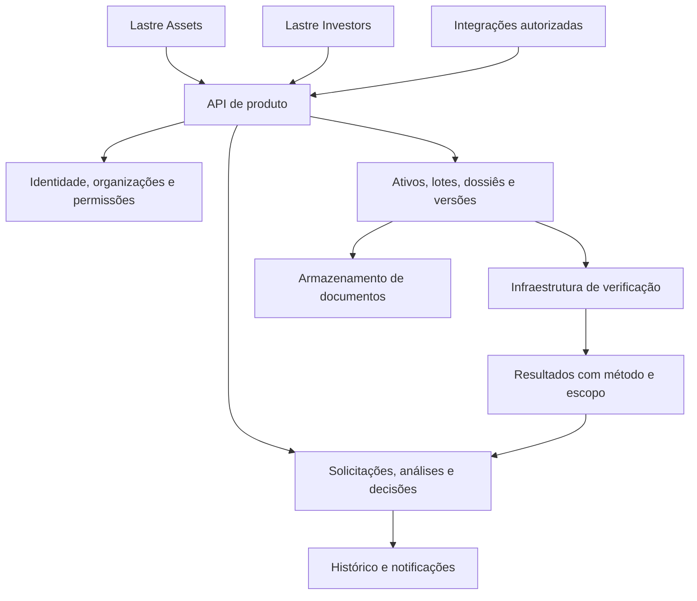

# Lastre Investors + Lastre Assets

## Arquitetura de produto, experiência e organização de funcionalidades

**Data:** 25 de setembro de 2026  
**Versão:** 0.1 — proposta detalhada para discussão e execução  
**Responsáveis pela leitura:** produto, design, frontend, backend, pesquisa e operação  
**Escopo:** duas experiências de produto sobre a infraestrutura de prova da Lastre  
**Direção solicitada:** Lastre Investors  
**Nome proposto para o segundo app:** Lastre Assets

Este documento transforma a discussão de arquitetura em uma referência persistente. Reúne perguntas, respostas recomendadas, justificativas, jornadas, objetos de domínio, navegação, estados, funcionalidades, critérios de aceitação e sequência de entrega. É uma especificação proposta; não representa funcionalidades já implementadas nem resultados de entrevistas que ainda não ocorreram.

As respostas foram construídas a partir das instruções desta conversa, do mapa de públicos, do corpus estratégico e da leitura de partes do app atual. O documento usa a distinção abaixo para evitar que uma recomendação seja confundida com uma decisão aprovada ou um fato de mercado.

| Classificação | Significado |
|---|---|
| Diretriz confirmada | Instrução expressa nesta conversa: dois apps; prova no backend; experiência compreensível; documentação detalhada |
| Proposta | Escolha recomendada de produto ou arquitetura, ainda ajustável |
| Hipótese de piloto | Suposição operacional a verificar com os primeiros participantes |
| Evidência do repositório | Comportamento ou estrutura observada nos arquivos citados |
| Validação pendente | Pergunta cuja resposta depende de pesquisa, operação ou decisão de negócio |

### Índice

1. [Decisões de partida e posicionamento](#1-decisões-de-partida-e-posicionamento)
2. [Arquitetura de marca e nomes](#2-arquitetura-de-marca-e-nomes)
3. [Públicos, responsabilidades e primeiro caso de uso](#3-públicos-responsabilidades-e-primeiro-caso-de-uso)
4. [Perguntas estruturantes com respostas recomendadas](#4-perguntas-estruturantes-com-respostas-recomendadas)
5. [Modelo de domínio e linguagem compartilhada](#5-modelo-de-domínio-e-linguagem-compartilhada)
6. [Jornadas entre os dois apps](#6-jornadas-entre-os-dois-apps)
7. [Estados, transições e próximos passos](#7-estados-transições-e-próximos-passos)
8. [Arquitetura de informação e navegação](#8-arquitetura-de-informação-e-navegação)
9. [Especificação das telas principais](#9-especificação-das-telas-principais)
10. [Catálogo de funcionalidades e prioridades](#10-catálogo-de-funcionalidades-e-prioridades)
11. [Funcionalidades detalhadas para o primeiro ciclo](#11-funcionalidades-detalhadas-para-o-primeiro-ciclo)
12. [Linguagem, orientação e compreensão](#12-linguagem-orientação-e-compreensão)
13. [Formulários, mobile e acessibilidade](#13-formulários-mobile-e-acessibilidade)
14. [Permissões e compartilhamento entre organizações](#14-permissões-e-compartilhamento-entre-organizações)
15. [Contrato de experiência com o backend](#15-contrato-de-experiência-com-o-backend)
16. [Notificações, histórico e suporte](#16-notificações-histórico-e-suporte)
17. [Métricas e validação com usuários](#17-métricas-e-validação-com-usuários)
18. [Sequência de entrega e critérios de avanço](#18-sequência-de-entrega-e-critérios-de-avanço)
19. [Relação com a implementação atual](#19-relação-com-a-implementação-atual)
20. [Modelo de especificação de uma feature](#20-modelo-de-especificação-de-uma-feature)
21. [Exemplo completo de uso](#21-exemplo-completo-de-uso)
22. [Decisões pendentes e fontes](#22-decisões-pendentes-e-fontes)

## 1. Decisões de partida e posicionamento

### 1.1 O desenho de produto

A plataforma terá duas experiências principais. Lastre Assets atende quem cadastra, organiza e apresenta ativos e produção. Lastre Investors atende quem recebe essas informações, consulta evidências, pede esclarecimentos e registra uma análise. A infraestrutura de prova atende os dois produtos e integra os resultados ao trabalho de cada usuário.

O número de públicos do mapa não determina o número de aplicativos. Perfis distintos podem trabalhar sobre o mesmo objeto com permissões, ações e linguagem diferentes. Um responsável técnico pode contribuir para um dossiê no Lastre Assets. Um auditor pode consultar esse dossiê no Lastre Investors. Essas atividades não exigem criar outro app.

| Experiência | Promessa proposta | Resultado observável |
|---|---|---|
| Lastre Assets | Organize seus ativos e apresente as informações solicitadas | Um cadastro ou lote tem documentação organizada e uma versão compartilhável |
| Lastre Investors | Analise ativos com acesso às evidências disponíveis | Uma pessoa conclui uma análise com fundamentos, pendências e responsáveis registrados |
| Infraestrutura de prova | Execute verificações e preserve resultados rastreáveis | Cada resultado identifica objeto, versão, método, escopo e momento |

### 1.2 O que a arquitetura precisa preservar

O usuário deve saber sobre qual objeto está trabalhando, qual ação pode realizar, o que falta e quem age em seguida. O sistema deve manter esse contexto entre cadastro, envio, verificação, análise e acompanhamento. O dossiê não pode mudar silenciosamente depois de uma decisão.

Prova no backend não elimina responsabilidades humanas na origem do dado. O produto precisa identificar quem declarou, enviou, mediu ou assinou uma evidência. Também precisa distinguir resultado técnico de decisão do cliente. Um documento íntegro e uma análise favorável são informações diferentes.

A prioridade de experiência é concluir um ciclo entre duas organizações. Indicadores, mapas, comparações e automações avançadas só entram quando ajudam esse ciclo ou uma tarefa recorrente comprovada.

### 1.3 Hipótese adotada para especificar o piloto

Para tornar este documento concreto, o piloto usa uma organização que apresenta um lote de material e outra que analisa sua documentação de origem. Todos os exemplos de empresas, pessoas, quantidades e documentos são fictícios. O primeiro setor, o material e os requisitos documentais definitivos permanecem pendentes.

Essa hipótese não limita a plataforma a lotes. O modelo inclui ativos duradouros, áreas e direitos, mas evita exigir o preenchimento de um cadastro patrimonial completo para responder a uma solicitação simples sobre uma produção.

## 2. Arquitetura de marca e nomes

### 2.1 Direção de nomenclatura

Os nomes anteriores, Origem e Decisão, deixam de ser os nomes de produto nesta proposta. Continuam úteis apenas como conceitos internos para explicar a função de cada experiência. Lastre Investors é a direção solicitada para o lado de análise. O usuário esclareceu que “Lastre X” indicava um nome a encontrar; a proposta principal para esse segundo produto é **Lastre Assets**.

O par descreve os dois lados do trabalho: quem organiza e apresenta os ativos e quem os analisa. Assets permite acomodar áreas, direitos, lotes e projetos sem limitar a marca à mineração. A preferência por esse nome é uma recomendação de arquitetura de marca, ainda não uma escolha definitiva do usuário. Não há neste documento verificação de disponibilidade de marca, domínio ou proteção de nome.

### 2.2 Como avaliar o par de nomes

| Nome | O que comunica | Implicação para o produto |
|---|---|---|
| Lastre Investors | Experiência dirigida a investidores | O conteúdo deve explicar quais análises estão disponíveis e qual é o papel do usuário |
| Lastre Assets | Gestão e apresentação de ativos | Faz par com Investors e exige testar a compreensão do termo em inglês |
| Lastre Terra | Alternativa associada a território e produção | Tem vínculo forte com o físico, mas pode parecer estreita para energia, reciclagem e outros setores |
| Lastre Operators | Experiência dirigida a quem opera | Descreve melhor o usuário operacional, mas acolhe menos claramente titulares e proprietários |
| Lastre Enterprise | Software para organizações | Tem amplitude, mas comunica pouco sobre a tarefa e pode parecer um plano comercial |
| Lastre Issuers | Experiência de emissores | Anteciparia emissão como função central, que não é o escopo definido para este produto |

**Recomendação de trabalho:** desenvolver a arquitetura como **Lastre Investors + Lastre Assets**. Assets é o nome com melhor correspondência ao conjunto de tarefas definido aqui. Usar um descritor em português e testar se pessoas dos dois lados conseguem escolher o app adequado sem explicação oral. A escolha definitiva deve considerar entendimento e abrangência, além de preferência estética.

### 2.3 Descritores e linguagem dentro dos apps

Descritores propostos:

- **Lastre Assets — Cadastro e gestão de ativos.**
- **Lastre Investors — Análise de ativos e evidências.**

No primeiro acesso, a pessoa deve entender a função sem precisar interpretar o nome da marca. Menus e botões permanecem em português no uso em português: “Meus ativos”, “Enviar documentos”, “Iniciar análise”. O nome em inglês não obriga a introduzir palavras em inglês no restante da experiência.

Investors pode levar uma pessoa a esperar descoberta de oportunidades, comparação de rentabilidade ou realização de aportes. O escopo desta versão é análise e acompanhamento de evidências. Uma eventual expansão transacional deve ser especificada separadamente, com suas responsabilidades e operação, sem ser presumida pela mudança do nome.

Há também uma decisão comercial: compradores industriais e seguradoras se reconhecerão em Investors? A proposta permite seus fluxos, mas o encaixe do nome para esses públicos precisa ser pesquisado. O produto não deve criar três versões de uma mesma tarefa apenas para compensar um problema de nomenclatura.

## 3. Públicos, responsabilidades e primeiro caso de uso

### 3.1 Distribuição das sete camadas

O mapa reúne 42 públicos comerciais e oito atores institucionais ou sociais. Essa classificação serve para entender relações, e não deve ser convertida diretamente em categorias de acesso.

| Camada do mapa | Entrada proposta | Trabalho atendido inicialmente |
|---|---|---|
| Origem | Lastre Assets | Cadastrar ativos e lotes, apresentar documentos e responder solicitações |
| Prova | Integrações e contribuições contextualizadas | Acrescentar evidência identificada; revisar exceções quando houver responsabilidade humana |
| Mercado | Lastre Investors | Solicitar e analisar informações sobre lotes e fornecedores |
| Capital | Lastre Investors | Analisar evidências de ativos e registrar conclusões internas |
| DeFi | API de provas, em evolução posterior | Consumir resultados estruturados; sem interface específica no piloto |
| Infraestrutura | API e configurações de integração | Integrar sistemas autorizados ao fluxo |
| Estado e sociedade | Acessos específicos ou publicação deliberada | Consultar somente o conteúdo apropriado ao vínculo e à finalidade |

### 3.2 Papéis de trabalho

O primeiro modelo precisa de papéis simples e combináveis. Uma pessoa pode acumular papéis em uma organização. O mesmo papel em empresas distintas não implica acesso aos mesmos dados.

| Papel | Responsabilidade | Exemplo de ação |
|---|---|---|
| Administrador da organização | Gerir participantes e políticas de acesso | Convidar uma pessoa para a equipe |
| Responsável pelo cadastro | Organizar dados e documentos | Criar lote e corrigir um campo |
| Responsável pelo envio | Confirmar o conteúdo apresentado externamente | Compartilhar a versão revisada |
| Analista | Examinar evidências e levantar pendências | Solicitar esclarecimento sobre uma medição |
| Decisor | Registrar uma conclusão em nome da organização | Aceitar a documentação para uma finalidade declarada |
| Colaborador externo | Contribuir com escopo restrito | Anexar o laudo solicitado para um lote |
| Leitor | Consultar conteúdo autorizado | Acompanhar um dossiê sem alterá-lo |

### 3.3 Quem paga e quem usa

**Hipótese comercial:** a organização que solicita análises recorrentes é candidata a contratante inicial. O fornecedor convidado recebe um caminho simples para responder. Isso reduz o trabalho de cadastrar informações antes de haver uma necessidade concreta.

Essa é uma hipótese, não uma definição de preços. O piloto precisa medir quem inicia o processo, quem consegue aprovar uma contratação, quem arca hoje com a obtenção de documentos e qual ganho é relevante. Receita não deve depender de uma verificação produzir resultado favorável.

### 3.4 Recorte do primeiro caso de uso

Recomendação: uma análise documental de um lote, com uma finalidade declarada, uma organização fornecedora, uma organização solicitante e um conjunto pequeno de requisitos. A definição de “concluído” é um registro de análise compreensível e rastreável.

O piloto deve comprovar que o fornecedor consegue responder, que o analista entende o alcance das verificações e que o decisor identifica a versão usada. A expansão para outros ativos começa depois de entender quais partes da jornada são comuns e quais exigem modelos próprios.

## 4. Perguntas estruturantes com respostas recomendadas

Cada resposta abaixo é uma proposta de partida. A coluna mental a preservar durante a leitura é: “O que estamos assumindo, por que isso ajuda e como descobriremos se está errado?”.

### Q01. Quem é o usuário principal de Lastre Assets?

**Resposta recomendada:** a pessoa responsável por reunir e apresentar informações sobre um ativo ou lote. Pode ser um gestor, assistente administrativo, produtor ou técnico; não precisa ser o proprietário. O onboarding deve perguntar sua função e organização, evitando presumir titularidade. Validar com quem efetivamente reúne documentos hoje, além de entrevistar quem contrata o software.

### Q02. Quem é o usuário principal de Lastre Investors?

**Resposta recomendada:** o analista responsável por avaliar a documentação e preparar uma conclusão. O decisor pode ser outra pessoa. Essa separação permite iniciar uma análise sem dar a todos poder de encerrá-la. Validar se o cliente trabalha sozinho, em dupla ou com comitê; o primeiro fluxo precisa refletir a rotina real escolhida.

### Q03. O que leva a pessoa a entrar?

**Resposta recomendada:** uma solicitação concreta, um novo ativo a apresentar ou um caso a analisar. A primeira tela deve recuperar esse contexto. Um convite para enviar um laudo deve abrir a solicitação do laudo, preservando o destino depois do login. A página inicial geral serve à rotina, sem interceptar tarefas já definidas.

### Q04. Qual é o primeiro resultado útil em Lastre Assets?

**Resposta recomendada:** salvar um cadastro identificável e entender o que falta para enviá-lo. O primeiro resultado não exige completar todos os dados da empresa. Informações necessárias para compartilhar externamente podem ser solicitadas no momento apropriado. Medir abandono por etapa e observar se as pessoas reconhecem que o rascunho foi salvo.

### Q05. Qual é o primeiro resultado útil em Lastre Investors?

**Resposta recomendada:** abrir um caso e entender objeto, finalidade, origem das informações, pendências e responsável. Uma análise que ainda depende de documentos pode ser útil se mostrar claramente como obtê-los. Não usar uma tela vazia aguardando que alguém descubra onde iniciar a solicitação.

### Q06. A pessoa analisa o ativo ou o fornecedor?

**Resposta recomendada:** o primeiro caso analisa um ativo ou lote com finalidade específica. O fornecedor é uma organização relacionada, com histórico próprio. Uma conclusão sobre um lote não deve aprovar automaticamente todos os lotes daquele fornecedor. O desenho pode evoluir para homologação de fornecedores quando esse trabalho for validado.

### Q07. Área, direito e lote são a mesma coisa?

**Resposta recomendada:** não. Área e direito têm continuidade e documentação própria; lote representa uma quantidade ou conjunto definido em determinado contexto produtivo. A relação entre eles precisa ser registrada sem confundir cadastro com comprovação. O formulário só solicita a entidade adicional quando o tipo de análise realmente precisa dela.

### Q08. Qual é a decisão que o app ajuda a tomar?

**Resposta recomendada:** “a documentação apresentada atende aos requisitos desta análise?”. Essa formulação serve ao piloto sem presumir compra, crédito ou aporte automático. A finalidade deve aparecer na análise. Se o cliente precisar aprovar uma operação financeira ou comercial, suas regras devem ser acrescentadas como processo específico.

### Q09. O que o backend verifica?

**Resposta recomendada:** verificações disponíveis e explicitamente especificadas, como integridade, presença de dados ou consistência de determinados campos. Cada método precisa declarar limites, versão e fonte. A existência de automação não autoriza usar o rótulo genérico “origem garantida”. O inventário de capacidades reais será confirmado com backend antes de definir os textos finais.

### Q10. Que dados devem ser solicitados?

**Resposta recomendada:** somente os dados necessários para identificar o objeto, cumprir os requisitos aplicáveis e atribuir responsabilidade. Cada campo precisa de finalidade, origem e regra de validação. Campos “para talvez usar depois” não entram como obrigatórios. Dados já disponíveis devem ser reaproveitados com confirmação quando apropriado.

### Q11. Quem define os documentos exigidos?

**Resposta recomendada:** a organização solicitante escolhe um modelo de requisitos adequado à sua finalidade. A Lastre pode oferecer modelos configuráveis, com autoria e versão, sem apresentar uma lista genérica como universal. Requisitos de um caso enviado ficam versionados para que alterações não surpreendam o fornecedor.

### Q12. Como apoiar quem não conhece um documento?

**Resposta recomendada:** explicar para que serve, quem costuma emiti-lo e como reconhecer um exemplo. Quando aceitável, oferecer “Não tenho este documento” com motivo e encaminhamento. O sistema deve distinguir ausência de documento, documento inadequado e falha técnica de envio; cada situação pede uma resposta diferente.

### Q13. O que acontece quando falta informação?

**Resposta recomendada:** o cadastro pode continuar como rascunho. Para enviar, o sistema mostra pendências obrigatórias e opcionais separadamente. Se o solicitante permitir justificativa, a pessoa pode enviar a ausência declarada. A análise recebe essa ausência de forma explícita, sem preencher campos com valores fictícios para desbloquear o fluxo.

### Q14. Quem pode compartilhar?

**Resposta recomendada:** um papel autorizado na organização fornecedora, depois de revisar destinatário, finalidade, documentos e versão. A pessoa que anexou um arquivo não recebe automaticamente permissão para distribuí-lo. Equipes pequenas podem acumular funções, mantendo registro de quem executou cada ação.

### Q15. Quem pode registrar a decisão?

**Resposta recomendada:** um decisor designado pela organização que conduz a análise. Analistas podem recomendar, pedir documentos e registrar observações. Se o mesmo usuário acumular os dois papéis, a experiência pode ser simples, mas o evento de decisão continua distinto da verificação automática.

### Q16. Como tratar uma correção depois do envio?

**Resposta recomendada:** criar nova versão e informar quem recebeu a anterior. Uma correção não reescreve o material usado em uma decisão passada. O sistema explica o que mudou e quais verificações ou análises precisam ser refeitas. O escopo de reprocessamento depende dos campos alterados.

### Q17. Um resultado “inválido” é sempre fraude?

**Resposta recomendada:** não. Uma divergência criptográfica, um documento ilegível, um dado faltante e um indício de inconsistência factual não são equivalentes. A interface deve apresentar a categoria real e o próximo passo. Classificações graves exigem critérios e responsabilidade explícitos; não devem nascer de uma tradução simplificada de um estado técnico.

### Q18. A plataforma precisa de um catálogo público?

**Resposta recomendada:** não como requisito do piloto. O compartilhamento começa entre organizações identificadas, com acesso delimitado. Um catálogo poderá ser criado se houver necessidade de descoberta e autorização para publicar informações. A existência de um dossiê não torna seus documentos públicos.

### Q19. A plataforma precisa executar transações?

**Resposta recomendada:** o primeiro escopo termina na análise e no acompanhamento de evidências. O nome Investors não define sozinho mecanismos de aporte, negociação ou liquidação. Essas capacidades têm jornadas, integrações e responsabilidades próprias e precisam de especificação adicional caso entrem na estratégia.

### Q20. Como lidar com conexão instável?

**Resposta recomendada:** preservar rascunhos de forma segura e informar claramente se o conteúdo está salvo no dispositivo ou no servidor. Upload interrompido deve permitir nova tentativa sem duplicar o envio. Operação offline completa exige validar uso em campo e desenhar sincronização e conflitos; não é promessa implícita de uma interface responsiva.

### Q21. Como apresentar o resultado a alguém leigo?

**Resposta recomendada:** começar por uma frase que explique o que foi conferido e o que ainda falta. Exibir data, abrangência e próxima ação; detalhes de método ficam disponíveis em segundo nível. Cor e ícone apoiam o texto, mas não carregam sozinhos o significado.

### Q22. Qual é o papel da inteligência artificial?

**Resposta recomendada:** apoiar extração, organização, localização de informação e elaboração de resumos com referências ao material. Dados extraídos ficam identificados e podem precisar de confirmação. A IA não transforma uma hipótese em prova nem registra uma decisão comercial em nome do usuário sem uma política explicitamente definida.

### Q23. Como escolher a próxima funcionalidade?

**Resposta recomendada:** priorizar o que remove um bloqueio do ciclo completo, evita interpretação errada ou reduz trabalho recorrente observado. Registrar evidência de necessidade, dependências e critério de sucesso. Comparar o custo de implementação com o custo de continuar a tarefa manualmente durante o piloto.

### Q24. Como saber se o produto é fácil de usar?

**Resposta recomendada:** observar pessoas representativas realizando tarefas sem instruções de interface. Pedir que expliquem o que enviaram, quem verá, o que foi verificado e qual decisão foi tomada. Medir conclusão, pedidos de ajuda, erros e retomadas. Opiniões como “bonito” ou “parece fácil” complementam, mas não substituem, essas observações.

### Q25. Que informação um investidor precisa antes de abrir os documentos?

**Resposta recomendada:** identificação do objeto, organização que apresentou, finalidade da análise, abrangência do dossiê, data da última atualização e pontos que exigem atenção. Valores financeiros só aparecem se fizerem parte de um escopo próprio, com fonte e significado definidos. O resumo não deve sugerir recomendação de investimento por meio de uma pontuação técnica.

### Q26. Quando uma feature merece uma página própria?

**Resposta recomendada:** quando tem objetivo recorrente, contexto identificável e necessidade de retorno independente. Enviar um documento de um lote geralmente é uma ação contextual. Acompanhar dezenas de análises é um destino próprio. Essa regra reduz menus e ajuda a pessoa a reconhecer onde está.

### Q27. Como tratar uma empresa presente dos dois lados?

**Resposta recomendada:** a identidade da pessoa é compartilhada, mas a organização ativa e o contexto do trabalho permanecem explícitos. A empresa pode apresentar seus lotes e analisar os de fornecedores. Trocar de produto não concede permissões adicionais; a autorização deriva do vínculo e do objeto acessado.

### Q28. Qual promessa devemos validar antes de expandir?

**Resposta recomendada:** “duas organizações conseguem concluir uma análise rastreável com menos retrabalho e com entendimento correto do resultado”. O piloto deve produzir exemplos observáveis de conclusão, correção e reanálise. A expansão para mais setores exige comprovar que o modelo atende diferenças de evidência, unidades e responsabilidades.

## 5. Modelo de domínio e linguagem compartilhada

### 5.1 Objetos que sustentam as funcionalidades

| Objeto | Definição de produto | Regra importante |
|---|---|---|
| Organização | Empresa ou entidade em cujo contexto a pessoa trabalha | É a fronteira básica de responsabilidade e acesso |
| Participação | Vínculo de uma pessoa com uma organização | Pode ter papéis e prazo de validade |
| Ativo | Objeto duradouro cadastrado para uma finalidade | Cadastro não comprova titularidade ou valor |
| Área ou direito | Tipo de ativo com documentação e relações próprias | Identidade da área e direito declarado permanecem distintos |
| Lote | Conjunto definido de material ou produção | Quantidade, unidade, período e vínculo de origem devem ser explícitos |
| Evidência | Documento, medição ou registro identificado | Tem autoria, fonte, escopo e versão |
| Requisito | Informação ou evidência solicitada para uma finalidade | Tem aplicabilidade e critério de atendimento |
| Solicitação | Pedido enviado a uma organização ou responsável | Tem destinatário, contexto, requisitos e situação |
| Dossiê | Conjunto organizado de informações sobre um objeto | Pode ter versões com conteúdos diferentes |
| Versão enviada | Retrato identificado do conteúdo apresentado | Preserva a base de verificações e decisões |
| Verificação | Execução de um método sobre dados definidos | Resultado se refere a método e versão específicos |
| Análise | Caso de trabalho de quem avalia o material | Une finalidade, evidências consultadas e responsáveis |
| Decisão | Conclusão de uma pessoa autorizada | Registra motivo, finalidade e versão analisada |
| Permissão de compartilhamento | Autorização delimitada para acesso externo | Não concede acesso ao restante da organização |

### 5.2 Relações e fronteiras

Uma organização possui cadastros e recebe permissões sobre dossiês de outras organizações. Um lote pode estar relacionado a um ativo. Um dossiê reúne informações de um objeto e gera versões enviadas. Cada análise referencia a versão recebida e sua finalidade. O mesmo lote pode sustentar análises diferentes, feitas por empresas distintas.

Notas internas, avaliação do analista e conclusão da organização destinatária pertencem ao caso dessa organização. Não passam automaticamente a compor o dossiê do fornecedor. Um pedido de esclarecimento pode ser compartilhado deliberadamente; o restante da discussão interna continua restrito.

### 5.3 Propriedades que não podem se perder

Cada registro relevante precisa ter identificador estável, organização responsável, autor da ação, datas, versão e vínculos com os objetos afetados. Quantidades devem carregar unidade; datas devem preservar a diferença entre captura, emissão, envio e verificação. Um documento emitido ontem e enviado hoje não tem uma única “data do documento” indiferenciada.

As categorias mineral, energia, ambiental e reciclagem não devem ser comprimidas em um formulário universal cheio de campos opcionais. Compartilham o mecanismo de cadastro, evidência, envio e análise. Seus atributos e requisitos específicos entram por modelos de domínio versionados.

### 5.4 Vocabulário visível

“Dossiê” deve receber uma explicação no primeiro uso: conjunto de informações e documentos deste ativo. “Lote” deve ser adaptado ao setor quando a palavra não fizer parte da rotina. “Ativo” pode permanecer como categoria geral, mas o título da tela deve preferir a espécie concreta: área, direito, lote de material ou projeto.

Termos como hash, atestação, transação e referência criptográfica ficam nos detalhes técnicos, com acesso preservado para quem precisa auditá-los. O resumo apresenta o significado do resultado, sem ampliar o que o método realmente demonstrou.

## 6. Jornadas entre os dois apps

### J01. Solicitar informações pelo Lastre Investors

**Gatilho:** um analista precisa examinar um lote ou ativo apresentado por outra organização.

1. Seleciona “Solicitar informações”.
2. Identifica a organização destinatária e o objeto, quando já conhecido.
3. Informa a finalidade da análise e escolhe um modelo de requisitos.
4. Revisa documentos exigidos, prazo e quem poderá acessar o conteúdo recebido.
5. Confirma o envio e acompanha a solicitação dentro da análise.

**Conclusão:** existe um caso identificável, com destinatário e requisitos registrados. Se o destinatário ainda não tiver conta, o convite preserva a tarefa para depois do cadastro. E-mail incorreto ou convite expirado podem ser corrigidos sem criar outra análise.

### J02. Responder pelo Lastre Assets

**Gatilho:** a pessoa recebe um convite relacionado a um lote.

1. Abre uma explicação de quem pediu, o que pediu e para qual finalidade.
2. Confirma identidade e vínculo com a organização.
3. Associa um lote existente ou cria o cadastro mínimo necessário.
4. Preenche dados e anexa os documentos aplicáveis.
5. Consulta a lista de pendências e revisa o conteúdo a ser compartilhado.
6. Envia a versão e recebe confirmação.

**Conclusão:** o usuário sabe que o material foi recebido e se há verificação pendente. Um salvamento local ou upload parcial nunca recebe a mesma confirmação de um envio final.

### J03. Começar sem convite

**Gatilho:** a organização quer preparar suas informações antes de receber uma solicitação.

1. Cadastra o ativo ou lote com um modelo adequado ao setor.
2. Organiza os documentos e identifica seus responsáveis.
3. Salva o dossiê como rascunho ou preparado para apresentação.
4. Seleciona posteriormente destinatário e finalidade.
5. Atende aos requisitos adicionais daquele destinatário antes de enviar.

**Conclusão:** trabalho já realizado é reaproveitado. “Preparado” significa organizado conforme um modelo, sem sugerir que qualquer destinatário aceitará o conteúdo.

### J04. Resolver uma pendência

**Gatilho:** uma verificação ou analista identifica uma informação que precisa de esclarecimento.

1. O usuário abre uma pendência vinculada ao campo ou documento.
2. Lê motivo, responsável pela solicitação e ação esperada.
3. Corrige o dado, envia nova evidência ou apresenta uma justificativa permitida.
4. Revisa as alterações e envia uma nova versão.
5. O backend executa as verificações afetadas e a análise recebe o novo material.

**Conclusão:** a pendência informa como foi respondida e continua vinculada ao histórico. Um comentário não encerra automaticamente uma pendência que exige documento.

### J05. Analisar e concluir

**Gatilho:** o material compartilhado está disponível no Lastre Investors.

1. O analista consulta o resumo de finalidade, versão, requisitos e resultados.
2. Inspeciona documentos e detalhes relevantes.
3. Registra notas internas ou pede esclarecimentos específicos.
4. Prepara uma recomendação, se houver separação entre análise e decisão.
5. O decisor autorizado registra conclusão e justificativa.
6. Define quais informações dessa conclusão serão comunicadas externamente.

**Conclusão:** a decisão identifica autor, data, finalidade e versão. O texto deixa claro se a documentação foi aceita para análise, se a análise foi concluída ou se houve uma aprovação de outro processo expressamente modelado.

### J06. Acompanhar uma mudança

**Gatilho:** chega nova versão, uma evidência perde validade aplicável ou um resultado é revogado por processo autorizado.

O caso recebe um aviso que diferencia a situação histórica da situação atual. O responsável compara as versões e decide se inicia reanálise. Uma decisão registrada no passado permanece consultável sobre sua base original; não é silenciosamente reescrita.

**Conclusão:** o usuário entende o que mudou e se precisa agir. O acompanhamento respeita o acesso vigente; se o compartilhamento terminou, informa a limitação sem expor novos documentos.

### J07. Convidar um colaborador

**Gatilho:** a organização precisa de uma contribuição técnica.

O responsável convida a pessoa para um objeto ou solicitação delimitada, informa a contribuição esperada e escolhe a permissão adequada. O colaborador vê o contexto mínimo necessário. Ao concluir, o material retorna para revisão do responsável pelo envio.

**Conclusão:** a contribuição tem autoria identificada. O convite para anexar um laudo não dá acesso à carteira de ativos da organização.

## 7. Estados, transições e próximos passos

### 7.1 Dimensões independentes

| Dimensão | Estados propostos | Responsável pela mudança |
|---|---|---|
| Cadastro | Rascunho, pronto para revisão, arquivado | Organização que apresenta o objeto |
| Envio | Não enviado, em envio, recebido, falha no envio | Usuário e confirmação do servidor |
| Verificação | Aguardando, em andamento, concluída, falha técnica | Infraestrutura |
| Resultado por verificação | Conforme o critério, divergente, inconclusivo, não aplicável | Método especificado |
| Análise | Aguardando material, em análise, aguardando resposta, concluída | Organização que analisa |
| Compartilhamento | Ativo, expirado, revogado | Política e responsáveis autorizados |

“Concluída” descreve execução, não resultado favorável. Uma verificação concluída pode encontrar divergência. “Não aplicável” exige justificativa ou regra do modelo, e não equivale a aprovação.

Para resultados emitidos, manter também a situação de validade: vigente, substituído, expirado quando aplicável ou revogado. A regra de validade é própria do método e da evidência; não se inventa uma validade padrão para todos os documentos.

### 7.2 Apresentação ao usuário

A tela oferece um resumo orientado à ação e permite abrir as dimensões relevantes. Exemplo: “Recebemos seus documentos. Duas verificações estão em andamento.” A conclusão posterior pode ser: “Verificações concluídas. Uma divergência precisa de esclarecimento.”

Evitar um selo verde único para resumir cadastro, integridade, origem, análise e autorização comercial. O usuário deve conseguir distinguir “o arquivo chegou”, “o conteúdo foi conferido” e “a outra organização concluiu a análise”.

### 7.3 Regras de transição

| Evento | Regra |
|---|---|
| Enviar novamente após falha | Retomar ou repetir a tentativa sem gerar envios duplicados |
| Editar rascunho | Atualizar o rascunho e preservar confirmação de salvamento |
| Corrigir versão enviada | Criar nova versão e manter referência à anterior |
| Concluir com requisito ausente | Exigir política explícita de exceção e justificativa, se permitido |
| Falha de integração externa | Informar indisponibilidade; não classificar o objeto como divergente |
| Perda de acesso durante análise | Interromper novas consultas e explicar a situação |
| Nova evidência após conclusão | Sinalizar mudança e oferecer reanálise |
| Arquivar cadastro | Preservar referências necessárias ao histórico, conforme política de retenção |

O contrato de estados precisa ser acordado entre produto, design e backend antes de desenhar badges. A interface usa os estados confirmados pelo servidor para ações relevantes, com tratamento claro para demora e falha.

## 8. Arquitetura de informação e navegação

### 8.1 Lastre Assets

| Destino | Pergunta respondida | Ação principal |
|---|---|---|
| Início | O que precisa da minha atenção? | Retomar a tarefa prioritária |
| Meus ativos | O que minha organização tem cadastrado? | Cadastrar ativo |
| Lotes | Que produção estou apresentando? | Cadastrar lote |
| Solicitações | O que pediram à minha organização? | Responder solicitação |
| Organização, no menu de conta | Quem participa e com quais permissões? | Gerir equipe, quando autorizado |

“Áreas e direitos” aparece como recorte de Meus ativos quando aplicável. A arquitetura não exige que todos os públicos vejam termos ligados à mineração. Listas vazias devem explicar o objeto e oferecer uma ação útil.

### 8.2 Lastre Investors

| Destino | Pergunta respondida | Ação principal |
|---|---|---|
| Início | Quais casos exigem ação agora? | Abrir o caso prioritário |
| Análises | Que casos minha organização está avaliando? | Solicitar informações |
| Organizações | Com quem estamos trocando informações? | Consultar relacionamento |
| Acompanhamento | O que mudou nos casos que acompanho? | Revisar uma mudança |
| Organização, no menu de conta | Quem pode analisar e decidir? | Gerir equipe, quando autorizado |

“Organizações” pode receber o rótulo “Fornecedores” em uma experiência dedicada a compras. No piloto mais amplo, usar organizações evita chamar de fornecedor todo titular que apresenta um ativo. Acompanhamento pode começar como uma visão dentro de Análises e ganhar menu próprio quando a frequência justificar.

### 8.3 Regras para menus e páginas

Uma entidade tem um detalhe principal com contexto estável. Documentos, pendências e histórico são seções desse detalhe. Solicitações reúne trabalho transversal, mas abre o caso preservando o vínculo com lote e destinatário.

Relatórios começam como exportação contextual. Notificações levam ao objeto afetado. Busca pode começar restrita às listas; busca global só entra com indexação e autorização capazes de respeitar o acesso de cada pessoa.

Rotas futuras devem ter identificadores estáveis e permitir retorno direto. A escolha de subdomínios ou prefixos não precisa preceder a validação dos fluxos. “Lastre Assets” é marca; um caminho técnico estável pode continuar funcionando depois de uma mudança de nome.

## 9. Especificação das telas principais

| Tela | Conteúdo essencial | Ação e critério de compreensão |
|---|---|---|
| Assets: início | Solicitações abertas, rascunhos e pendências; próximos responsáveis | A pessoa identifica uma tarefa que consegue executar |
| Assets: lista de ativos | Nome reconhecível, tipo, responsável e atualização | Identifica o ativo sem depender de um código técnico |
| Assets: cadastro | Campos do tipo escolhido, explicações e salvamento | Entende por que os campos obrigatórios são necessários |
| Assets: lista de lotes | Identificação, material, quantidade com unidade e situação do trabalho | Distingue lotes semelhantes e retoma o correto |
| Assets: detalhe do lote | Resumo, documentos, solicitações, verificações e histórico | Entende o que está pronto e o que falta |
| Assets: responder solicitação | Solicitante, finalidade, prazo e lista de requisitos | Sabe para quem os dados serão enviados |
| Assets: revisão de envio | Destinatário, versão, campos e arquivos incluídos | Confirma o alcance do compartilhamento |
| Investors: início | Casos atribuídos, respostas recebidas e mudanças relevantes | Distingue tarefa própria de espera por terceiro |
| Investors: lista de análises | Objeto, organização, finalidade, responsável e situação | Encontra o caso certo por termos conhecidos |
| Investors: detalhe da análise | Versão recebida, requisitos, evidências e resultados | Explica o que foi verificado e o que permanece desconhecido |
| Investors: pedir esclarecimento | Campo ou documento, pergunta e resposta esperada | O destinatário consegue agir sem interpretar uma mensagem vaga |
| Investors: registrar decisão | Conclusão, justificativa, base analisada e comunicação externa | Sabe qual decisão está registrando e quem poderá vê-la |

### 9.1 Estrutura do detalhe de um objeto

O topo identifica objeto, organização responsável e versão. Em seguida aparece o resumo de situação com uma ação prioritária, quando houver. As seções propostas são Resumo, Documentos, Verificações e Histórico. Na análise, acrescentar Pendências e Decisão conforme a função.

Uma aba não deve aparecer vazia apenas porque existe no modelo. Quando uma capacidade é indisponível, explicar a condição para usá-la se isso ajudar a tarefa; caso contrário, reduzir a interface ao necessário.

### 9.2 Hierarquia visual

Primeiro, contexto e ação. Depois, evidências que sustentam a tarefa. Por fim, referências técnicas e histórico detalhado. Quantidade, unidade, data e autoria precisam permanecer legíveis. Estados críticos exigem texto e ação, não apenas cor.

O desenho deve comportar nomes longos, documentos com várias páginas, listas extensas e traduções. A qualidade da interface deve ser avaliada também com pendências e falhas, além de dados completos e favoráveis.

## 10. Catálogo de funcionalidades e prioridades

Prioridade P0 significa necessária para um piloto completo e confiável. P1 amplia recorrência e reduz trabalho já observado. P2 depende de validação adicional. A tabela propõe organização do backlog; não define funcionalidades existentes.

| ID | Funcionalidade | Produto | Prioridade | Dependência principal |
|---|---|---|---|---|
| C01 | Identidade e participação em organização | Compartilhado | P0 | Autenticação real |
| C02 | Papéis e autorização por objeto | Compartilhado | P0 | C01 |
| C03 | Modelos versionados de requisitos | Compartilhado | P0 | Recorte do piloto |
| A01 | Cadastro mínimo de ativo ou lote | Assets | P0 | Modelo do objeto |
| A02 | Rascunho e retomada | Assets | P0 | A01 e persistência |
| A03 | Upload com autoria e versão | Assets | P0 | C02 e armazenamento |
| A04 | Resposta a solicitação | Assets | P0 | I01 e A03 |
| A05 | Revisão e envio de dossiê | Assets | P0 | C02 e versionamento |
| A06 | Correção e nova versão | Assets | P0 | A05 |
| A07 | Cadastro completo de áreas e direitos | Assets | P1, salvo exigência do piloto | Modelo específico |
| A08 | Importação de vários lotes | Assets | P1 | Fluxo individual validado |
| A09 | Colaboração externa delimitada | Assets | P1 | C02 e convites |
| A10 | Captura offline completa | Assets | P2 | Pesquisa de campo e sincronização |
| I01 | Solicitar informações | Investors | P0 | C03 e convites |
| I02 | Receber e consultar dossiê | Investors | P0 | A05 e compartilhamento |
| I03 | Lista de requisitos e resultados | Investors | P0 | Contrato de verificações |
| I04 | Pedir esclarecimento contextual | Investors | P0 | I02 |
| I05 | Notas internas | Investors | P0 | Autorização própria do caso |
| I06 | Registrar conclusão fundamentada | Investors | P0 | I03 e papel de decisor |
| I07 | Histórico e consulta da versão analisada | Investors | P0 | Versionamento |
| I08 | Aviso de atualização relevante | Investors | P0 | A06 e eventos |
| I09 | Acompanhamento com filtros avançados | Investors | P1 | I08 e recorrência |
| I10 | Comparação de dossiês | Investors | P1 | Objetos comparáveis e unidades |
| I11 | Fluxo de comitê com várias aprovações | Investors | P2 | Validação organizacional |
| I12 | Descoberta por catálogo publicado | Investors | P2 | Política e demanda de publicação |
| C04 | Expiração e revogação de acesso | Compartilhado | P0 | C02 e A05 |
| C05 | Histórico de ações relevantes | Compartilhado | P0 | Identidade e eventos |
| C06 | Notificações essenciais | Compartilhado | P0 | Eventos e destinatários |
| C07 | Exportação de resumo com versão | Compartilhado | P1 | Escopo e permissões de exportação |
| C08 | Configuração de integrações | Compartilhado | P1 | API autorizada |
| C09 | Personalização de marca por parceiro | Compartilhado | P2 | Demanda comercial validada |

Um requisito classificado como P1 pode virar P0 se o piloto depender dele. A alteração precisa registrar o caso que justifica a mudança. “P0” não significa atender todos os setores ou construir todos os campos possíveis da capacidade.

## 11. Funcionalidades detalhadas para o primeiro ciclo

### F01. Cadastro orientado ao objeto

**Objetivo:** criar um registro reconhecível sem exigir conhecimento da estrutura técnica.

**Entrada:** ação Cadastrar lote ou resposta a uma solicitação. Campos mínimos propostos: identificação familiar, tipo de material, quantidade, unidade e responsável; vínculos e documentos adicionais dependem do modelo.

**Comportamento:** reaproveitar organização e contexto conhecidos, aceitar rascunho incompleto e indicar obrigatoriedade perto do campo. Unidades compatíveis são escolhidas explicitamente. Datas recebem instrução sobre qual evento representam.

**Aceitação:** não há envio de campo obrigatório ausente; um rascunho pode ser retomado; mudança de unidade não altera silenciosamente o significado do valor; erros preservam o conteúdo preenchido.

### F02. Upload de evidência

**Objetivo:** associar o arquivo correto ao requisito e ao objeto correto.

**Comportamento:** mostrar finalidade, formatos e limite de tamanho antes da escolha. Depois, apresentar nome, situação de envio e prévia quando disponível. Extração automática de dados, se existir, fica distinguida do conteúdo confirmado.

**Aceitação:** falha de rede não aparece como envio concluído; nova tentativa não duplica a evidência; o usuário consegue remover um arquivo ainda não enviado; um documento substituído após envio gera nova versão; o acesso ao arquivo respeita o dossiê autorizado.

### F03. Envio revisado

**Objetivo:** tornar compreensível o compromisso de compartilhar.

**Comportamento:** mostrar destinatário, finalidade, versão, documentos incluídos, pendências permitidas e regras de acesso. A ação final usa “Enviar para [organização]” quando houver espaço suficiente.

**Aceitação:** o servidor confirma recebimento; cliques repetidos não geram envios adicionais; a versão enviada é recuperável; o histórico identifica quem enviou. Se o conteúdo mudar durante a revisão, a confirmação deve usar a versão revisada ou exigir atualização explícita.

### F04. Consulta de verificação

**Objetivo:** permitir entender o resultado sem conhecer o mecanismo técnico.

**Comportamento:** mostrar método em linguagem compreensível, objeto e versão examinados, resultado, momento e limitações. Referências técnicas ficam acessíveis. Métodos não implementados aparecem como indisponíveis quando pertinentes, sem resultados simulados em contexto real.

**Aceitação:** falha técnica, conclusão divergente e resultado inconclusivo têm apresentação distinta; nenhuma pendência de processamento vira conclusão favorável; a pessoa consegue identificar exatamente o que foi conferido.

### F05. Pedido de esclarecimento

**Objetivo:** transformar uma dúvida em uma tarefa executável pelo destinatário.

**Comportamento:** vincular pergunta a requisito, campo ou documento; indicar o que deve ser respondido; permitir anexar nova evidência quando necessário. Diferenciar comentário interno de pedido enviado ao fornecedor.

**Aceitação:** o destinatário recebe somente o pedido destinado a ele; a resposta permanece ligada ao contexto; resposta recebida não significa automaticamente pendência resolvida; o analista registra a resolução ou solicita complemento.

### F06. Decisão fundamentada

**Objetivo:** registrar uma conclusão recuperável e atribuída a uma pessoa autorizada.

**Comportamento:** exibir finalidade, versão e pendências antes da conclusão. Exigir justificativa proporcional ao processo. Quando uma exceção for permitida, identificar seu fundamento e responsável. Configurar comunicação externa separadamente das notas internas.

**Aceitação:** usuário sem papel adequado não conclui pela interface nem por chamada direta; resultado técnico não preenche sozinho a decisão; uma edição posterior da evidência não altera a base histórica; reabrir gera evento e nova etapa reconhecível.

### F07. Comparação de versões

**Objetivo:** mostrar por que uma análise pode precisar de revisão.

**Comportamento:** apresentar campos alterados, documentos adicionados ou substituídos, autoria e data. Indicar quais verificações foram refeitas e quais permanecem associadas à versão anterior.

**Aceitação:** a nova versão não herda um resultado incompatível; notas anteriores mantêm referência; quem não pode acessar determinado documento não o recebe através da comparação; a situação histórica continua legível.

### F08. Gestão de acesso

**Objetivo:** controlar a colaboração sem obrigar o usuário a entender a arquitetura técnica.

**Comportamento:** apresentar pessoas e organizações autorizadas, escopo, permissões e vigência. Convites externos especificam o objeto e a tarefa. Revogação informa o efeito esperado sobre novas consultas.

**Aceitação:** acesso expirado ou revogado é negado nos arquivos e APIs; mudar o identificador de objeto não amplia acesso; o administrador de uma empresa não consulta automaticamente outra; arquivos já exportados não são apresentados como remotamente apagáveis.

## 12. Linguagem, orientação e compreensão

### 12.1 Contrato de compreensão de cada tela

Toda tela de tarefa deve permitir responder: de qual objeto estamos falando, o que posso fazer agora, por que a ação é necessária, o que acontece depois e como corrigir ou retomar. Essas perguntas fazem parte da revisão de produto e design.

Explicações devem aparecer perto da decisão que esclarecem. Um glossário ajuda, mas não compensa um formulário incompreensível. A pessoa deve conseguir continuar sem abrir uma documentação separada para cada campo.

### 12.2 Dicionário de interface

| Conceito ou texto técnico | Formulação proposta | Condição de uso |
|---|---|---|
| Capture / New | Cadastrar lote | Quando cria um registro de lote |
| Run batch | Enviar para verificação | Somente se essa for a ação real |
| Artifact | Dados e documentos do lote | No resumo destinado ao usuário |
| Seal | Registro de integridade | Com explicação do que esse registro permite conferir |
| Attested | Resultado registrado | Informar qual resultado e onde |
| Valid | Integridade conferida | Apenas quando o método é comparação de integridade |
| Invalid | Divergência de integridade | Não traduzir automaticamente como fraude |
| Escalated | Precisa de revisão | Identificar quem deve revisar |
| Pending | Aguardando [ação ou responsável] | Evitar estado vago sem próximo passo |
| Missing evidence | Falta o laudo solicitado | Nomear a evidência concreta |
| Retry | Tentar enviar novamente | Explicar o que será repetido |
| Unauthorized | Você não tem acesso a este dossiê | Oferecer pedido de acesso quando permitido |
| Expired link | Este convite expirou | Explicar como solicitar novo convite |
| Snapshot | Versão enviada em [data] | Manter identificador acessível |
| Submit decision | Registrar decisão | Mostrar a finalidade e a base analisada |

Esses textos são exemplos de intenção, não substituições automáticas no código. “Resultado registrado” não informa sozinho se existe registro em blockchain; o detalhe precisa refletir a infraestrutura utilizada naquele caso.

### 12.3 Exemplos de mensagens completas

**Pendência documental:** “Falta o laudo de composição deste lote. Envie o documento emitido pelo laboratório ou informe por que ele não está disponível.” Ações: Enviar laudo; Informar ausência, quando permitido.

**Processamento:** “Recebemos a versão 2. A conferência dos documentos está em andamento. Você pode sair desta página e acompanhar o resultado pela análise.”

**Falha técnica:** “Não conseguimos consultar a fonte externa agora. Seus documentos continuam salvos. A verificação será retomada conforme a política informada.” Só prometer retomada automática se ela estiver implementada.

**Mudança relevante:** “O responsável enviou uma nova versão do laudo. Sua decisão anterior usou a versão 1.” Ação: Comparar versões.

**Compartilhamento:** “A organização destinatária terá acesso aos três documentos selecionados e aos resultados incluídos nesta versão.” Deve haver acesso ao escopo detalhado antes da confirmação.

### 12.4 Limites da simplificação

Eliminar jargão não significa esconder incerteza. “Inconclusivo” precisa explicar o dado que falta. “Documento conferido” precisa indicar a conferência realizada. Não usar uma porcentagem de confiança sem significado definido, nem apresentar um resumo de IA como conclusão de especialista.

## 13. Formulários, mobile e acessibilidade

### 13.1 Formulários proporcionais à tarefa

Dividir um cadastro longo em etapas que o usuário reconheça: identificação, características, documentos e revisão. Mostrar progresso por etapas reais. Se uma tarefa for pequena, usar uma única página; não transformar cada campo em uma etapa.

Campos obrigatórios devem ter motivo compreensível. Opções condicionais aparecem depois da escolha relevante. Uma categoria que não se aplica ao usuário não deve gerar uma lista de perguntas que ele precisa marcar como “não aplicável”.

### 13.2 Salvamento e prevenção de perda

Mostrar confirmação de salvamento com significado preciso. Rascunhos no dispositivo e rascunhos no servidor precisam de mensagens diferentes. Dados sensíveis não devem ser persistidos no navegador por conveniência sem considerar acesso compartilhado ao equipamento.

Ao detectar conflito de edição, preservar as duas contribuições ou pedir uma escolha informada. Nunca usar silenciosamente a última gravação para sobrescrever uma versão que outra pessoa está revisando. Uploads e envio final precisam de mecanismos contra repetição acidental.

### 13.3 Uso no celular

Lastre Assets deve permitir responder a uma solicitação pelo celular: ler requisitos, anexar arquivo ou fotografia adequada, revisar e enviar. Informar quando uma foto é insuficiente para o método exigido. Permitir continuar no computador com o mesmo contexto.

Lastre Investors deve permitir consulta e ações simples no celular. Análises extensas podem priorizar espaço de leitura no desktop, mantendo acesso aos estados e documentos essenciais em telas menores. Evitar tabelas cuja única forma de uso dependa de colunas invisíveis.

### 13.4 Acessibilidade verificável

Usar rótulos persistentes, navegação por teclado, foco visível e mensagens de erro associadas aos campos. Mudanças relevantes devem ser percebidas por tecnologias assistivas. Ícones precisam de nomes quando executam ações, e estados precisam de texto além de cor.

Testar ampliação, nomes longos, contraste e leitura sequencial. Dialogs devem preservar foco e devolver a pessoa ao ponto de origem. A revisão de acessibilidade acontece no fluxo completo, incluindo upload, confirmação e erro.

## 14. Permissões e compartilhamento entre organizações

### 14.1 Matriz inicial

| Ação | Cadastro | Envio | Analista | Decisor | Leitor |
|---|---|---|---|---|---|
| Editar rascunho próprio da organização | Sim, no escopo atribuído | Se acumular permissão | Não por receber análise | Não por receber análise | Não |
| Compartilhar externamente | Não por padrão | Sim | Não sobre dados de terceiros sem autorização | Não por padrão | Não |
| Consultar dossiê recebido | Conforme concessão | Conforme concessão | Sim, no caso atribuído | Sim, no caso atribuído | Conforme concessão |
| Registrar nota interna | Não por padrão | Não por padrão | Sim | Sim | Não |
| Pedir esclarecimento | No próprio fluxo, se autorizado | No próprio fluxo, se autorizado | Sim | Sim | Não |
| Concluir análise | Não | Não | Se também for decisor | Sim | Não |
| Convidar participantes | Somente com papel administrativo adicional | Somente com papel administrativo adicional | Somente com papel administrativo adicional | Somente com papel administrativo adicional | Não |

Administrar participantes não implica poder irrestrito sobre documentos externos. O sistema precisa distinguir permissões da organização, do caso e do compartilhamento recebido. A matriz deve se transformar em regras verificáveis no backend.

### 14.2 Compartilhamento por finalidade

A concessão identifica organização destinatária, dossiê, versão ou política de atualização, operações permitidas e vigência. Acesso a uma versão não deve habilitar automaticamente consulta a todas as versões futuras.

A organização fornecedora precisa entender o que compartilha. A destinatária precisa entender o que pode fazer com o conteúdo. Notas internas não acompanham exportações destinadas ao fornecedor. Download, quando permitido, é uma ação explícita e registrada.

### 14.3 Revogação e retenção

Revogar interrompe acessos futuros conforme a política. Não se promete apagar arquivos já baixados em dispositivos externos. A conservação de registros históricos após encerramento de acesso depende de uma política de retenção definida para o produto e para a relação entre as partes.

O modelo deve permitir preservar referência da decisão histórica sem manter exposição indevida de documentos. Essa política precisa ser especificada antes de operar com dados reais, incluindo quem acessa registros retidos e por quanto tempo.

## 15. Contrato de experiência com o backend

### 15.1 Organização proposta

A proposta inicial é um núcleo modular com contratos compartilhados. Dois produtos não exigem dois bancos incompatíveis, duplicação de autenticação ou serviços distribuídos para cada recurso. A separação de implantação pode evoluir conforme equipe, segurança, operação e cadência de entrega.

O frontend apresenta tarefas. O backend aplica autorização, preserva versões, executa verificações e confirma transições. Dados de uma organização só são acessados no contexto autorizado, inclusive em documentos, exportações, filas e notificações.

### 15.2 Informação mínima de um resultado

| Informação | Por que é necessária |
|---|---|
| Identificador da execução | Investigar uma ocorrência sem confundir tentativas |
| Objeto e versão examinados | Evitar associar prova antiga a conteúdo novo |
| Método e versão do método | Explicar o que foi conferido |
| Situação da execução | Separar espera, conclusão e falha técnica |
| Resultado e motivo estruturado | Produzir mensagem correta e ação apropriada |
| Escopo e limitações | Impedir interpretação mais ampla que o método |
| Fonte e responsável, quando aplicável | Sustentar rastreabilidade |
| Datas relevantes | Distinguir evidência antiga de consulta recente |
| Validade e substituição, quando aplicáveis | Orientar acompanhamento e reanálise |
| Referências técnicas | Permitir inspeção por usuários autorizados |

Esses campos são um contrato proposto, não a descrição integral da API existente. O produto precisa mapear o que já é fornecido, o que pode ser derivado corretamente e o que exige implementação.

### 15.3 Processamento assíncrono e falhas

Enviar documentos deve gerar confirmação durável e um estado consultável. A pessoa pode sair da página sem perder o processamento confirmado. Repetição de requisição precisa de tratamento idempotente para evitar duplicidade.

Falhas transitórias podem ter nova tentativa conforme política. O usuário recebe o último estado confirmado e a ação disponível; não se inventa um percentual de progresso quando o backend não o fornece. Suporte deve conseguir localizar a ocorrência sem pedir ao usuário que copie informações sensíveis em canais inadequados.

### 15.4 Fronteira da automação

Automação pode conferir integridade, aplicar regras especificadas e organizar a fila de trabalho. Uma conferência criptográfica não demonstra sozinha a existência física ou a legitimidade de uma origem declarada. Quando o processo depende de uma medição ou laudo externo, a fonte e sua responsabilidade precisam permanecer visíveis.

Ancoragem em blockchain pode ser parte da infraestrutura e da inspeção técnica. O início do fluxo não deve exigir carteira ou conhecimento de rede se a tarefa de produto pode ser cumprida com identidade organizacional. Qualquer assinatura que represente responsabilidade do usuário exige intenção e confirmação compreensíveis.

## 16. Notificações, histórico e suporte

### 16.1 Eventos que merecem comunicação

| Evento | Destinatário | Ação esperada |
|---|---|---|
| Nova solicitação | Responsável da organização convidada | Responder |
| Material recebido | Analista responsável | Iniciar ou retomar análise |
| Pendência enviada | Responsável pelo dossiê | Corrigir ou esclarecer |
| Resposta recebida | Quem acompanha a pendência | Conferir resposta |
| Nova versão após decisão | Responsável pela análise | Avaliar necessidade de reanálise |
| Acesso próximo de expirar | Responsável apropriado, se necessário | Renovar ou concluir o trabalho |
| Falha que exige ação humana | Pessoa capaz de resolver | Executar a correção indicada |

O centro de notificações é uma entrada para tarefas, não uma cópia de todos os eventos técnicos. Agrupar alterações de uma mesma atualização evita várias mensagens sobre o mesmo envio. E-mail ou outro canal deve respeitar preferências, permissões e contexto.

### 16.2 Histórico legível

O histórico deve permitir reconstruir quem fez o quê e sobre qual versão. Mostrar eventos relevantes em linguagem humana, com acesso ao detalhe autorizado. Uma lista de chamadas internas não substitui a linha do tempo da análise.

Registrar criação, envio, compartilhamento, mudança de permissão, nova versão, resultado, pedido de esclarecimento e decisão. Evitar duplicar conteúdo sensível nos logs. Cada ocorrência importante deve ter referência que suporte e engenharia consigam investigar.

### 16.3 Recuperação assistida

Ao pedir ajuda, a pessoa deve poder informar o caso e a etapa sem reenviar todos os documentos. O acesso de suporte a conteúdo restrito precisa ser específico e rastreável. Um painel interno enxuto pode atender exceções sem criar um terceiro app comercial.

## 17. Métricas e validação com usuários

### 17.1 Indicadores orientados a resultado

| Indicador | Definição operacional proposta | Decisão que ajuda a tomar |
|---|---|---|
| Conclusão de envio | Solicitações respondidas com versão recebida sobre solicitações elegíveis iniciadas | Onde simplificar o lado Assets |
| Tempo de trabalho ativo | Tempo observado de execução, separado de espera por terceiros | Onde reduzir esforço |
| Retrabalho documental | Casos devolvidos por documento incorreto ou incompleto | Melhorar requisitos e instruções |
| Pedidos de ajuda por tarefa | Intervenções necessárias durante o fluxo | Identificar falta de compreensão |
| Conclusão de análise | Casos concluídos sobre casos aptos à análise no período | Identificar bloqueios em Investors |
| Compreensão do resultado | Pessoas que explicam corretamente escopo, pendência e decisão | Validar linguagem e hierarquia |
| Reanálise identificada | Mudanças relevantes reconhecidas pelo responsável | Validar acompanhamento |
| Erros de acesso | Tentativas indevidas, bloqueios incorretos e incidentes confirmados | Corrigir autorização e colaboração |

Os denominadores e as exclusões precisam ser definidos antes de instrumentar eventos. Não comparar análise de lote simples com análise extensa de ativo sem segmentação. Tempo de processamento do backend e demora para obter um laudo externo são causas diferentes.

Não há baseline observado neste documento. As primeiras sessões e o piloto estabelecem referências. Metas numéricas futuras precisam partir desses dados e da exigência do caso de uso.

### 17.2 Pesquisa formativa proposta

Começar com uma rodada pequena, por exemplo cinco a oito participantes de cada lado, escolhidos por função e contexto. Essa quantidade é uma proposta operacional para encontrar problemas de uso, sem pretensão de estimar estatisticamente todo o mercado. Incluir pessoas que hoje executam o trabalho e pessoas com menor familiaridade digital.

Pedir relatos sobre o último caso real: qual documento precisou reunir, como soube que era suficiente, onde perdeu tempo, quem decidiu e o que aconteceu quando houve divergência. Evitar perguntar apenas se a pessoa “usaria uma plataforma”.

### 17.3 Tarefas de teste

1. Encontrar a solicitação correta e explicar quem a enviou.
2. Cadastrar um lote com unidade e quantidade adequadas.
3. Anexar um documento e identificar se o envio terminou.
4. Corrigir uma pendência sem perder o cadastro.
5. Explicar quem terá acesso antes de compartilhar.
6. Consultar uma verificação e dizer o que ela demonstra.
7. Registrar uma conclusão com a versão correta.
8. Reconhecer uma mudança posterior e iniciar reanálise.

Não orientar o caminho antes de observar a tentativa. Registrar termos que confundem, menus procurados e ações esperadas. Perguntas de compreensão devem ser abertas: “O que essa mensagem significa para você?”.

### 17.4 Critérios de qualidade

Um erro recorrente sobre destinatário, escopo da prova ou decisão registrada é bloqueador de produto. Uma preferência estética isolada é tratada em outra categoria. Problemas devem ser classificados por efeito: impede concluir, causa entendimento incorreto, gera retrabalho ou cria atrito menor.

Depois da correção, repetir as tarefas afetadas. Para autorização e versionamento, incluir verificações técnicas que tentem acesso cruzado, reutilização de links expirados e conclusão sobre dados alterados. Boa compreensão não substitui a aplicação das regras pelo servidor.

## 18. Sequência de entrega e critérios de avanço

| Etapa | Entrega concreta | Critério para avançar |
|---|---|---|
| 0. Definir o piloto | Público inicial, objeto, finalidade, requisitos e responsáveis | Equipe consegue descrever um caso completo sem decisões centrais contraditórias |
| 1. Prototipar o ciclo | Solicitação, resposta, verificação, pendência e conclusão | Usuários entendem as ações e os resultados principais |
| 2. Construir a base | Identidade, organizações, permissões, persistência e documentos | Dados e acessos permanecem corretos entre sessões e organizações |
| 3. Entregar o primeiro ciclo | Uma organização envia e outra conclui uma análise | Fluxo funciona com histórico e versão identificada |
| 4. Cobrir exceções | Correção, falha, nova versão, acesso encerrado e reanálise | Cenários de recuperação têm comportamento verificável |
| 5. Operar piloto | Casos acompanhados com participantes reais autorizados | Há evidência de utilidade, esforço e dificuldades |
| 6. Ampliar recorrência | Importação, filtros, modelos e acompanhamento | Demanda observada justifica cada ampliação |

As etapas descrevem dependência lógica, sem estimar semanas antes de conhecer capacidade da equipe e lacunas de infraestrutura. O protótipo pode usar dados fictícios; a etapa operacional exige os controles e capacidades correspondentes aos dados utilizados.

### 18.1 O primeiro incremento implementável

O menor incremento útil contém: criar solicitação, receber convite, associar lote, anexar evidência, revisar e enviar, consultar resultado disponível e registrar conclusão. Uma pendência e sua correção devem ser exercitadas antes de considerar o fluxo pronto.

A definição de pronto inclui persistência, permissão, estados de erro, texto revisado e teste da jornada. Criar todas as listas e dashboards antes de fechar o ciclo não resolve a principal incerteza de produto.

### 18.2 Evolução por setor

Adicionar um setor implica definir seus objetos, unidades, evidências, responsáveis e métodos. Reutilizar componentes e mecanismos comuns. Evitar copiar o app inteiro por segmento ou presumir que um campo criado para mineral descreve adequadamente energia ou crédito ambiental.

## 19. Relação com a implementação atual

Esta leitura é localizada nos arquivos citados, não uma auditoria exaustiva do repositório. As recomendações descrevem uma evolução do produto; a redação deste documento não altera a aplicação.

| Evidência observada | Consequência para a evolução |
|---|---|
| O onboarding usa judge, operator e explorer | Criar entradas relacionadas a apresentar e analisar, com papéis organizacionais |
| A leitura de autenticação no frontend usa uma flag local | Não tratar esse mecanismo demonstrativo como identidade organizacional de produção |
| Lots reúne cadastro, processamento e acesso ao marketplace | Reorganizar as ações conforme Assets e Investors |
| Capture abre o wizard e retorna à lista de lotes | Pode apoiar o fluxo de cadastro, após revisar campos e contexto |
| Tipos atuais expõem Valid/Invalid e tokenizable/rejected | Introduzir uma camada de apresentação com escopo e dimensões de estado claras |
| AppSettings declara persistência de sessão | Especificar persistência durável para cadastros, versões e decisões |
| O servidor instancia um AppRuntime compartilhado | Examinar isolamento e ciclo de vida antes de operar múltiplas organizações |
| Há rotas de audit e escalations | Avaliar reutilização para histórico e revisão, preservando a diferença entre operação técnica e análise do cliente |

### 19.1 Estratégia de transição

Começar por modelos e contratos que expressem os novos conceitos, reaproveitando componentes adequados. Preservar a demo enquanto os novos fluxos são construídos em contexto identificável. Não renomear automaticamente toda rota técnica para um nome de produto.

O modelo atual de ativo identificado por assetId precisa ser confrontado com a distinção proposta entre ativo duradouro, lote, dossiê e análise. Compatibilidade pode exigir adaptação; não basta trocar o título da tela.

### 19.2 Limites da prontidão

Os fluxos de organizações, compartilhamento, versionamento e decisão descritos aqui devem ser tratados como escopo a verificar e implementar. O documento não afirma que a API atual já entrega esses recursos. Dados demonstrativos e capacidades reais precisam continuar distinguíveis durante a evolução.

## 20. Modelo de especificação de uma feature

Usar esta ficha em cada item que entrar para design ou desenvolvimento:

| Campo | Conteúdo exigido |
|---|---|
| Identificador e nome | Código estável e nome compreensível |
| Jornada e produto | Em qual trabalho a feature participa |
| Usuário e papel | Quem executa e em nome de qual organização |
| Problema observado | Evidência ou hipótese explicitamente marcada |
| Resultado esperado | O que passa a ser possível ao concluir |
| Gatilho e entrada | Como a pessoa chega e qual contexto recebe |
| Dados e requisitos | O que é necessário, fonte e justificativa |
| Ação principal | Verbo e consequência claros |
| Permissões | Regras de leitura, alteração e compartilhamento |
| Estados | Inicial, processamento, sucesso, ausência e falha |
| Efeitos sobre versões | O que muda e o que permanece como histórico |
| Notificações | Quem precisa saber e com qual objetivo |
| Critérios de aceitação | Comportamentos verificáveis, inclusive exceções |
| Métrica | Como observar utilidade e dificuldade |
| Dependências e exclusões | Capacidades necessárias e limites desta entrega |
| Responsáveis pela validação | Funções da equipe, sem presumir pessoas nomeadas |

### Exemplo de história completa

**I04 — Solicitar correção do laudo.** Como analista de uma organização destinatária, preciso apontar que o laudo recebido se refere a outro lote, para obter a evidência correta antes de concluir a análise.

**Entrada:** detalhe da análise, documento selecionado. **Ação:** Solicitar correção. **Dados:** motivo, referência ao documento e instrução sobre a resposta esperada. **Permissão:** analista atribuído ao caso com capacidade de comunicar-se externamente.

**Resultado:** uma pendência compartilhada aparece para o responsável em Assets; a análise passa a aguardar resposta sem perder notas internas. O documento original permanece na versão recebida.

**Aceitação:** a mensagem identifica o lote correto; notas internas não são enviadas; o fornecedor pode substituir o arquivo em nova versão; a resposta fica ligada à pendência; o analista verifica a correção antes de resolver o item.

**Métrica:** proporção de pedidos respondidos com o documento adequado, acompanhada do número de novas interações necessárias. **Exclusão:** o sistema não conclui automaticamente que houve fraude ou que o lote é impróprio.

## 21. Exemplo completo de uso

### 21.1 Cenário fictício

A organização **Operadora Horizonte**, fictícia, apresenta o **Lote HZ-014**, também fictício. A organização **Grupo Aurora**, fictícia, quer analisar as informações de origem antes de encaminhar uma decisão interna. O exemplo ilustra interação e não define um conjunto universal de documentos.

### 21.2 Solicitação e resposta

No Lastre Investors, uma analista do Grupo Aurora cria uma análise com finalidade “Conferência documental do lote apresentado”. Seleciona identificação do lote e laudo de composição como requisitos do exemplo. Confere destinatário e envia.

No Lastre Assets, o responsável da Operadora Horizonte vê: “Grupo Aurora solicitou informações do lote HZ-014”. Ele associa o lote, informa a quantidade com unidade, anexa o laudo e salva o rascunho. Ao voltar, encontra os dados e o arquivo no estado confirmado.

Antes de enviar, revisa o destinatário e os documentos incluídos. A confirmação informa recebimento da versão 1 e identifica as verificações em andamento.

### 21.3 Pendência e correção

A analista consulta o dossiê e percebe que o laudo menciona outro lote. A integridade do arquivo pode estar correta, mas a correspondência documental exige esclarecimento. Ela seleciona o documento e pede correção, sem transformar sua nota interna em mensagem pública.

O responsável recebe a pendência, substitui o arquivo e envia a versão 2. O sistema preserva a versão 1 e apresenta o que mudou. A analista confere a resposta e resolve a pendência.

### 21.4 Conclusão e mudança posterior

O decisor autorizado registra: “Documentação aceita para esta etapa de análise”, com justificativa e referência à versão 2. Essa conclusão não representa automaticamente compra ou investimento.

Mais tarde, a organização apresenta uma versão 3 com uma informação relevante alterada. O caso mostra que a conclusão anterior se baseou na versão 2. O responsável compara o conteúdo e decide iniciar reanálise.

### 21.5 O que esse cenário precisa demonstrar

O fornecedor entende o pedido e consegue responder. O analista distingue integridade de adequação documental. O decisor identifica a base da conclusão. A nova versão não apaga o histórico. Cada organização acessa somente o conteúdo autorizado. Esses comportamentos constituem um teste conjunto da arquitetura.

## 22. Decisões pendentes e fontes

### 22.1 Registro de decisões

| Tema | Situação | Direção registrada |
|---|---|---|
| Quantidade de apps principais | Confirmada na conversa | Dois |
| Prova como app separado | Retirada do escopo por orientação do usuário | Capacidade do backend |
| Nome Origem/Decisão | Rejeitado pelo usuário | Usar nova arquitetura de marca |
| Lastre Investors | Direção solicitada pelo usuário | Nome do lado de análise |
| X como nome literal | Esclarecido pelo usuário | Era um espaço para propor outro nome |
| Lastre Assets | Proposta deste documento | Nome recomendado para o lado de cadastro e apresentação |
| Piloto baseado em lote | Hipótese operacional | Tornar concreto o primeiro fluxo entre duas organizações |
| Decisão sobre documentação | Proposta de escopo inicial | Registrar finalidade, justificativa e versão |
| Catálogo público e transações | Fora da proposta inicial | Exigem definição própria se priorizados |
| Modelos de requisitos por setor | Proposta | Reutilizar mecanismo, especificar conteúdo |

### 22.2 Perguntas que precisam de resposta externa

| Decisão pendente | Resposta de trabalho | Quem deve validar |
|---|---|---|
| Qual público inicia Investors? | Analista institucional examinando um ativo ou lote | Produto e primeiros clientes |
| Qual é o primeiro setor e objeto? | Um lote de material, com setor ainda aberto | Negócio, operação e pesquisa |
| Quem contrata e financia o uso? | Organização que solicita análises recorrentes | Comercial e clientes |
| Quais métodos de prova entram no piloto? | Somente capacidades reais inventariadas | Backend e responsáveis técnicos |
| Quais documentos são obrigatórios? | Modelo específico da finalidade escolhida | Cliente solicitante e especialistas do domínio |
| Quem assina dados externos? | Fonte ou responsável identificado | Operação e parceiros |
| Qual política de atualização e retenção? | Versões explícitas e acesso delimitado | Produto, operação e responsáveis contratuais |
| Investors acolhe compradores e seguradoras? | Fluxos suportados; nome ainda precisa de teste | Pesquisa e estratégia de marca |
| Assets é o nome definitivo? | Principal recomendação, ainda não confirmada | Usuário e validação de marca |

Essas pendências não impedem organizar protótipos e backlog. Impedem apenas tratar hipóteses como regras definitivas do produto ou promessas de funcionalidades existentes.

### 22.3 Artefatos derivados para execução

Este documento deve alimentar: mapa visual da jornada, protótipo do ciclo completo, inventário de requisitos, contrato de estados, matriz de autorização, backlog por jornada e roteiro de teste. Ao mudar uma decisão central, atualizar primeiro a regra correspondente e depois os artefatos afetados.

Cada feature pronta para implementação precisa apontar para sua jornada, objetos envolvidos e critérios de aceitação. Cada tela precisa mostrar estados reais do contrato. Cada texto de resultado precisa refletir o método efetivamente disponível.

### 22.4 Fontes e procedência

- **Conversa de produto:** direção para dois apps, prova no backend, rejeição dos nomes anteriores, solicitação de Lastre Investors e esclarecimento de que X era um nome a propor.
- [Mapa de públicos — dados das sete camadas](../web/src/decks/content/publicos-data.ts): distribuição dos públicos.
- [Deck do mapa de públicos](../web/src/decks/content/publicos.tsx): síntese e posicionamento da camada de prova.
- [Corpus estratégico](../web/public/corpus/index.html): Parte III, mapa e distinção entre ativo e fluxo; Parte V, fronteiras entre prova, registro, circulação e capital.
- [Arquitetura e handoff anteriores](LAURA_PLATFORM_ARCHITECTURE_SUPER_FILE.md): referência histórica da plataforma demonstrativa.
- [Rotas do app](../app/src/App.tsx) e [navegação](../app/src/lib/navigation.ts): organização observada do console.
- [Tela de lotes](../app/src/routes/Lots.tsx), [entrada de captura](../app/src/routes/Capture.tsx) e [boas-vindas](../app/src/routes/Welcome.tsx): fluxos observados.
- [Tipos do cliente](../app/src/lib/types.ts) e [onboarding](../app/src/lib/onboarding.ts): contratos e mecanismos demonstrativos observados.
- [Entrada do servidor](../app/server/index.ts) e [runtime](../app/server/runtime.ts): referências para avaliar a evolução de persistência e isolamento.
- [OWASP — Multi-Tenant Security Cheat Sheet](https://cheatsheetseries.owasp.org/cheatsheets/Multi_Tenant_Security_Cheat_Sheet.html): referência consultada na discussão anterior para isolamento e autorização entre organizações.

As recomendações de marca, navegação, funcionalidades e sequência de entrega são propostas elaboradas para este projeto. As fontes internas não são tratadas como confirmação independente de mercado, enquadramento jurídico ou disponibilidade comercial.
