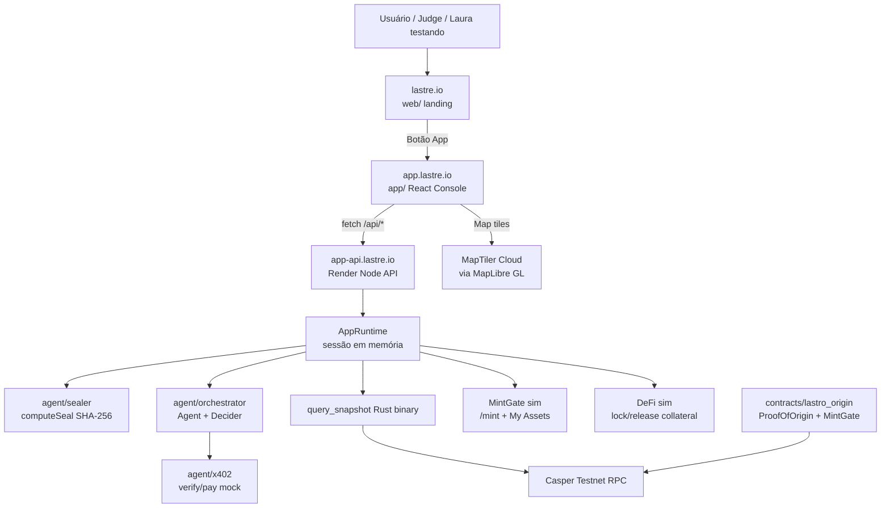
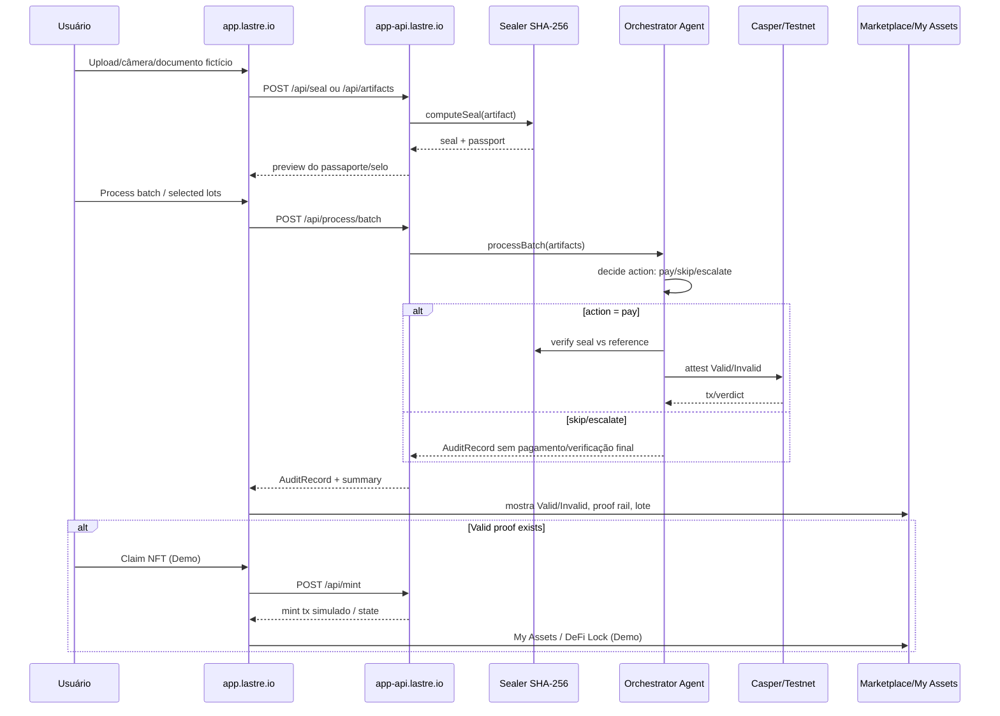
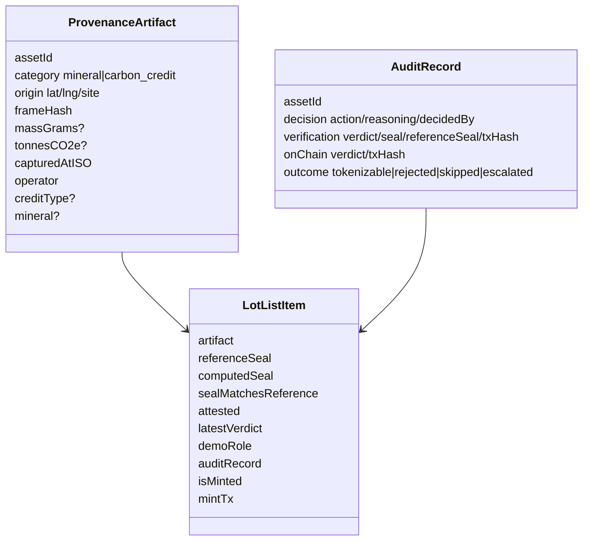
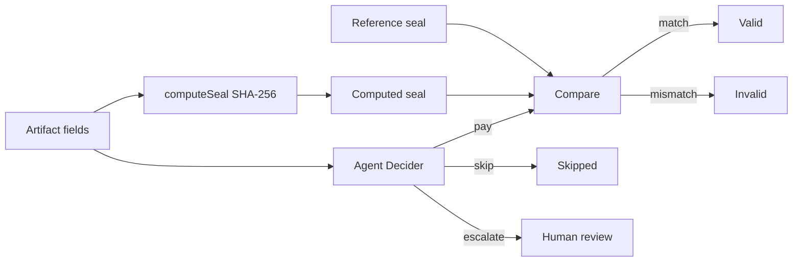

# Lastre — Plataforma, Arquitetura e UX Handoff para Laura

**Data:** 2026-07-02  
**Repo:** `FelixRodrigues007/lastre` / workspace local `lastro`  
**Snapshot técnico local:** `c6ae3c6` — `fix(web): resolve catalog lot detail pages instead of 404 Retry`  
**Audiência:** Laura / Frontend, UX, Produto, Design System  
**Objetivo deste arquivo:** dar uma visão completa e prática da plataforma para Laura entender, operar mentalmente o produto, melhorar usabilidade/UX e mexer no front sem quebrar a lógica de confiança.

---

## 0. TL;DR — o que é a plataforma em uma frase

**Lastre é uma plataforma de prova de proveniência para ativos físicos e créditos ambientais fictícios em demo, onde o documento/origem gera um selo criptográfico determinístico, o agente decide a ação, e Casper registra a atestação antes de qualquer representação tokenizada.**

A tese central é:

> **Proof before token** — primeiro prova, depois qualquer token/credencial/representação.

A UI deve comunicar isso em segundos:

1. Um documento/lote físico vira dados estruturados.
2. Esses dados geram um **selo SHA-256**.
3. Qualquer alteração mínima quebra o selo.
4. O agente decide se paga/verifica/escala, mas **não decide a verdade**.
5. O veredito `Valid` / `Invalid` vem da comparação do selo.
6. Casper registra a prova.
7. Só depois aparece Marketplace, NFT simbólico, My Assets e DeFi demo.

---

## 1. Regra mais importante para UX e copy

A Laura pode melhorar telas, fluxos, clareza, hierarquia visual, mobile, estados vazios, onboarding e interação. Mas **não deve mudar a semântica de confiança**.

### Invariantes não negociáveis

| Regra | O que significa na UI |
|---|---|
| **DEMO only** | Todos os dados são fictícios. Sempre deixar claro. |
| **Sem linguagem de investimento** | Não usar ROI, yield, lucro, preço, oportunidade financeira, ownership real ou venda de token. |
| **Selo decide veredito** | `Valid`/`Invalid` nasce da comparação deterministicamente computada, não de IA. |
| **Agente decide ação** | O agente decide `pay`, `skip` ou `escalate`. Ele não decide se algo é verdadeiro. |
| **Invalid também é prova** | Um lote inválido não é “erro escondido”; é uma prova permanente de adulteração/rejeição. |
| **Proof before token** | Mint/claim/marketplace/DeFi só podem vir depois de prova válida. |
| **Dados fictícios** | Mesmo no mapa, não prometer rastreamento GPS/custódia real. |

### Banner/copy base do app atual

No console aparece:

```text
Fictional data · Seal decides verdict · Not investment or token sale
```

Em PT, a ideia equivalente é:

```text
Dados fictícios · O selo decide o veredito · Não é investimento nem venda de token
```

---

## 2. Nome, linguagem e escopo

### Naming

| Termo | Uso |
|---|---|
| **Lastre** | Marca/produto público, domínio e console. |
| **Lastro** | Nome histórico do repo/pacotes/código. Não precisa aparecer para usuário final. |
| **Provenance Console** | App interno/demo em `app.lastre.io`. |
| **CasperGuard** | Pode aparecer no roteiro/hackathon como narrativa do sistema em Casper. |
| **ProofOfOrigin** | Contrato/semântica da prova de origem. |
| **MintGate** | Contrato/camada de gate: só deixa “mintar” representação simbólica depois de prova válida. |
| **Global Mundi Map** | Aba de mapa no Marketplace, mostrando origem fictícia dos registros. |

### O produto NÃO é

- marketplace financeiro;
- corretora;
- protocolo de investimento;
- tokenização real de mineral;
- garantia legal de custódia/GPS;
- emissão real de crédito de carbono;
- app de carteira real.

### O produto É

- uma demonstração de infraestrutura de confiança;
- um console de proveniência;
- um fluxo de prova criptográfica;
- uma visualização de agentes + Casper;
- uma base de UX para explicar “prova antes de token”.

---

## 3. Topologia de produção atual

> Importante: docs antigos ainda citam Vercel e `api.lastre.io`. O estado atual de trabalho está em **Cloudflare Pages + Render**, com app separado em subdomínio.

| Superfície | URL | Stack | Pasta | Responsabilidade |
|---|---|---|---|---|
| Landing pública | `https://lastre.io` | Cloudflare Pages + Vite React | `web/` | narrativa, prova visual, botão App, branding público |
| Console/App | `https://app.lastre.io` | Cloudflare Pages + Vite React Router | `app/` | produto interativo: capture, lots, process, audit, marketplace, map |
| API do console | `https://app-api.lastre.io` | Render Docker + Node 22 | `app/server/` + `Dockerfile.app-api` | API `/api/*`, runtime, leitura Casper, mint/DeFi demo |
| Casper Testnet | `testnet.cspr.live` / node RPC | Rust/Odra/Casper | `contracts/lastro_origin/` | contratos e leitura testnet |
| Agentes | local/build dentro API | TypeScript packages | `agent/` | sealer, x402, orchestrator, gateway legado |
| Design system | CSS tokens | CSS | `design-system/` + cópias em `web/`/`app/` | tokens visuais e linguagem UI |

### Variáveis importantes em produção

#### Landing `web/` / `lastre.io`

```text
VITE_PUBLIC_SITE_URL=https://lastre.io
VITE_APP_URL=https://app.lastre.io
VITE_GATEWAY_URL=https://lastro.onrender.com   # legado/live proof público do web, se usado
NODE_VERSION=22
```

#### Console `app/` / `app.lastre.io`

```text
VITE_API_BASE_URL=https://app-api.lastre.io
VITE_MAPTILER_KEY=<MapTiler Cloud key>
NODE_VERSION=22
```

Observações:

- `VITE_*` entra no bundle em **build time**. Mudou variável? Precisa redeploy.
- `VITE_MAPTILER_KEY` ativa MapLibre + MapTiler no mapa. Sem chave, cai para SVG fallback.
- O app local usa proxy Vite: `/api` → `http://127.0.0.1:3001`.

#### Render API `app-api.lastre.io`

Pelo `Dockerfile.app-api`, defaults relevantes:

```text
PORT=10000
LASTRO_QUERY_SNAPSHOT_BIN=/app/bin/query_snapshot
PACKAGE_HASH=hash-b8b505fe96c183de157beda5f2233903aa7805208b428c668d191c83f2590561
NODE_ADDRESS=https://node.testnet.casper.network/rpc
CHAIN_NAME=casper-test
ODRA_CASPER_LIVENET_NODE_ADDRESS=https://node.testnet.casper.network/rpc
ODRA_CASPER_LIVENET_CHAIN_NAME=casper-test
```

CORS default no app server permite:

```text
http://localhost:5174
http://127.0.0.1:5174
https://app.lastre.io
```

Também pode aceitar `LASTRO_APP_ALLOWED_ORIGINS` ou `CORS_ORIGINS` no Render.

---

## 4. Mapa mental da arquitetura



### Separação por responsabilidade

| Camada | Responsabilidade | Laura deve mexer? |
|---|---|---|
| `web/` landing | narrativa pública, visual premium, CTA para App | Sim, se for marketing/landing |
| `app/src/routes/*` | telas reais do console | Sim, principal área de UX |
| `app/src/components/*` | componentes reutilizáveis do console | Sim |
| `app/src/lib/api.ts` | client único para API do console | Com cuidado; não espalhar fetch |
| `app/src/lib/demoCatalog.ts` | catálogo fictício do Marketplace/Mapa e fallback de detalhe | Com cuidado; manter DEMO claro |
| `app/server/*` | API Node do console | Só se precisar mudar contrato/estado |
| `agent/*` | lógica de sealer/orquestração/x402 | Evitar para UX; é lógica de confiança |
| `contracts/*` | Casper/Odra/Rust | Evitar; é camada de contrato/protocolo |
| `design-system/*` | tokens base | Sim, mas preservar compatibilidade |

---

## 5. Diretórios do repo explicados

```text
lastro/
├── web/                         # Landing pública Lastre (Vite + React)
├── app/                         # Console de produto (Vite + React Router + API Node)
│   ├── src/
│   │   ├── routes/              # Overview, Chain, Lots, Process, Audit, Marketplace...
│   │   ├── components/          # layout, proof, lots, process, UI primitives
│   │   ├── lib/                 # API client, demoCatalog, format, navigation, theme
│   │   ├── context/             # Locale/NavCounts
│   │   └── i18n/                # traduções EN/PT
│   └── server/                  # Node API do console /api/*
├── agent/
│   ├── sealer/                  # SHA-256 seal deterministicamente computado
│   ├── x402/                    # simulação/abstração de pagamento/verificação
│   ├── orchestrator/            # Agent, RuleDecider, LlmDecider, samples
│   └── gateway/                 # gateway legado Express para landing/live proof
├── contracts/lastro_origin/     # contratos Casper + binário query_snapshot
├── design-system/               # tokens e docs visuais
├── docs/                        # documentação/handoffs/runbooks
├── samples/                     # exemplos/documentos demo
└── Dockerfile.app-api           # imagem Render do console API
```

---

## 6. Fluxo principal do produto

### Flow completo: Capture → Proof → Process → Casper → Token/Marketplace



### Leitura humana do fluxo

1. **Capture**: o usuário cria um artefato fictício a partir de upload/câmera/manual.
2. **Seal**: a API calcula um selo determinístico SHA-256.
3. **Passport**: a UI mostra um passaporte estruturado com campos e selo.
4. **Process**: o agente escolhe uma ação.
5. **Verification**: se a ação for `pay`, compara selo calculado e referência.
6. **Verdict**: `Valid` ou `Invalid`.
7. **Audit**: grava histórico da sessão.
8. **Chain**: lê snapshot/testnet e exibe package/attestations.
9. **Marketplace**: mostra ativos provados/pendentes.
10. **Claim NFT (Demo)**: só deve aparecer se prova for `Valid`.
11. **DeFi sim**: travar/liberar como colateral, apenas demo, sem valor real.
12. **Global Mundi Map**: mostra origem fictícia/geográfica, não custódia GPS.

---

## 7. Rotas atuais do console (`app/`)

Arquivo fonte: `app/src/App.tsx`.

| Rota | Tela | O que explica para o usuário | Fonte de dados principal | Notas UX |
|---|---|---|---|---|
| `/` | Overview | Estado geral, counters, CTA para rodar demo | `/api/chain/summary`, `/api/audit/summary` | Deve orientar em 15s. |
| `/chain` | Chain | Snapshot Casper Testnet, package hash, attestations | `/api/chain/summary`, `/api/chain/testnet` | Bom para prova técnica/judge. |
| `/lots` | Lots | Fila de lotes fictícios | `/api/lots` | Deve separar pending/attested/escalated. |
| `/lots/:assetId` | Lot Detail | Artefato, selo, referência, proof rail | `/api/lots/:id` + fallback demo catalog | Tela forense, foco em confiança. |
| `/process` | Process | Executar agente em lote | `/api/process/defaults`, `/api/process/batch` | Principal demonstração operacional. |
| `/audit` | Audit | Histórico de decisões/verificações | `/api/audit`, `/api/audit/export` | Mostrar que Invalid não some. |
| `/audit/:assetId` | Audit Detail | Um registro em detalhe | `/api/audit/:id` | Drill-down técnico. |
| `/escalations` | Escalations | Fila de casos que precisam revisão | `/api/escalations` | Human-in-the-loop. |
| `/settings` | Settings | Decider mode, limites, tema/idioma | `/api/settings` | Não expor “config perigosa”. |
| `/capture` | Capture | Upload/câmera/form para gerar passaporte | `/api/seal`, `/api/artifacts` | Deve ser o início natural do fluxo. |
| `/marketplace` | Marketplace + Global Mundi Map | Ativos provados/pendentes, Claim NFT demo, mapa | `/api/lots` + demo catalog + MapTiler | Atenção à linguagem sem investimento. |
| `/my-assets` | My Assets | Ativos mintados na sessão demo | `/api/lots` + local/session state | “Meus ativos” é simbólico/demo. |

---

## 8. API atual do console (`app-api.lastre.io`)

Fonte: `app/server/index.ts` e `app/src/lib/api.ts`.

### Endpoints read

| Método | Endpoint | Uso |
|---|---|---|
| `GET/HEAD` | `/api/health` | Smoke test. |
| `GET` | `/api/chain/summary` | Resumo Casper + sessão. |
| `GET` | `/api/chain/testnet` | Snapshot live/fallback da testnet. |
| `GET` | `/api/chain/testnet/:assetId` | Attestation testnet de um asset. |
| `GET` | `/api/audit/summary` | Contadores de audit e last batch. |
| `GET` | `/api/lots` | Lista de lotes demo + user-submitted. |
| `GET` | `/api/lots/:assetId` | Detalhe do lote. |
| `GET` | `/api/audit` | Lista audit log da sessão. |
| `GET` | `/api/audit/:assetId` | Registro audit por asset. |
| `GET` | `/api/audit/export` | Download JSON. |
| `GET` | `/api/escalations` | Registros escalados. |
| `GET` | `/api/process/defaults` | Asset IDs default + decider atual. |
| `GET` | `/api/settings` | Decider, limites, persistence, llmConfigured. |

### Endpoints write/demo

| Método | Endpoint | Uso | Guardrail |
|---|---|---|---|
| `POST` | `/api/settings` | Troca decider `rule`/`llm` | Demo setting. |
| `POST` | `/api/process/batch` | Processa lotes pelo agente | Verdade vem do selo. |
| `POST` | `/api/artifacts` | Adiciona artefato criado no Capture | Dados fictícios. |
| `POST` | `/api/seal` | Calcula selo/passaporte local | Não escreve on-chain. |
| `POST` | `/api/mint` | MintGate simulado | Só se `latestVerdict === Valid`. |
| `POST` | `/api/defi/lock` | Trava colateral demo | Só se minted + Valid. |
| `POST` | `/api/defi/release` | Libera colateral demo | Apenas sessão/demo. |

### API client do app

Tudo no console deve passar por:

```text
app/src/lib/api.ts
```

Não espalhar `fetch` cru em componentes. Isso é importante para:

- loading/error state consistente;
- troca de base URL por env;
- tratamento de 404/fallback do catálogo;
- manutenção do contrato.

---

## 9. Modelo de domínio simplificado

Fonte principal: `app/src/lib/types.ts`.



### Categorias de ativo

| Categoria | Campos relevantes | Exemplo |
|---|---|---|
| `mineral` | `massGrams`, `mineral`, `origin` | `MINA-VALEDOURO-LOTE-001` |
| `carbon_credit` | `tonnesCO2e`, `creditType`, `vintage`, `verifier` | `CARBON-VCS-AMAZONIA-2024-001` |

### Vereditos e outcomes

| Campo | Valores | Quem decide |
|---|---|---|
| `decision.action` | `pay`, `skip`, `escalate` | Agent/decider |
| `latestVerdict` | `Valid`, `Invalid`, `null` | Selo/verificação |
| `outcome` | `tokenizable`, `rejected`, `skipped`, `escalated` | Resultado do processo |

---

## 10. O que o agente faz vs. o que o selo faz

Essa separação deve aparecer visualmente.



### UX recomendada

Mostrar em telas de Process/Audit:

- Coluna/etapa **Agent action**: `pay`, `skip`, `escalate`.
- Coluna/etapa **Seal verdict**: `Valid`, `Invalid`, `—`.
- Nunca escrever “AI says valid”. Melhor: “Agent chose verification; seal returned Valid”.

---

## 11. Marketplace, MintGate, My Assets e DeFi demo

### O que existe hoje

No `Marketplace` (`app/src/routes/Marketplace.tsx`):

- persona switcher: Public Verifier, NFT Buyer, DeFi User, Internal Operator;
- wallet/account demo em `localStorage`;
- filtros por categoria, tipo de crédito, status;
- cards com provenance score demo;
- ação **Inspect Proof**;
- ação **Claim NFT (Demo)** quando `isValidProof && !isMinted`;
- ação **Lock as Collateral** depois de minted/valid;
- aba **Global Mundi Map**.

### Importante: Claim NFT é simbólico/demo

UX/copy segura:

```text
Claim NFT (Demo)
Simulated Casper signature
Recorded via MintGate (demo)
No real asset, value, or transfer occurs
```

Evitar:

```text
Buy
Invest
Own mineral
Earn yield
Collateral value
Real market price
```

> O código ainda tem alguns textos como “Buy Confirmation (Demo)” por compatibilidade, mas a direção de UX deve reduzir “buy” e favorecer “Claim / Simulate signature / Mint representation”.

### Como o MintGate sim funciona

No backend atual (`AppRuntime.mintAsset`):

1. Se já minted → erro `Already minted`.
2. Busca o lote.
3. Exige `latestVerdict === "Valid"`.
4. Marca em memória (`Set`) como minted.
5. Gera `mint-<timestamp>-<suffix>` como tx hash simulado.

É sessão/memória do Render, não persistência definitiva.

### DeFi sim

`lockCollateral` só deixa travar se:

1. asset minted;
2. lote existe;
3. `latestVerdict === "Valid"`;
4. não está locked.

UX deve tratar isso como **simulação de camada DeFi**, não produto financeiro.

---

## 12. Global Mundi Map

### Stack escolhida

- **MapLibre GL JS**: renderer open-source.
- **MapTiler Cloud**: tiles/styles de produção.
- Fallback SVG interno: se não houver key ou se MapTiler falhar.

Arquivo principal:

```text
app/src/routes/Marketplace.tsx
```

Env:

```text
VITE_MAPTILER_KEY=<key>
```

Domínios MapTiler recomendados:

```text
https://app.lastre.io
https://lastre-app.pages.dev
https://*.pages.dev
```

### Semântica correta do mapa

O mapa deve dizer:

```text
Fictional origin map / demo-only origin surface.
Not GPS custody tracking.
```

Ele mostra:

- origem fictícia do ativo;
- categoria mineral vs carbon credit;
- status pending/proven/minted;
- rota visual para uma âncora Casper;
- ledger de pontos abaixo do mapa.

### Bug resolvido em `c6ae3c6`

Problema: o Marketplace tinha ativos fictícios que não existiam na API, então clicar em `MINA-VALEDOURO-LOTE-002` abria `/lots/MINA-VALEDOURO-LOTE-002` e dava `Unknown lot / Retry`.

Correção:

- `app/src/lib/demoCatalog.ts` virou fonte única do catálogo demo.
- `getLot()` em `app/src/lib/api.ts` faz fallback local para ids conhecidos do catálogo quando a API retorna 404.
- Id realmente desconhecido continua mostrando erro real.

Para Laura: o mapa não estava quebrado; o detalhe do ativo de catálogo precisava fallback.

---

## 13. Landing `web/` vs Console `app/`

### Landing (`web/`)

Objetivo: explicar e vender a tese visualmente.

- rota pública: `lastre.io`;
- narrativa editorial;
- botão `App` aponta para `VITE_APP_URL`;
- usa `web/src/site-links.ts` para links globais;
- usa `web/src/lib/lastro-api.ts` para gateway legado/live proof se necessário.

A landing deve responder:

> Por que Lastre existe?

### Console (`app/`)

Objetivo: permitir a demo operacional.

- rota pública: `app.lastre.io`;
- SPA com React Router;
- API própria `/api/*` em Render;
- fluxo Capture → Process → Audit → Marketplace.

O console deve responder:

> Como a prova acontece, passo a passo?

### Não misturar mentalmente

- Landing é narrativa/marketing.
- Console é produto/prova.
- O botão App deve sair da landing para `https://app.lastre.io`.
- Não tentar servir `/app` dentro da landing Cloudflare; isso cai no fallback SPA da landing.

---

## 14. Design system e linguagem visual

### Direção visual

Lastre deve parecer:

- infraestrutura forense;
- mineral/terra/oliva;
- prova física + criptográfica;
- técnico, premium e contido;
- sem hype cripto.

Evitar:

- roxo/ciano genérico de Web3;
- dashboards de trading;
- “AI magic”;
- excesso de animação;
- copy promocional vazia.

### Tokens e fontes

Arquivos relevantes:

```text
design-system/tokens/lastro.css
web/src/styles/lastro-tokens.css
app/src/styles/app.css
app/src/routes/*.css
app/src/components/**/*.css
```

Fontes usadas/esperadas:

| Uso | Fonte |
|---|---|
| Display/títulos | Inter/Space Grotesk dependendo superfície |
| Body | Inter |
| Hashes/IDs | JetBrains Mono |

Regra: monospace apenas para artefatos técnicos: hashes, asset IDs, package hash, tx, timestamps.

---

## 15. Componentes importantes do console

| Área | Componentes/arquivos | Função UX |
|---|---|---|
| Shell | `AppShell`, `AppSidebar`, `MobileTabBar`, `GuardrailBanner`, `CommandPalette` | Navegação, banner, mobile, cmd+k |
| Proof | `ProofRail`, `SealChip`, `Badges`, `AuditRecordCard` | Explicar cadeia de prova e veredito |
| Lots | `ArtifactPanel` | Mostrar campos que formam o selo |
| Process | `ProcessPipeline`, `BatchStepper` | Fazer o agente parecer auditável, não mágico |
| Chain | `ChainSnapshot` | Mostrar Casper package, counters, links |
| UI primitives | `MetricCard`, `Tabs`, `SearchInput`, `FilterPills`, `EmptyState`, `Skeleton` | Consistência e estados |
| Marketplace | `Marketplace.tsx` + `marketplace.css` | Persona, cards, mint demo, mapa |

### Padrão de estado de tela

O app usa:

```text
useAsyncData(loader)
StatePanel loading/error/skeleton/retry
```

UX deve sempre ter:

- loading/skeleton;
- erro honesto;
- retry claro;
- empty state com próximo passo;
- sem tela em branco.

---

## 16. Personas atuais e o que cada uma precisa entender

| Persona | Objetivo | Tela mais importante | UX ideal |
|---|---|---|---|
| **Internal Operator** | Processar/monitorar lotes | Capture, Process, Audit, Escalations | eficiência, feedback, batch status |
| **Public Verifier** | Conferir se a prova é verdadeira | Lot Detail, Chain, Audit | confiança, link externo, hashes copiáveis |
| **NFT Buyer / Collector demo** | Ver representação simbólica após prova | Marketplace, My Assets | linguagem sem investimento, claim demo claro |
| **DeFi Participant demo** | Entender prova como pré-condição para collateral sim | Marketplace, My Assets | evitar promessa financeira, explicar gates |
| **Contract Owner/Admin** | Ver contratos, package, estado testnet | Chain, Settings | dados técnicos, package hash, observabilidade |
| **Judge/Hackathon** | Entender em 15–60s | Landing, Overview, Process | narrativa curta + evidência técnica |
| **Laura/Designer** | Melhorar fluxo sem quebrar trust logic | Todas | documentação de fronteiras e estados |

---

## 17. Jornada de usuário sugerida para demo/vídeo

### Demo de 3–5 minutos

1. `lastre.io`: tese e CTA App.
2. `app.lastre.io`: Overview mostra sistema vivo.
3. Capture: cria/gera passaporte e selo.
4. Lot Detail: mostra artifact + computed/reference seal.
5. Process: roda agente, mostra action vs verdict.
6. Audit: prova que Valid/Invalid ficam registrados.
7. Chain: abre Casper package/attestation.
8. Marketplace: mostra ativo provado e Claim NFT Demo.
9. Global Mundi Map: origem fictícia no mapa.
10. My Assets / DeFi sim: reforça que token/DeFi vem depois da prova.

### North Star de UX

A pessoa deve conseguir repetir esta frase:

> “Um documento físico vira um selo. Se mexer em qualquer campo, o selo muda. O agente só decide o que fazer; o selo decide a verdade. Casper registra a prova antes do token.”

---

## 18. Pontos de melhoria de UX para Laura

### P0 — clareza imediata

- Criar um “What just happened?” em Process após rodar batch.
- Mostrar uma linha fixa: **Artifact → Seal → Agent Action → Verdict → Casper**.
- Reforçar que `Invalid` é evidência, não falha.
- Trocar qualquer copy “Buy” por “Claim representation (Demo)” / “Simulate claim”.
- Melhorar empty states: “Run Process first”, “Capture a document”, “Connect demo account”.

### P1 — usabilidade do fluxo

- Tornar Capture o primeiro passo visual da experiência.
- Adicionar breadcrumbs/next step CTA entre Capture → Lot Detail → Process.
- Adicionar painel lateral “Current proof status” em Lot Detail.
- Criar comparação visual de selo computado vs referência.
- Padronizar “copy hash” em todos os hashes/txs.

### P1 — Marketplace/Map

- No mapa, diferenciar visualmente “Casper anchor” de “origin pin”.
- Renomear legenda para evitar confusão com GPS/custódia.
- Ao clicar num ponto, abrir drawer/preview antes de navegar.
- Mostrar badge “catalog demo fallback” para ativos de vitrine, se útil.

### P2 — mobile/a11y

- Revisar mobile tab bar com rotas novas Marketplace/My Assets.
- Garantir foco visível em todos botões/cards.
- `aria-live` para Process stepper e estados de verificação.
- `prefers-reduced-motion` para mapa/animações.
- Contraste AA em badges verdes/dourados.

### P2 — IA/narrativa

- Criar microcopy consistente:
  - “Seal computed”
  - “Reference matched”
  - “Agent action: pay”
  - “Verdict recorded”
- Evitar termos vagos como “AI verified”.

---

## 19. Fronteiras de segurança e confiança

### O que pode ser simulado

- wallet demo;
- claim NFT demo;
- mint tx hash simulado;
- collateral lock/release;
- provenance score;
- mapa/coords fictícios;
- catalog assets.

### O que não pode ser falsificado visualmente

- dizer que algo foi on-chain se não foi;
- chamar simulação de compra real;
- dizer que NFT representa propriedade real;
- esconder `Invalid`;
- atribuir veredito à IA;
- transformar erro de API em `Valid`.

### Estado e persistência

| Estado | Onde vive | Consequência UX |
|---|---|---|
| Demo account/persona | `localStorage` do navegador | some ao limpar browser |
| Runtime audit/mint/lock | memória do Render Node | pode resetar em redeploy/restart/cold start |
| Catalog demo fallback | bundle frontend | estável pós-build |
| Casper package snapshot | query Rust/testnet/fallback | pode demorar ou cair para fallback |
| Map tiles | MapTiler externo | pode falhar por key/domínio/quota |

---

## 20. Como rodar localmente

### App console completo

```bash
make app-dev
```

Ou manual:

```bash
make build-sealer build-x402 build-orchestrator build-query-snapshot
cd app
npm install
npm run dev
```

Abre:

```text
UI:  http://localhost:5174
API: http://127.0.0.1:3001/api/health
```

### Landing

```bash
cd web
npm install
npm run dev
```

### Build/quality

```bash
cd app
npm run build
npm run lint

cd ../web
npm run build
npm run lint
```

### Testes dos agentes

```bash
cd agent/sealer && npm test
cd ../orchestrator && npm test
cd ../gateway && npm test
```

---

## 21. Deploy mental model

### Console app Cloudflare Pages

Config atual esperada:

```text
Project: lastre-app
Repository: FelixRodrigues007/lastre
Branch: main
Root directory: app
Build command: npm run build
Output directory: dist
Env: VITE_API_BASE_URL=https://app-api.lastre.io
Env: VITE_MAPTILER_KEY=<key>
Env: NODE_VERSION=22
Custom domain: app.lastre.io
```

### API Render

Config esperada:

```text
Service: lastre-app-api
Runtime: Docker
Dockerfile: Dockerfile.app-api
URL: https://lastre-app-api.onrender.com
Custom domain: app-api.lastre.io
Health path: /api/health
```

### Landing Cloudflare Pages

Config mental:

```text
Root directory: web
Build command: npm run build
Output directory: dist
Custom domain: lastre.io / www.lastre.io
VITE_APP_URL=https://app.lastre.io
```

> Docs antigos podem citar Vercel. Para o estado atual, use Cloudflare Pages.

---

## 22. Checklist de QA para Laura antes de considerar “bom”

### Funcional

- [ ] `lastre.io` abre sem login/interstitial.
- [ ] Botão App abre `https://app.lastre.io`.
- [ ] `app.lastre.io` abre Overview.
- [ ] `/marketplace` carrega cards.
- [ ] Aba Global Mundi Map carrega MapTiler ou fallback SVG sem quebrar.
- [ ] Clicar `MINA-VALEDOURO-LOTE-002` abre detalhe sem Retry.
- [ ] `/process` consegue rodar batch.
- [ ] `/audit` mostra registros após processar.
- [ ] `/chain` mostra package/testnet ou fallback honesto.
- [ ] Claim NFT Demo não aparece para Invalid/pending.

### UX/copy

- [ ] Todo caminho público deixa claro que é demo/fictício.
- [ ] Não há promessa financeira.
- [ ] `Valid` e `Invalid` têm texto + cor/ícone.
- [ ] Erros explicam próximo passo.
- [ ] Empty states têm CTA.
- [ ] Hashes são truncados, copiáveis e com `title`/full value quando possível.

### Acessibilidade/mobile

- [ ] Navegação por teclado.
- [ ] Focus states visíveis.
- [ ] Sem overflow horizontal no mobile.
- [ ] Mapa não prende scroll de forma agressiva.
- [ ] Reduced motion respeitado em animações críticas.
- [ ] Contraste suficiente em badges e botões.

---

## 23. Glossário rápido

| Termo | Explicação humana |
|---|---|
| Artifact | Objeto/dados estruturados que representam o documento/lote. |
| Provenance | Origem e trilha de prova de um ativo. |
| Seal | Hash SHA-256 determinístico do artifact. |
| Reference seal | Selo esperado/registrado para comparação. |
| Computed seal | Selo calculado agora a partir dos dados atuais. |
| Tamper | Alteração em campo que muda o selo. |
| Valid | Computed seal bate com reference seal. |
| Invalid | Computed seal não bate; prova de adulteração/rejeição. |
| Agent action | Decisão operacional: pay/skip/escalate. |
| Attestation | Registro da prova/veredito. |
| MintGate | Gate que só libera representação simbólica depois de Valid proof. |
| Global Mundi | Mapa demo de origem fictícia. |
| x402 | Camada de pagamento/verificação simulada/agentic no fluxo. |
| Casper package hash | Identificador do pacote de contrato na Casper Testnet. |

---

## 24. Copy deck curto para a Laura usar

### Hero/overview

```text
Proof before token.
Lastre turns a physical provenance record into a deterministic seal, lets an agent decide the next action, and records the result on Casper.
```

### Capture

```text
Capture a fictional document and generate its provenance passport.
The passport is sealed before any token or claim can exist.
```

### Process

```text
The agent chooses the action. The seal decides the verdict.
```

### Invalid

```text
Invalid is not a hidden failure. It is recorded evidence that the data no longer matches the reference seal.
```

### Marketplace

```text
Claim a symbolic demo representation only after a Valid proof.
No real asset, price, return, or ownership transfer is offered.
```

### Map

```text
A fictional origin map for demo records. It is not GPS custody tracking.
```

---

## 25. Decisões arquiteturais importantes

### ADR-lite 1 — Landing separada do Console

**Decisão:** manter `web/` e `app/` separados.  
**Por quê:** landing precisa vender a tese; console precisa operar prova.  
**Consequência:** o botão App usa `VITE_APP_URL`; não servir console em `/app` dentro da landing.

### ADR-lite 2 — API do console no Render

**Decisão:** rodar `app/server` em Render Docker.  
**Por quê:** precisa Node server, pacotes agent e binário Rust `query_snapshot`; não cabe em Cloudflare Pages Functions simples.  
**Consequência:** app estático em Cloudflare chama `app-api.lastre.io`.

### ADR-lite 3 — MapLibre + MapTiler

**Decisão:** MapLibre GL JS para renderer, MapTiler para tiles.  
**Por quê:** renderer open-source/vendor-neutral; tiles de produção prontos.  
**Consequência:** `VITE_MAPTILER_KEY` ativa mapa real; fallback SVG preserva demo.

### ADR-lite 4 — Fallback local para catálogo demo

**Decisão:** ativos de vitrine do Marketplace têm fallback local no frontend se API retornar 404.  
**Por quê:** alguns ativos existem para UX/demo, não no runtime API.  
**Consequência:** `/lots/:id` funciona para ids conhecidos do catálogo; ids desconhecidos continuam 404.

### ADR-lite 5 — Estado demo em memória

**Decisão:** audit/mint/lock são session/runtime state, não banco persistente.  
**Por quê:** hackathon/demo rápida, sem promessa de produto financeiro.  
**Consequência:** UX deve tratar como demo e tolerar reset em redeploy/cold start.

---

## 26. Onde Laura provavelmente vai mexer primeiro

### Para melhorar a experiência principal

```text
app/src/routes/Capture.tsx
app/src/routes/Process.tsx
app/src/routes/LotDetail.tsx
app/src/routes/Marketplace.tsx
app/src/routes/MyAssets.tsx
```

### Para melhorar navegação/shell

```text
app/src/components/layout/AppSidebar.tsx
app/src/components/layout/AppShell.tsx
app/src/components/layout/MobileTabBar.tsx
app/src/lib/navigation.ts
app/src/i18n/translations.ts
```

### Para melhorar componentes de prova

```text
app/src/components/proof/ProofRail.tsx
app/src/components/proof/SealChip.tsx
app/src/components/proof/Badges.tsx
app/src/components/lots/ArtifactPanel.tsx
```

### Para melhorar UI visual

```text
app/src/styles/app.css
app/src/routes/*.css
app/src/components/**/*.css
design-system/tokens/lastro.css
```

### Para alterar dados fictícios do Marketplace/Mapa

```text
app/src/lib/demoCatalog.ts
```

Cuidado: se mudar ids/categorias aqui, testar `Marketplace → Inspect Proof`.

---

## 27. Riscos conhecidos / dívida técnica atual

| Risco | Impacto | Mitigação UX/técnica |
|---|---|---|
| Render Free cold start | API demora/failed fetch temporário | loading honesto + retry + talvez plano pago |
| Runtime em memória | minted/audit some em restart | comunicar demo session; persistência futura se necessário |
| Docs antigos Vercel | confusão operacional | este arquivo é a fonte atual para Laura |
| Mapa depende de key/domínio | fallback ou tela sem tiles | fallback SVG + allow domains no MapTiler |
| Large MapLibre chunk | warning no build | aceitável; lazy import já usado |
| Sem auth real | app é público demo | não colocar dados reais/secrets |
| Copy “Buy” residual | pode soar financeiro | trocar por Claim/Simulate/Representation |
| API app e gateway legado coexistem | confusão de endpoints | app usa `VITE_API_BASE_URL`; landing pode usar `VITE_GATEWAY_URL` |

---

## 28. Roadmap UX sugerido em ordem

### Fase A — compreensão e demo

1. Melhorar Overview como “mapa da prova”.
2. Criar CTA guiado: Capture → Process → Audit → Marketplace.
3. Melhorar Process para mostrar separação Agent Action vs Seal Verdict.
4. Melhorar Lot Detail com diff/tamper visual.

### Fase B — marketplace sem risco financeiro

1. Trocar “Buy” residual por “Claim representation (Demo)”.
2. Criar modal educativo antes de Claim.
3. Explicar MintGate em linguagem simples.
4. My Assets como “symbolic demo holdings”, não carteira real.

### Fase C — Global Mundi

1. Drawer ao clicar no pin.
2. Diferenciar origin pin vs Casper anchor.
3. Legenda mais didática.
4. Filtros por categoria/status mais claros.

### Fase D — polimento final

1. A11y audit.
2. Mobile QA.
3. Reduced motion.
4. Skeletons e error states consistentes.
5. Copy sweep em EN/PT.

---

## 29. Critério de sucesso para o produto/demo

A plataforma está “boa” quando uma pessoa nova consegue, sem explicação externa:

1. entender que é demo/fictício;
2. entender o que é o selo;
3. ver que uma alteração quebra o selo;
4. perceber que a IA/agente não decide verdade;
5. ver Casper como registro de prova;
6. entender que NFT/marketplace/DeFi são camadas **depois** da prova;
7. não confundir o produto com investimento.

---

## 30. Resumo final para Laura

Laura, pense na plataforma como uma **sala de evidências digital**:

- o documento físico entra;
- o sistema transforma campos em um selo;
- qualquer adulteração muda o selo;
- o agente opera o fluxo;
- Casper registra o resultado;
- só depois aparece token/marketplace/DeFi demo.

Seu trabalho de UX é fazer essa cadeia ficar óbvia, bonita e confiável — sem transformar a demo em promessa financeira e sem esconder os `Invalid`. A melhor UI para Lastre não parece “crypto hype”; ela parece infraestrutura forense premium.

