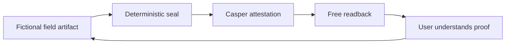
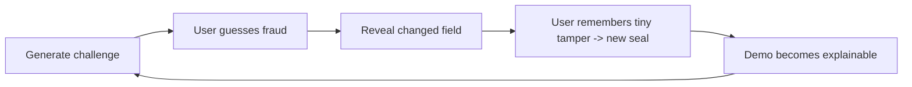
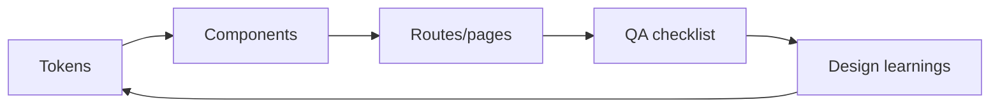
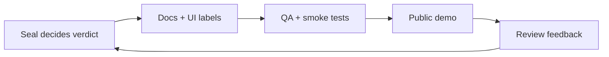
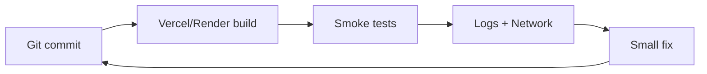

# Lastre Operating Wheels

These are the repeatable loops that make the product, demo, and repository
stronger over time. They are not tokenomics or financial flywheels; they are
operational/product learning loops.

## 1. Proof wheel

Purpose: every demo reinforces the core thesis — proof before token.

## 2. Fraud-learning wheel

Purpose: Spot-the-Fraud makes deterministic verification memorable for judges,
users, and future contributors.

## 3. Design-system wheel

Purpose: Laura can improve the UI without breaking the protocol, copy guardrails,
or API integration.

## 4. Trust-boundary wheel

Purpose: every release re-validates that the frontend does not invent trust.

## 5. Deployment wheel

Purpose: keep deploys boring, observable, and reversible.

## Practical cadence

| Cadence | Wheel | Output |
|---|---|---|
| Every UI change | Design-system wheel | components remain tokenized and accessible |
| Every deploy | Deployment wheel | smoke tests and rollback confidence |
| Every demo recording | Fraud-learning wheel | clear 15-second explanation |
| Every product edit | Trust-boundary wheel | no prohibited copy or fake verdicts |
| Every protocol change | Proof wheel | readback still proves accepted/rejected state |
